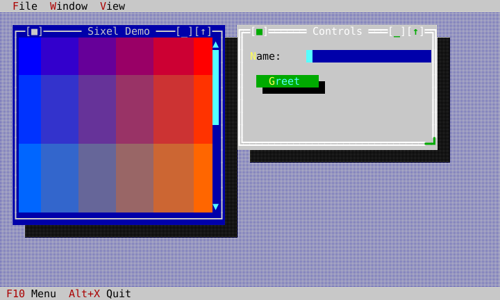
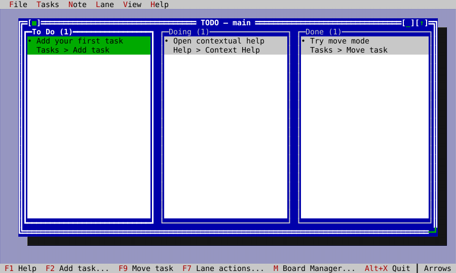
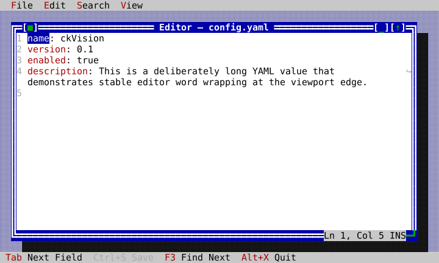
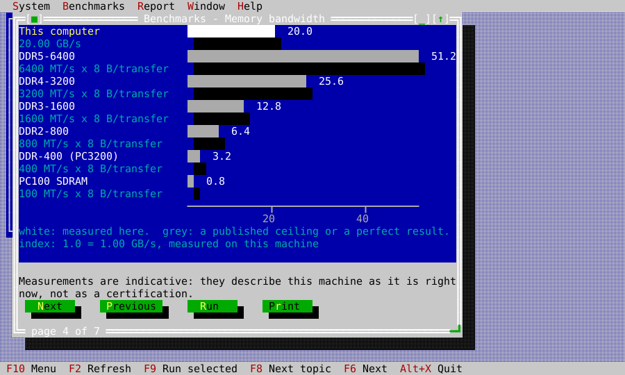

# ckVision

**ckVision** is a windowed terminal-UI framework for C++20 — overlapping
movable windows, drop-down menus, modal dialogs, complete keyboard *and* mouse
interaction, themes, and first-class Sixel graphics, drawn through a
damage-tracked pipeline that repaints only what changed.

It takes the interaction grammar of the classic desktop-in-a-terminal
applications of the early 1990s and rebuilds it on modern grounds: modern C++,
modern terminals, modern library architecture.

## Screenshots

These deterministic SVG captures are rendered from the current shipped example
applications through ckVision's own headless terminal and presentation pipeline.

| Gallery and Sixel graphics | TODO application |
|:---:|:---:|
|  |  |
| **Text editor** | **SysInfo benchmark comparison** |
|  |  |

```cpp
#include "cvision/term/posix_clock.hpp"
#include "cvision/term/posix_terminal.hpp"
#include "cvision/term/terminal_clipboard.hpp"
#include "cvision/ui/application.hpp"

int main() {
    ckv::term::PosixClock clock;
    ckv::term::PosixTerminal terminal(clock);
    ckv::term::TerminalClipboardWriter clipboard(terminal);

    ckv::ui::Application app(terminal, clock, clipboard);
    MyApp my_app(app);          // your view tree
    app.run();
}
```

The host owns the terminal, the clock, and the clipboard and passes them in.
Nothing in the library reaches for a global, and nothing reads the wall clock
behind your back — which is also why the whole framework can be driven
headlessly in a test.

## What you get

- **Windows and menus** — a `Desktop` with z-order, activation, cycling, tile
  and cascade; windows with frame chrome, move/resize, zoom and a vetoable
  close protocol; a menu bar with mnemonics, shadows, context menus and
  light-dismiss.
- **Widgets** — Label, StaticText, Button, InputLine (validators, input masks,
  password echo, history), CheckGroup, RadioGroup, ComboBox, SpinBox, Slider,
  SearchBox, KeyChordCapture, ListView, PopupList, TreeView, TextView, Memo,
  Table, CellGrid, FlowView, TabControl, ToolBar, BreadcrumbBar,
  PropertyInspector, Progress, CalendarView, DatePicker, TimePicker, ClockView,
  BigClockView, Scrollbar, ScrollViewport, ImageView, Canvas, Splitter,
  StatusLine, TerminalView, tooltips, notifications, a command palette and
  wizards, plus message boxes, file open/save, directory, date and time
  dialogs, a window list, a theme editor and a help viewer.
- **Dialogs as data** — declarative descriptors that materialize into a
  validated dialog, with accept-veto and Esc-cancel.
- **Graphics** — a public-protocol Sixel encoder, cropped raster overlay that
  respects window occlusion, and pixel-precise SGR-Pixels mouse input.
- **Terminal handling** — an incremental input decoder covering legacy, kitty
  and modifyOtherKeys key encodings, SGR mouse, sanitized bracketed paste,
  focus events and capability probe replies; a presenter that diffs cells,
  degrades color depth to what the host has, and emits synchronized output.
- **Themes** — a flat, interned-role theme system with Classic (the default,
  with its dark drop shadows), Dark, Light, Mono and High Contrast schemes,
  switchable while the application runs, and a theme editor whose themes save
  and load as text.
- **A text editor core** — revisioned documents, `TextEditor`, language
  profiles, incremental syntax caching, search and replace, and a safe file
  workflow.
- **Backends** — POSIX (real termios, signals, PTY-tested), Windows (a VT
  outer backend and a ConPTY child adapter), headless, and record/replay.

Zero mandatory dependencies. C++20. `find_package(ckvision)` gives you one
target: `ckvision::cvision`.

## Status

Version 1.0.0. The widget catalog is complete, every public
declaration carries reference documentation, and the suite covers unit
behavior, byte-exact golden output, every widget in every state in four schemes,
PTY contracts, fuzzed decoders, allocation budgets, and visual captures. The
recorded release verification builds it on three hosts — Release builds with
warnings as errors on macOS ARM64, Linux ARM64 (GCC 14) and Windows ARM64
(MSVC) — and each passes its full CTest suite with zero warnings. CI adds
dedicated Address, UndefinedBehavior and Thread sanitizer lanes and a fuzzing
lane. Some interactive acceptance runs on real terminals are still open.

The owner selected 1.0.0 for the current framework and its public C++ and
CMake package API. A major version does not assert that the product is free of
defects or that every internal milestone is accepted. The interactive five-app
walkthrough was waived for this release, and the idle-host p99 and theme-switch
baselines remain open. Public compatibility follows semantic versioning from
1.0.0 onward: fixes use patch versions, compatible additions use minor versions,
and incompatible public changes require a new major version.

## Build

Needs a C++20 compiler, CMake 3.25+ and Python 3. A top-level configure builds
the test suite by default, and its gates run Python scripts, so CMake stops
without a Python 3 interpreter. A build that only wants the library and the
examples can configure with `-DCKVISION_BUILD_TESTING=OFF`, which needs no
Python.

```bash
cmake -B build -DCMAKE_BUILD_TYPE=Release
cmake --build build -j8
./build/examples/ckvision_hello
```

Run the suite:

```bash
ctest --test-dir build --output-on-failure
```

Install and consume from another project:

```bash
cmake --install build --prefix /your/prefix
```

```cmake
find_package(ckvision CONFIG REQUIRED)
target_link_libraries(my_app PRIVATE ckvision::cvision)
```

## Examples

`examples/` are built, tested and screenshot from the same object graphs the
documentation describes — they are the fastest way in.

| Example | Shows |
|---|---|
| `hello` | The smallest complete host: terminal, clock, clipboard, view tree, loop |
| `gallery` | An application shell: windows, a form, keyboard and mouse navigation, a Sixel picture scrolled in a viewport, and the Classic, Dark, Light and Mono schemes |
| `filebrowser` | `TreeView` driving `ListView` over the real filesystem |
| `layouts` | Row/Column layout and resize behavior |
| `forms` | Dialogs, validation, focus restoration, wizards |
| `rootdialog` | A form that is the whole application: no Desktop, no window, no frame |
| `echo` | The decoded input events of a host, one line per key, mouse, focus or paste event |
| `graphics` | `ImageView`, `Canvas`, and graceful degradation without Sixel |
| `editor` | The document editor: profiles, search/replace, file workflow |
| `terminal` | An embedded terminal in a window |
| `workbench` | A larger multi-window application |
| `spin` | Animated windows rendered on worker threads while the application stays responsive |
| `sysinfo` | Injected host facts, cancellable benchmarks, charts, and reports |
| `todo` | Persistent Kanban, editor notes, drag/drop, Boards, and conflict resolution |

## Documentation

Start with [getting started](docs/getting-started.md), then the complete
[Hello tutorial](docs/tutorial-hello.md) and the
[object model](docs/object-model.md).

| Document | Content |
|---|---|
| [getting-started.md](docs/getting-started.md) | Build, install, and the minimal host application |
| [tutorial-hello.md](docs/tutorial-hello.md) | Complete Hello source, hierarchy, and walkthrough |
| [object-model.md](docs/object-model.md) | Application/view/Desktop/window ownership, focus, events, painting |
| [layout-guide.md](docs/layout-guide.md) | Choosing a layout container, and resize behavior |
| [widget-gallery.md](docs/widget-gallery.md) | Every public type: a figure of the widget running, the compiled code that drew it, and what each setting does |
| [dialogs-and-commands.md](docs/dialogs-and-commands.md) | Commands, dialogs, validation, focus restoration, wizards |
| [standard-commands.md](docs/standard-commands.md) | The standard command identifiers |
| [themes-and-rendering.md](docs/themes-and-rendering.md) | Theme roles and the render model |
| [graphics.md](docs/graphics.md) | ImageView, Canvas, and Sixel/no-graphics behavior |
| [editor.md](docs/editor.md) | Revisioned documents, TextEditor, profiles, search/replace |
| [embedded-terminal.md](docs/embedded-terminal.md) | Running a terminal inside a window |
| [data-views.md](docs/data-views.md) | Table and list data binding |
| [flow-view.md](docs/flow-view.md) | The flow view |
| [platform-services.md](docs/platform-services.md) | The terminal/clock/filesystem/clipboard host boundary |
| [terminal-profiles.md](docs/terminal-profiles.md) | Known terminals and their capabilities |
| [terminal-host-integration.md](docs/terminal-host-integration.md) | Embedding ckVision in an existing event loop |
| [input-decoder.md](docs/input-decoder.md) | Key, mouse, paste and probe-reply coverage |
| [text-width.md](docs/text-width.md) | Unicode width and grapheme handling |
| [api-index.md](docs/api-index.md) | Curated public-header index |
| [example-apps.md](docs/example-apps.md) | What each example demonstrates and how it is tested |
| [hello-example.md](docs/hello-example.md) | Hello verification appendix and golden evidence |
| [sysinfo-example.md](docs/sysinfo-example.md) | Injected host facts, benchmark rules, charts, and reports |
| [todo-example.md](docs/todo-example.md) | Complete TODO tour, architecture, persistence, keys, and evidence |
| [golden-format.md](docs/golden-format.md) | The golden capture format |
| [performance.md](docs/performance.md) | Allocation and cost gates, and the p99 procedure |
| [fuzzing.md](docs/fuzzing.md) | Fuzz targets and corpora |
| [coverage.md](docs/coverage.md) | Machine-checked docs-to-header/example/test traceability |
| [client-handoff.md](docs/client-handoff.md) | Producing an installable SDK and example bundle |

The site at [cklukas.github.io/ckVision](https://cklukas.github.io/ckVision/)
is built from `docs/` by [ckdocs](https://github.com/cklukas/ck-git-hosting)
(`ckdocs build --root . --out public`, configured by `ckdocs.yml`).
Regenerate the documentation visuals and rendered outputs with
`tools/docgen/generate_docs.sh`.

## Provenance

ckVision shares no code and no API with Turbo Vision or any port or derivative
of it, or with any other prior framework. It is inspired by what those
programs *did* — the interaction grammar a user could see and learn — and its
behavior is derived from published standards (ECMA-48, xterm ctlseqs, the
kitty protocol specs, Unicode UAX #11/#29, terminfo(5), POSIX) and from
documented black-box observation of terminals. Contributions are held to the
same rule; see [CONTRIBUTING.md](CONTRIBUTING.md).

## License

[MIT](LICENSE). Copyright (c) 2026 Dr. Christian Klukas.
