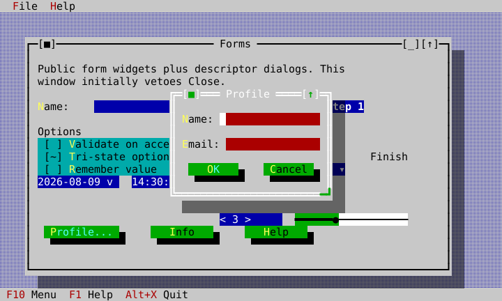
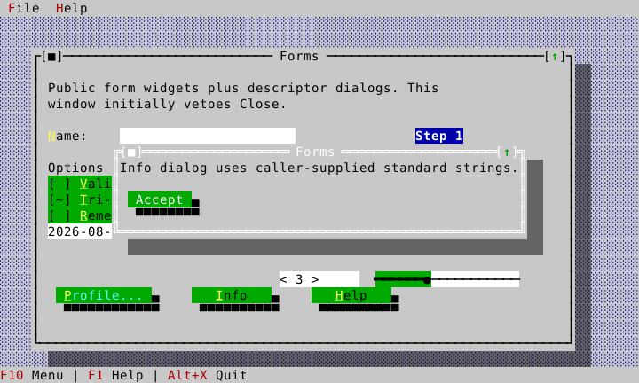
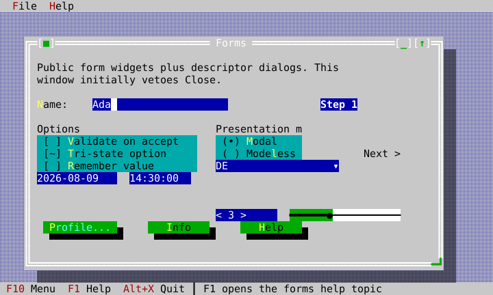



# Dialogs and commands

Declare a command once under a namespaced key, give it a title/chord/handler,
and render it through `CommandPresentation` in menus, toolbars, and status
lines. Use a standard presentation function for modal dialogs. This preserves
one execution path, one source of enablement, and typed completion rather than
scattered callbacks.

## Command presentation

`CommandRegistry::declare()` returns the `CommandId` it assigned to the key —
identity is the key, the id is a handle, and no application, widget or
extension library picks a number for itself (`docs/standard-commands.md`).
Hello declares its own application commands, while the larger examples attach
a handler to the framework's standard Quit command, `commands().standard().quit`.
The menu/status chrome is then simple data that references a command id.

<!-- ckvision-snippet source="examples/hello/hello_app.cpp" lines="14-30" -->
```cpp
HelloApp::HelloApp(ui::Application& app) : app_(app), roles_(ui::intern_standard_roles(app.roles())) {
    // Each command names itself; the registry hands back the id this
    // application then references. Nothing here picks a number.
    const ui::CommandId greeting_command = app_.commands().declare({.key = "hello.greeting", .title = "&Greeting...", .category = "Hello", .chord = "Alt+G", .handler = [this] { greeting_box(); }});
    // Its own quit command rather than the framework's, so this example
    // can present the concept as "Exit" in the reference vocabulary it
    // follows -- see docs/standard-commands.md on when that is the right
    // call and when CommandPresentation is.
    const ui::CommandId quit_command = app_.commands().declare({.key = "hello.quit", .title = "&Quit", .category = "Hello", .chord = "Alt+X", .handler = [this] { app_.request_quit(); }});
    widgets::ApplicationShell shell(app_, {.theme = ui::make_classic_theme(app_.roles(), roles_),
                                           .menus = {{"&File",
                                                      {widgets::MenuItem::command(widgets::CommandPresentation{greeting_command}),
                                                       widgets::MenuItem::separator(),
                                                       widgets::MenuItem::command(widgets::CommandPresentation{
                                                           app_.commands().standard().help, "&About..."}),
                                                       widgets::MenuItem::separator(),
                                                       widgets::MenuItem::command(widgets::CommandPresentation{quit_command, "E&xit"})}}},
```
<!-- /ckvision-snippet -->

Use `ApplicationShell` for a minimal common shell, or create `Desktop`,
`MenuBar`, and `StatusLine` directly when a larger app needs custom chrome.
The Gallery, Forms, and Workbench examples demonstrate the latter.

## Descriptor dialog with validation

The Forms app derives a descriptor from current state. Accept only completes
when each validator succeeds; invalid input retains modality and focus moves to
the failing field. Escape cancels.

Each button states its `ButtonRole`, which is what pressing it does to the
dialog around it:

| Role | Enter reaches it | Validates | Completion | Dialog |
|---|---|---|---|---|
| `Accept` | yes (the default button) | yes — a veto blocks the press | `accepted == true`, with every field's value | closes |
| `Dismiss` | no | no | `accepted == false`, no values | closes, exactly as Esc does |
| `Neutral` | no | no | — | stays up |

`Neutral` is the default, because it is the role that does nothing on its own:
Apply, Browse…, Reset. A Cancel button is therefore written `ButtonRole::Dismiss`
and needs no handler of its own — the role is the behaviour, and a button whose
only instruction was "not the default" used to be an inert control.

<!-- ckvision-snippet source="examples/forms/forms_app.cpp" lines="181-206" -->
```cpp
    help->set_bounds(Rect{33, 14, 12, 2});
    help->on_press = [this] { present_help(); };
    help_button_ = help.get();
    content->add_child(std::move(help));

    window->set_content(std::move(content));
    window_ = desktop_->add_window(std::move(window));
}

widgets::DialogDescriptor FormsApp::make_profile_dialog_descriptor() {
    widgets::DialogDescriptor descriptor;
    descriptor.title = "Profile";
    descriptor.resizable = true;
    descriptor.fields.push_back(widgets::FieldDescriptor{
        "&Name:", name_input_->text(),
        [this](const std::string& value) {
            ++validation_attempts_;
            return !value.empty();
        }});
    descriptor.fields.push_back(widgets::FieldDescriptor{"&Email:", "", [](const std::string& value) {
                                                             return value.find('@') != std::string::npos;
                                                         }});
    descriptor.buttons.push_back(widgets::ButtonDescriptor{"&OK", widgets::ButtonRole::Accept, nullptr});
    descriptor.buttons.push_back(widgets::ButtonDescriptor{"&Cancel", widgets::ButtonRole::Dismiss, nullptr});
    return descriptor;
}
```
<!-- /ckvision-snippet -->



## Fields that are not text

`FieldDescriptor::kind` selects what a field materializes as. `Text` is the
default; `Check` is a single checkbox carrying `label` as its own text; `Note`
is text the form states rather than asks. `Radio`, `Combo`, `Number`, `Date`,
and `Time` materialize their corresponding typed ckVision controls.

```cpp
descriptor.fields.push_back(widgets::FieldDescriptor{
    .label = "&Ask for a filename every time",
    .kind = widgets::FieldKind::Check,
    .initial_checked = true});
descriptor.fields.push_back(widgets::FieldDescriptor{
    .label = "  Otherwise each file is named from its job and the time.",
    .kind = widgets::FieldKind::Note});
```

`MaterializedDialog::labels`, `inputs`, `checks`, `radios`, `combos`, `numbers`,
`dates`, and `times`, and the corresponding typed `DialogResult` vectors, are
all parallel to `descriptor.fields`: field *i*'s widget and answer sit at index
*i* whatever kind it is, so a caller never counts kinds to find its own value.
The slots a field did not fill are null (or empty), and a `Check` field is
skipped by validation — it has no text to validate and no invalid state to
show. Date and time answers remain typed values; their canonical ISO strings in
`values` are a convenience for persistence and general validators.

A checkbox is ticked with `Space`. `Enter` is left to the form, so it reaches
the default button from anywhere in the dialog, a focused checkbox or radio
group included.

Notes take no focus, so `Tab` still moves between the fields a reader answers.
Consecutive notes lay out as one paragraph with no blank row between them: the
form's own spacing separates questions, not the lines of a sentence.

`Date` can be optional and carries an explicit deterministic seed. `Time`
supports 24-hour or 12-hour display and optional seconds. Both controls use
arrow-key segmented editing and remain ordinary labeled tab stops. A Date
field presented by the standard dialog host also opens ckVision's full
`CalendarDropdown` with Space or its visible dropdown affordance; calendar
selection updates the same typed `DateValue` returned by the dialog.

## Standard message boxes and strings

`present_message_box` owns the modal window and returns a typed presentation.
`StandardStrings` supplies application-local wording without global locale
state. The Forms app changes Ok/Cancel to `Accept`/`Dismiss`. A descriptor may
also carry immutable raster artwork with a requested cell size and explicit
cross-axis alignment; the shared factory retains Canvas' ordinary text
fallback, so an About-style identity panel remains usable without graphics.
`DialogDescriptor` likewise carries an optional measured minimum window size,
action alignment, and bottom-anchoring policy for forms whose whitespace is
part of their presentation rather than an accidental by-product of fields.



An alert opens at the width its message asks for: a short sentence gets a box
the size of the sentence, and a paragraph gets one no wider than the prose
measure described under
[StaticText](widget-gallery.md#statictext), however wide the terminal is. The
box is then as tall as its wrapped text, and widens past the measure only when
that would not fit the desktop's height — there is nothing to scroll in an
alert, so it grows rather than cutting its own text off. Use
`MessageBoxDescriptor::minimum_content_width` for an identity panel that wants
deliberate whitespace around compact content.

For file/directory selection, help, and window lists use the matching standard
presentation headers shown in [the API index](api-index.md#dialogs-and-client-services).

## Wizard: state-dependent Next

`WizardPage` receives a predicate that tells the Wizard whether Next is
currently permitted. Here Step 1 is unavailable until Name has text; entering
`Ada` produces the enabled state shown below. The predicate is reevaluated from
the actual control state, so a caller does not manually synchronize a button.

<!-- ckvision-snippet source="examples/forms/forms_app.cpp" lines="151-156" -->
```cpp
    spin_box_ = spin.get();
    content->add_child(std::move(spin));

    auto slider = std::make_unique<widgets::Slider>();
    slider->set_bounds(Rect{42, 13, 18, 1});
    slider->set_value(40);
```
<!-- /ckvision-snippet -->



## Focus and close policy

Give a standard dialog a completion handler and do work after that handler is
called. Do not retain a raw `Window*` as a completion mechanism. A modeless
window can use `close_request` to veto close when unsaved data must be handled;
the Forms example makes that policy visible. For details of focus restoration,
see [object model](object-model.md#modal-versus-modeless-surfaces).

