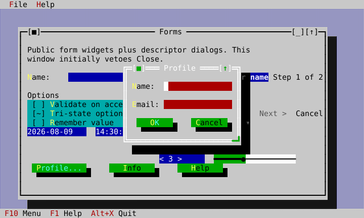
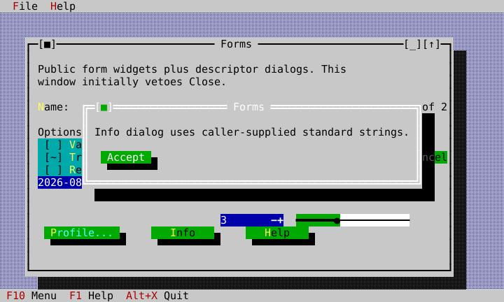
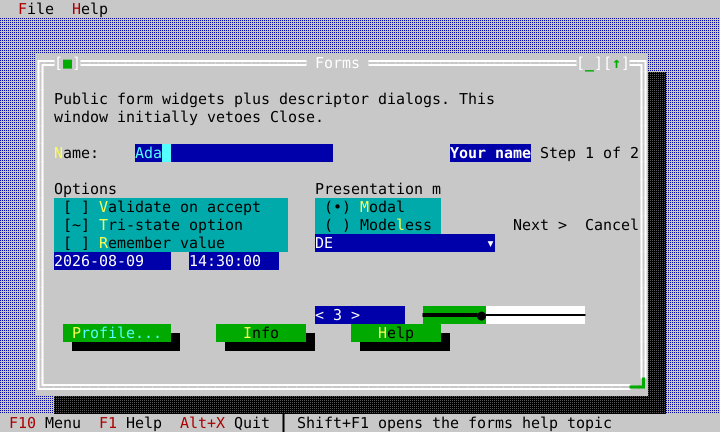

# Dialogs and commands

Declare a command once under a namespaced key, give it a title/chord/handler,
and render it through `CommandPresentation` in menus, toolbars, and status
lines. Use a standard presentation function for dialogs; its name states the
modality (`present_modal_message_box`, `exec_modal_file_dialog`,
`present_modeless_help_viewer`). This preserves one execution path, one source
of enablement, and typed completion rather than scattered callbacks.

## Command presentation

`CommandRegistry::declare()` returns the `CommandId` it assigned to the key —
identity is the key, the id is a handle, and no application, widget or
extension library picks a number for itself (`docs/standard-commands.md`).
Hello declares its own application commands, while the larger examples attach
a handler to the framework's standard Quit command, `commands().standard().quit`.
The menu/status chrome is then simple data that references a command id.

<!-- ckvision-snippet source="examples/hello/hello_app.cpp" lines="14-30" -->
```cpp
HelloApp::HelloApp(ui::Application& app) : app_(app), roles_(ui::intern_standard_roles(app.roles())) {
    // Each command names itself; the registry hands back the id this
    // application then references. Nothing here picks a number.
    const ui::CommandId greeting_command = app_.commands().declare({.key = "hello.greeting", .title = "&Greeting...", .category = "Hello", .chord = "Alt+G", .handler = [this] { greeting_box(); }});
    // Its own quit command rather than the framework's, so this example
    // can present the concept as "Exit" in the reference vocabulary it
    // follows -- see docs/standard-commands.md on when that is the right
    // call and when CommandPresentation is.
    const ui::CommandId quit_command = app_.commands().declare({.key = "hello.quit", .title = "&Quit", .category = "Hello", .chord = "Alt+X", .handler = [this] { app_.request_quit(); }});
    widgets::ApplicationShell shell(app_, {.theme = ui::make_classic_theme(app_.roles(), roles_),
                                           .menus = {{"&File",
                                                      {widgets::MenuItem::command(widgets::CommandPresentation{greeting_command}),
                                                       widgets::MenuItem::separator(),
                                                       widgets::MenuItem::command(widgets::CommandPresentation{
                                                           app_.commands().standard().help, "&About..."}),
                                                       widgets::MenuItem::separator(),
                                                       widgets::MenuItem::command(widgets::CommandPresentation{quit_command, "E&xit"})}}},
```
<!-- /ckvision-snippet -->

Use `ApplicationShell` for a minimal common shell, or create `Desktop`,
`MenuBar`, and `StatusLine` directly when a larger app needs custom chrome.
The Gallery, Forms, and Workbench examples demonstrate the latter.

## Descriptor dialog with validation

The Forms app derives a descriptor from current state. Accept only completes
when each validator succeeds; invalid input retains modality and focus moves to
the failing field. Escape cancels.

Each button states its `ButtonRole`, which is what pressing it does to the
dialog around it:

| Role | Enter reaches it | Validates | Completion | Dialog |
|---|---|---|---|---|
| `Accept` | yes (the default button) | yes — a veto blocks the press | `accepted == true`, with every field's value | closes |
| `Dismiss` | no | no | `accepted == false`, no values | closes, exactly as Esc does |
| `Neutral` | no | no | — | stays up |

`Neutral` is the default, because it is the role that does nothing on its own:
Apply, Browse…, Reset. A Cancel button is therefore written `ButtonRole::Dismiss`
and needs no handler of its own — the role is the behaviour, and a button whose
only instruction was "not the default" used to be an inert control.

<!-- ckvision-snippet source="examples/forms/forms_app.cpp" region="forms-profile-descriptor" -->
```cpp
widgets::DialogDescriptor FormsApp::make_profile_dialog_descriptor() {
    widgets::DialogDescriptor descriptor;
    descriptor.title = "Profile";
    descriptor.resizable = true;
    descriptor.fields.push_back(widgets::FieldDescriptor{
        "&Name:", name_input_->text(),
        [this](const std::string& value) {
            ++validation_attempts_;
            return !value.empty();
        }});
    descriptor.fields.push_back(widgets::FieldDescriptor{"&Email:", "", [](const std::string& value) {
                                                             return value.find('@') != std::string::npos;
                                                         }});
    descriptor.buttons.push_back(widgets::ButtonDescriptor{"&OK", widgets::ButtonRole::Accept, nullptr});
    descriptor.buttons.push_back(widgets::ButtonDescriptor{"&Cancel", widgets::ButtonRole::Dismiss, nullptr});
    return descriptor;
}
```
<!-- /ckvision-snippet -->



The labels that stand beside a control — every field but a `Check`, a `Note`
and a stacked `Radio`, which captions its own choices above them — form one
column as wide as the widest of them, so each control starts at the same
place and the answers read straight down the form. A `Radio` laid out in
`columns` whose choices share one row is labelled beside that row like any
other field; a stacked list keeps its caption above however many entries it
holds, so a form does not change shape with the number it offers.

## Fields that are not text

`FieldDescriptor::kind` selects what a field materializes as. `Text` is the
default; `Check` is a single checkbox carrying `label` as its own text; `Note`
is text the form states rather than asks. `Memo` is a multi-line, word-wrapped
text field; use `memo_rows` to request its visible height (five rows by
default). `Radio`, `Combo`, `Number`, `Date`, and `Time` materialize their
corresponding typed ckVision controls. A `Radio` field's `label` captions its
choices, mnemonic included, and `columns` lets the choices flow into columns:
a form that asks "keep, on, off or reset" of four properties names four
columns and takes four rows for it rather than twenty.

```cpp
descriptor.fields.push_back(widgets::FieldDescriptor{
    .label = "&Ask for a filename every time",
    .kind = widgets::FieldKind::Check,
    .initial_checked = true});
descriptor.fields.push_back(widgets::FieldDescriptor{
    .label = "  Otherwise each file is named from its job and the time.",
    .kind = widgets::FieldKind::Note});
```

`MaterializedDialog::labels`, `inputs`, `memos`, `checks`, `radios`, `combos`,
`numbers`, `dates`, and `times`, and the corresponding typed `DialogResult` vectors, are
all parallel to `descriptor.fields`: field *i*'s widget and answer sit at index
*i* whatever kind it is, so a caller never counts kinds to find its own value.
The slots a field did not fill are null (or empty), and a `Check` field is
skipped by validation — it has no text to validate and no invalid state to
show. A Memo's complete multi-line text is returned in `values` and receives
the same accept-time validation and invalid styling as an InputLine. Date and
time answers remain typed values; their canonical ISO strings in `values` are a
convenience for persistence and general validators.

A checkbox is ticked with `Space`. `Enter` is left to the form, so it reaches
the default button from anywhere in the dialog, a focused checkbox or radio
group included.

Notes take no focus, so `Tab` still moves between the fields a reader answers.

A `Text`, `Number` or `Combo` field may name a `history_key`: a list in the
application's history registry (`Application::history()`), shared with every
input line, combo box, search box and dialog field that names the same key.
The field recalls the list's entries with Up and Down, and accepting the dialog
records its answer as the newest entry — a Find dialog's field offers what was
searched for last, whichever surface it was typed into.

```cpp
descriptor.fields.push_back(widgets::FieldDescriptor{
    .label = "&Find:", .history_key = "editor.find"});
```

## Describing the focused field

A form with more fields than room for a line of help beside each can keep one
explanation in view instead. Give each field a `description` and reserve rows
for it with `DialogDescriptor::field_description_rows`: a panel between the
fields and the buttons shows the focused field's description, word-wrapped and
broken at `'\n'`, and keeps the last one while a button has the focus. The
panel never scrolls with the fields, so the explanation stays beside whichever
field the reader is on however long the form is.

```cpp
descriptor.field_description_rows = 3;
descriptor.fields.push_back(widgets::FieldDescriptor{
    .label = "&Network name",
    .description = "The network's SSID, exactly as it is broadcast.\nExample: Home"});
```

## Checking the whole answer

A field's `validate` answers for its own text. What only the whole answer can
be wrong about — an abbreviation with no expansion, a range whose end comes
before its start — goes in `DialogDescriptor::check`, which runs when the reader
accepts and every field has passed, with the `DialogResult` the dialog would
complete with. Returning a `DialogVeto` keeps the dialog open with everything
the reader entered: the field it names is marked and takes the focus, and its
message stands in the description panel until the focus moves on. A descriptor
with a check always has that panel, two rows tall when it reserved none.

```cpp
descriptor.check = [](const widgets::DialogResult& answers) -> std::optional<widgets::DialogVeto> {
    if (answers.selected[0] == kAbbreviation && answers.values[1].empty())
        return widgets::DialogVeto{"An abbreviation needs its expansion.", 1};
    return std::nullopt;
};
```
Consecutive notes lay out as one paragraph with no blank row between them: the
form's own spacing separates questions, not the lines of a sentence.

Inside a Memo, `Enter` creates a line break. The form's default action remains
available by Tab navigation or pointer, rather than making a prose editor lose
its ordinary newline key.

`Date` can be optional and carries an explicit deterministic seed, a
`date_format` and a `date_time_labels` table (see
[Date and time dialogs](#date-and-time-dialogs)). `Time` supports 24-hour or
12-hour display, with the table's meridiem words, and optional seconds. Both controls use
arrow-key segmented editing and remain ordinary labeled tab stops. A Date
field presented by the standard dialog host also opens ckVision's full
`CalendarDropdown` with Space or its visible dropdown affordance; calendar
selection updates the same typed `DateValue` returned by the dialog.

## Standard message boxes and strings

`present_modal_message_box` owns the modal window and returns a typed presentation.
`StandardStrings` supplies application-local wording without global locale
state. The Forms app changes Ok/Cancel to `Accept`/`Dismiss`. A descriptor may
also carry immutable raster artwork with a requested cell size and explicit
cross-axis alignment; the shared factory retains Canvas' ordinary text
fallback, so an About-style identity panel remains usable without graphics.
`DialogDescriptor` likewise carries an optional measured minimum window size,
action alignment, and bottom-anchoring policy for forms whose whitespace is
part of their presentation rather than an accidental by-product of fields.



An alert opens at the width its message asks for: a short sentence gets a box
the size of the sentence, and a paragraph gets one no wider than the prose
measure described under
[StaticText](widget-gallery.md#statictext), however wide the terminal is. The
box is then as tall as its wrapped text, and widens past the measure only when
that would not fit the desktop's height — there is nothing to scroll in an
alert, so it grows rather than cutting its own text off. Use
`MessageBoxDescriptor::minimum_content_width` for an identity panel that wants
deliberate whitespace around compact content.

For file/directory selection, help, window lists, and theme editing use the
matching standard presentation headers shown in
[the API index](api-index.md#dialogs-and-client-services); the theme editor's
round trip, saving included, is in
[Themes and rendering](themes-and-rendering.md#the-theme-editor).

A presentation's completion handler runs only while the presentation is kept.
An application with a handful of dialogs keeps one member per dialog; one that
asks many questions keeps a single
[`PendingDialogs`](widget-gallery.md#pendingdialogs) and hands it every
presentation together with what to do with the answer. Each is released when
its answer arrives and before that answer runs, so a confirmation can present
the error box that follows it without a second member to hold it.

## Wizard: state-dependent Next

`WizardPage` receives a predicate that tells the Wizard whether Next is
currently permitted. Here the first page is unavailable until Name has text;
entering `Ada` produces the enabled state shown below. The predicate is
reevaluated from the actual control state, so a caller does not manually
synchronize a button. The top row names the page and where it stands ("Step 1
of 2"); the bottom row offers `< Back`, `Next >` or `Finish`, and `Cancel`, by
key and by click. The words are the host's, through `WizardLabels`.

How the flow ended is typed: `on_complete` receives `WizardOutcome::Finished`
or `WizardOutcome::Cancelled`. A wizard that is a dialog of its own is
presented rather than embedded, and then completes like every standard dialog,
without blocking and exactly once, after its window has gone:

```cpp
auto wizard = std::make_unique<widgets::Wizard>();
auto name = std::make_unique<widgets::InputLine>();
const widgets::InputLine* name_field = name.get();
wizard->set_pages({widgets::WizardPage{"Name", [name_field] { return !name_field->text().empty(); }},
                   widgets::WizardPage{"Confirm", {}}});
wizard->set_page_content(0, std::move(name));
pending_.await(widgets::present_modal_wizard(std::move(wizard), "New project", app, desktop, roles),
               [](widgets::WizardOutcome outcome) {
                   if (outcome == widgets::WizardOutcome::Finished) { /* create it */ }
               });
```

The page callbacks run while the window is up, so whatever they capture must
outlive it; the page content itself is owned by the wizard.

<!-- ckvision-snippet source="examples/forms/forms_app.cpp" region="forms-wizard" -->
```cpp
auto wizard = std::make_unique<widgets::Wizard>();
wizard->set_bounds(Rect{45, 4, 21, 5});
wizard->set_pages({widgets::WizardPage{"Your name", [this] { return !name_input_->text().empty(); }},
                   widgets::WizardPage{"Review", [] { return true; }}});
wizard->on_complete = [this](widgets::WizardOutcome outcome) { wizard_outcome_ = outcome; };
wizard_ = wizard.get();
content->add_child(std::move(wizard));
```
<!-- /ckvision-snippet -->



## Date and time dialogs

`present_modal_date_dialog` and `present_modal_time_dialog` are the standard ways to ask
for one date or one time. The date dialog offers a month picker and an
editable year field over a CalendarView; the time dialog a TimePicker. Each
completes with a typed result — `DateDialogResult` or `TimeDialogResult`,
`accepted` and the value — once its window has gone. Neither reads a clock or
a locale: the day it opens on, today's mark and the range are the caller's,
and every word comes from explicit tables, English by default: month and
weekday names and the meridiem from `DateTimeLabels`, the titles and buttons
from `StandardStrings`.

```cpp
widgets::DateDialogOptions options;
options.initial = due_date;
options.today = injected_today();
options.labels = german_labels();  // "März", "Mo Di Mi …"
pending_.await(widgets::present_modal_date_dialog(app, desktop, roles, std::move(options), german_strings),
               [this](widgets::DateDialogResult answer) {
                   if (answer.accepted) set_due_date(answer.date);
               });
```

A year typed into the date dialog that the calendar cannot draw is refused as
it is in any editable SpinBox: marked, with its reason standing under the
calendar, and OK vetoed with the field focused until it is corrected — the
same rule as a failing field in a descriptor form.


A descriptor form's `Date` field is the same DatePicker the gallery shows; its
`date_format` says how the date is written, shown and typed
(`DateFormat`: field order, separator, month by number or by name, or a
caller's own `format`/`parse` callbacks), and `date_time_labels` gives its
words. A typed date the field cannot read keeps the form open when the reader
accepts: the field takes the focus and the reason stands in the description
panel, exactly as a `DialogVeto` does. The answer's `values` text stays
canonical `YYYY-MM-DD` whatever the format.

## Focus and close policy

Give a standard dialog a completion handler and do work after that handler is
called. Do not retain a raw `Window*` as a completion mechanism. A modeless
window can use `close_request` to veto close when unsaved data must be handled;
the Forms example makes that policy visible. For details of focus restoration,
see [object model](object-model.md#modal-versus-modeless-surfaces).
