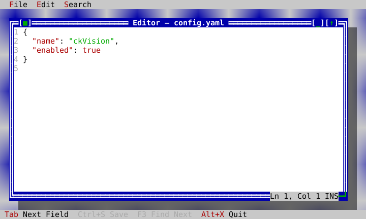
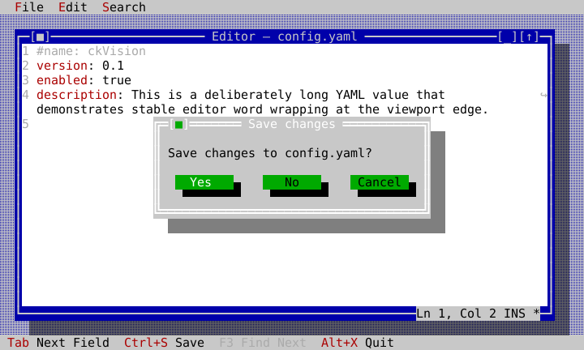

# Text and source editing

`Memo` is a compact form control. Use `EditorDocument` and `TextEditor` when
the application edits a real document: selections are revision-bound,
undo/redo is document-wide, syntax styling is profile-driven, and a file
workflow remains explicit through an injected `FileSystem`.


The source is compact but complete: [`editor_app.hpp`](../examples/editor/editor_app.hpp),
[`editor_app.cpp`](../examples/editor/editor_app.cpp), and
[`main.cpp`](../examples/editor/main.cpp). The application owns the document,
profile registry, injected filesystem/controller, Desktop, and Window; the
Window owns the TextEditor and its status overlay.

Build and run the actual example on a POSIX host:

```sh
cmake -S . -B build
cmake --build build --target ckvision_editor
./build/examples/ckvision_editor
```

Its ownership is deliberately ordinary and explicit:

```text
Application
└─ EditorApp
   ├─ EditorDocument (shared model)
   ├─ SyntaxProfileRegistry
   ├─ MemoryFileSystem → FileEditorController
   └─ Desktop → Window → TextEditor + status frame overlay
```

```cpp
auto document = std::make_shared<widgets::EditorDocument>("name: ckVision\n");
widgets::SyntaxProfileRegistry profiles;
widgets::register_standard_syntax_profiles(profiles);

auto editor = std::make_unique<widgets::TextEditor>(document, &profiles);
editor->set_file_name("config.yaml");
editor->set_show_line_numbers(true);
window->set_content(std::move(editor));
```

The application owns the shared document and profile registry; `TextEditor`
borrows both. A document can therefore be used by more than one editor, a
search panel, and a file controller without global state or widget-local copies.

For the common one-window case, `EditorWindow` composes a `Window`,
`TextEditor`, `FileEditorController`, dirty title, and bottom-frame status
overlay. Its normal close request vetoes a dirty document; map a client's
Save/Discard/Cancel UI to `request_close()` before calling `close()`. The
lower-level `EditorDocument`, `TextEditor`, and `FileEditorController` remain
available for applications with a different shell.
`EditorWindow::open(path, EditorOpenOptions{...})` forwards the same explicit
malformed-input policy as the lower-level controller, rather than adding a
second, implicit conversion rule.

`set_word_wrap(true)` reflows only the viewport: it never adds document
newlines or changes the stable logical line/column reported by `status()`.
Each continued display row ends in `↪`, so a wrapped source line is visibly
distinct from a real line ending. The shipped editor example enables wrap and
puts its live `Ln <line>, Col <column>` status in a bottom-right window-frame
overlay; resizing and reflow therefore do not make the position ambiguous.
The focused editor also publishes a terminal caret: a bar in insert mode and a
block in overwrite mode. Arrow keys move by grapheme, Ctrl+Left/Right by word,
Ctrl+Home/End by document, and Tab inserts four spaces into the document.
Adding Shift extends the primary selection for every cursor movement, including
Ctrl+Shift+Left/Right/Home/End. Ctrl+C/X/V use the application clipboard;
Ctrl+Insert/Shift+Insert are equivalent copy/paste bindings, and Shift+Delete
cuts the selection. Delete and Backspace erase a selection or one grapheme,
while Ctrl+Delete and Ctrl+Backspace erase forward/backward by word.
`set_read_only(true)` leaves navigation and selection available but rejects
mutation; inherited `set_enabled(false)` rejects keyboard, text, and mouse
editing input entirely.
`EditorStatus` also exposes the shared document's UTF-8 encoding and preferred
LF/CRLF/CR newline form, so a client status line can report format without
re-reading or parsing the file.
`EditorStatusModel` subscribes to one `TextEditor` and mirrors those snapshots
for a client-owned status bar, frame overlay, or other presentation; it has no
window ownership or global registration requirement.

For a large source file, profile work need not run as one unbounded task.
`SyntaxCache::update_bounded(profile, lines, maximum_lines)` relexes no more
than the requested number of logical lines. A false
`SyntaxRelexReport::reached_fixed_point` means the client should schedule
another ordinary application task with the same current lines; the cache
resumes deterministically at its recorded invalidation point. `update()` is
the complete-pass convenience for small documents and documentation tooling.

Mouse drag selection remains active while the pointer leaves the editor's top
or bottom edge: the viewport scrolls one display row per move event and the
selection continues from the clamped edge cell. This keeps drag selection
deterministic in terminals without timer-driven mouse auto-repeat.
An explicit host-provided double-click selects the clicked ASCII source word
(or a single non-word grapheme). ckVision does not synthesize double-clicks
from wall-clock timing.

## Positions and edits

`DocumentPosition` carries both a byte offset and the document revision that
created it. Obtain positions through `position_at_byte()` or
`position_at_line_column()`; both reject a byte inside a grapheme cluster.
`replace()` rejects stale positions instead of applying an offset to changed
text. Use `DocumentTransaction` to make several non-overlapping edits against
one revision and advance the revision once.

Line/column and byte-position lookup use the persistent piece tree's byte and
newline aggregates. A local edit therefore does not need to materialize the
entire document merely to locate a line or validate a grapheme boundary.

The document stores valid UTF-8 and normalizes line endings to LF internally.
Malformed UTF-8 is rejected by default; applications that deliberately choose
replacement must set `EditorDocumentOptions::invalid_utf8` to `Replace`.
The document records a leading UTF-8 BOM separately from editable text and
remembers the first observed line-ending convention. `FileEditorController`
uses those explicit metadata values to write a UTF-8 BOM and CRLF/CR/LF form
back on save. `max_document_bytes` is an optional atomic document limit: an
oversize `set_text()` or transaction returns `LimitExceeded` without changing
the document or its revision.

`FileEditorController::open(path)` also rejects malformed UTF-8 by default.
Pass `EditorOpenOptions{InvalidUtf8Policy::Replace}` only when the client has
made an explicit replacement decision for that particular load.
It also refuses to replace a modified document by default. After the client
has presented Save/Discard/Cancel and the user chose Discard, pass
`EditorOpenOptions{.modified_document = EditorOpenModifiedPolicy::Discard}`
to perform that separately confirmed replacement.

Built-in profiles use explicit ASCII source-language grammar classification;
they never consult the host locale. Non-ASCII source text is retained by the
document and safely styled as plain/error text when a deliberately compact
profile has no corresponding rule.
`EditorDocumentOptions::invalid_utf8` explicitly selects replacement or
rejection. The detected input newline style is retained as
`preferred_newline()` for a file controller to preserve on save.

## Profiles and highlighting

`SyntaxProfileRegistry` is instance-owned. Register the standard profiles with
`register_standard_syntax_profiles()` for Plain text, JSON, YAML, and Bash.
Automatic detection uses an explicit requested profile, file suffix, content
prefix, and shebang; it never reads environment variables. A profile consists
of a stable ID, detector, and `SyntaxLineHighlighter`, so an application can
register another language without private headers.



Highlighters return semantic `SyntaxSpan` values for one logical line and a
next lexical state. `TextEditor` turns those categories into semantic theme
roles (`ckv.editor.syntax.*`) while preserving selection priority.
The editor smoke suite also verifies that an active search selection and caret
survive all four built-in schemes after the retained tree is explicitly
invalidated for the theme change.

`SyntaxCache` is the deterministic incremental layer behind `TextEditor`.
It retains each line's incoming state, spans, and outgoing state; after an
edit it relexes forward only until an unchanged line has the same lexical
input and output again. Invalid or grapheme-splitting spans from an extension
are rejected before painting, so a highlighter cannot create a partial-glyph
style boundary.

To add a profile, construct a `LanguageProfile` with a stable identifier, a
detector that examines only `LanguageDetectionInput`, and a total
`highlight_line` function. The detector must return an explicit score and
reason; automatic selection uses the highest score, then stable identifier
order for a tie. A line highlighter receives the prior lexical-state string,
returns only grapheme-boundary spans within that line, and supplies the next
state. Register it on the application-owned `SyntaxProfileRegistry`; nothing
is process-global. The shipped JSON, YAML, and Bash profiles demonstrate
suffix, content-prefix, and shebang detection respectively.

The complete [INI extension sample](../examples/editor/profile_sample.cpp)
compiles and runs in the test suite using only this public API. Its essential
shape is deliberately small:

```cpp
SyntaxProfileRegistry profiles;
register_standard_syntax_profiles(profiles);
profiles.register_profile(LanguageProfile{
    "ini", "INI",
    [](const LanguageDetectionInput& input) {
        return input.file_name.ends_with(".ini") ? LanguageDetection{90, "file suffix"}
                                                   : LanguageDetection{};
    },
    [](std::string_view line, std::string_view state) {
        SyntaxLineResult result;
        result.next_state = std::string(state);
        if (const auto equals = line.find('='); equals != std::string_view::npos) {
            result.spans.push_back({0, equals, SyntaxTokenKind::Property});
            result.spans.push_back({equals, equals + 1U, SyntaxTokenKind::Operator});
        }
        return result;
    }});
```

## Search and files

`EditorSearch::find_all()` and `replace_all()` provide deterministic literal
search. Replace-all creates one document transaction: stale positions or an
invalid edit leave the document unchanged. There is intentionally no implicit
regular-expression engine. Case-insensitive and whole-word searches use
explicit ASCII source-token rules (`A`–`Z`, `a`–`z`, digits, and `_`), never
the host locale; every returned match still begins and ends on grapheme
boundaries.

`FileEditorController` receives both the document and `FileSystem`. Its
`open()` and `save()` operations use file fingerprints and atomic write
requests; they refuse to overwrite a changed-on-disk file. `save_as(path)`
creates a new path only; an existing target returns `Conflict` unless the
caller deliberately supplies `EditorSaveAsPolicy::Overwrite`, which is itself
fingerprint-checked. The controller
does not access the host filesystem directly, which makes its full lifecycle
testable with `MemoryFileSystem`. Before a window closes, map its
Save/Discard/Cancel dialog result to `request_close()`; a dirty document never
silently closes or overwrites a detected external change.
Opening a different file follows the same rule: the default open returns
`Conflict` while the document is dirty, and only an already-confirmed discard
may opt into `EditorOpenModifiedPolicy::Discard`.

The shipped editor opens `config.yaml` from its injected in-memory filesystem
through this controller. Its File/Save command uses the same atomic workflow
and becomes available only after an edit, which keeps the example deterministic
while showing the exact client-side lifetime and command wiring.

The File > Open Sample submenu drives that same controller path for
`config.yaml`, `settings.json`, `sample.sh`, and `notes.txt`. It is a runnable
profile-detection tour: YAML, JSON, Bash, and the plain-text fallback are each
selected from explicit filename/content metadata, with no host probing.

| Command | Where | What it proves |
|---|---|---|
| Save (`Ctrl+S`) | File menu and status line | injected atomic save and dirty enablement |
| Open Sample | File submenu | YAML/JSON/Bash detection and plain fallback |
| Undo/Redo, Cut/Copy/Paste | Edit menu | document transaction and clipboard paths |
| Find Selection (`Ctrl+F`), Find Next (`F3`) | Search menu and status line | revision-bound literal search |
| Word Wrap (`Alt+W`) | Edit menu | viewport-only reflow and stable logical position |
| Quit (`Alt+X`) | File menu and status line | application exit routing |

Its window-close request uses a non-blocking Save/Discard/Cancel confirmation:
Save invokes `request_close(EditorCloseChoice::Save)`, Discard invokes the
explicit discard choice, and Cancel leaves the document and window untouched.
The modal dialog scopes background commands while it is open.

The `TextEditor` search facade keeps the current query and highlights all
revision-current matches. `Ctrl+F` uses the current selection as the literal
query, `F3` selects the next match, and `Shift+F3` selects the previous match.
Applications can call `replace_current_search_match()` or
`replace_all_search_matches()` for their own replacement UI; the latter stays
one document undo operation. The shipped example’s Edit and Search menus use
the same public methods and command enablement predicates.




See [platform services](platform-services.md) for injected host services and
[the widget gallery](widget-gallery.md#texteditor) for the public types.
