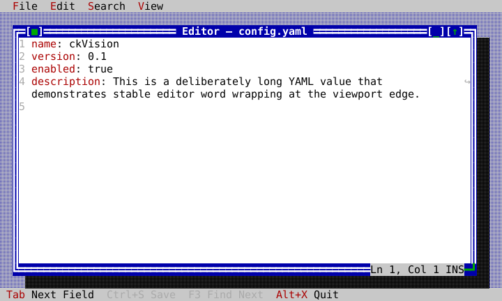
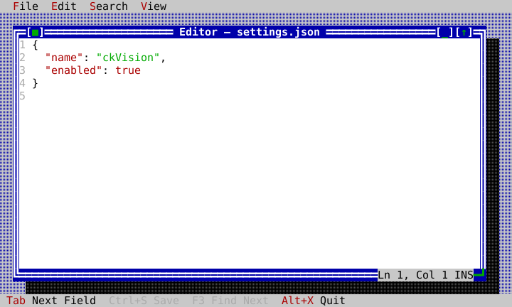
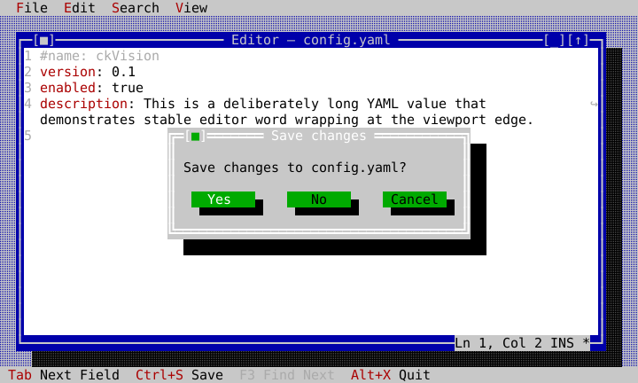

# Text and source editing

`Memo` is a compact form control. Use `EditorDocument` and `TextEditor` when
the application edits a real document: selections are revision-bound,
undo/redo is document-wide, syntax styling is profile-driven, and a file
workflow remains explicit through an injected `FileSystem`.



The source is compact but complete: [`editor_app.hpp`](../examples/editor/editor_app.hpp),
[`editor_app.cpp`](../examples/editor/editor_app.cpp), and
[`main.cpp`](../examples/editor/main.cpp). The application owns the document,
profile registry, injected filesystem/controller, Desktop, and Window; the
Window owns the TextEditor and its status overlay.

Build and run the actual example on a POSIX host:

```sh
cmake -S . -B build
cmake --build build --target ckvision_editor
./build/examples/ckvision_editor
```

Its ownership is deliberately ordinary and explicit:

```text
Application
└─ EditorApp
   ├─ EditorDocument (shared model)
   ├─ SyntaxProfileRegistry
   ├─ MemoryFileSystem → FileEditorController
   └─ Desktop → Window → TextEditor + status frame overlay
```

```cpp
auto document = std::make_shared<widgets::EditorDocument>("name: ckVision\n");
widgets::SyntaxProfileRegistry profiles;
widgets::register_standard_syntax_profiles(profiles);

auto editor = std::make_unique<widgets::TextEditor>(document, &profiles);
editor->set_file_name("config.yaml");
editor->set_show_line_numbers(true);
window->set_content(std::move(editor));
```

The application owns the shared document and profile registry; `TextEditor`
borrows both. A document can therefore be used by more than one editor, a
search panel, and a file controller without global state or widget-local copies.

For the common one-window case, `EditorWindow` composes a `Window`,
`TextEditor`, `FileEditorController`, dirty title, and bottom-frame status
overlay. Its normal close request vetoes a dirty document; map a client's
Save/Discard/Cancel UI to `request_close()` before calling `close()`. The
lower-level `EditorDocument`, `TextEditor`, and `FileEditorController` remain
available for applications with a different shell.
`EditorWindow::open(path, EditorOpenOptions{...})` forwards the same explicit
malformed-input policy as the lower-level controller, rather than adding a
second, implicit conversion rule.

`set_word_wrap(true)` reflows only the viewport: it never adds document
newlines or changes the stable logical line/column reported by `status()`.
Each continued display row ends in `↪`, so a wrapped source line is visibly
distinct from a real line ending. The shipped editor example enables wrap and
puts its live `Ln <line>, Col <column>` status in a bottom-right window-frame
overlay; resizing and reflow therefore do not make the position ambiguous.
The focused editor also publishes a terminal caret: a bar in insert mode and a
block in overwrite mode. Arrow keys move by grapheme, Ctrl+Left/Right by word,
Ctrl+Home/End by document, and Tab inserts `tab_width()` spaces — four unless
`set_tab_width()` says otherwise. Up and Down return to the column the caret
left: moving down through a short line and on to a long one lands where the
walk started, and only horizontal motion or an edit sets a new column.
PageUp and PageDown move the caret by the viewport less one row and scroll the
view with it, so the caret keeps its place on screen; with Shift they select
the paged range.
Printable character events insert their terminal-provided UTF-8 text; Shift is
part of normal text production, so uppercase and shifted symbols insert just
like unshifted text, while Alt/Ctrl/Super character chords remain available to
commands.
Adding Shift extends the primary selection for every cursor movement, including
Ctrl+Shift+Left/Right/Home/End. Ctrl+C/X/V use the application clipboard;
Ctrl+Insert/Shift+Insert are equivalent copy/paste bindings, and Shift+Delete
cuts the selection. Delete and Backspace erase a selection or one grapheme,
while Ctrl+Delete and Ctrl+Backspace erase forward/backward by word.
`set_read_only(true)` leaves navigation and selection available but rejects
mutation; inherited `set_enabled(false)` rejects keyboard, text, and mouse
editing input entirely.
`EditorStatus` also exposes the shared document's UTF-8 encoding and preferred
LF/CRLF/CR newline form, so a client status line can report format without
re-reading or parsing the file.
`EditorStatusModel` subscribes to one `TextEditor` and mirrors those snapshots
for a client-owned status bar, frame overlay, or other presentation; it has no
window ownership or global registration requirement.

For a large source file, profile work need not run as one unbounded task.
`SyntaxCache::update_bounded(profile, lines, maximum_lines)` relexes no more
than the requested number of logical lines. A false
`SyntaxRelexReport::reached_fixed_point` means the client should schedule
another ordinary application task with the same current lines; the cache
resumes deterministically at its recorded invalidation point. `update()` is
the complete-pass convenience for small documents and documentation tooling.

Mouse drag selection remains active while the pointer leaves the editor's top
or bottom edge: the viewport scrolls one display row per move event and the
selection continues from the clamped edge cell. This keeps drag selection
deterministic in terminals without timer-driven mouse auto-repeat.
An explicit host-provided double-click selects the clicked ASCII source word
(or a single non-word grapheme). ckVision does not synthesize double-clicks
from wall-clock timing.

## Commands and key bindings

The verbs a reader also finds in an Edit or Search menu — undo, redo, cut,
copy, paste, select all, find the selection, find next and previous, and the
overwrite toggle — are `EditorCommand` values, and the chords that run them are
data. `default_editor_key_bindings()` is what every editor starts with:

| Chord | Command |
|---|---|
| Ctrl+Z / Ctrl+Y | Undo / Redo |
| Ctrl+X, Shift+Delete | Cut |
| Ctrl+C, Ctrl+Insert | Copy |
| Ctrl+V, Shift+Insert | Paste |
| Ctrl+A | SelectAll |
| Ctrl+F | FindSelection |
| F3 / Shift+F3 | FindNext / FindPrevious |
| Insert | ToggleOverwrite |

A focused view sees a key before the application's command keymap, so an
editor that answered Ctrl+F itself would keep the chord from an application
whose own Find lives there. `set_key_bindings()` replaces the list: an
application that owns its commands and keyboard scheme gives the editor the
bindings it wants — often none — and runs the same verbs through
`TextEditor::perform()` from its own command handlers. A chord the editor does
not bind reaches the keymap like any other key. `perform()` reports whether the
verb did anything, so an undo with nothing to undo is visibly a no-op.

## Edit requests

Every change the reader asks for — typing, a paste, Enter, Tab, the four
deletions, a cut — is described as an `EditRequest` before anything is
committed: its `EditKind`, the text the reader supplied, the current range the
editor would replace, and the replacement it would put there (including any
padding a virtual caret needs). `set_edit_handler()` receives each request
first. Return `true` after handling it — typically by committing a transaction
of the host's own and restoring a current selection with `set_selection()` —
and the editor commits nothing; return `false`, having changed nothing, and the
editor commits `replacement` over `range` itself.

That one seam serves two kinds of host. One keeps its own editing rules —
a language-aware line break, a session whose undo steps are named "Typing",
"Paste" or "Cut" and which decides what folds into one step — and acts on the
request's intent. The other only wants to observe or veto, and commits the
described replacement. The handler is never called for a read-only or disabled
editor, so a rule cannot bypass either safeguard.

## A caret past the text

With `set_virtual_space(true)`, a double-click right of a line's end, or below
the last line, places a `VirtualCaret` there instead of snapping to the
nearest position. Nothing is written: the status reports the provisional
line and column (`EditorStatus::virtual_caret` says it is one), and the
terminal caret sits in the blank cell. The first text to arrive — typed,
pasted, a line break or an indent — supplies the line breaks and spaces needed
to reach that cell together with the text, as one edit. Any caret motion, a
click elsewhere, or a deletion abandons the provisional caret and leaves the
document byte-identical. A host restoring one after its own transaction calls
`set_virtual_caret()`, which refuses a position that is not past the text.

## Host colouring

A syntax profile lexes one line at a time, which suits source languages. A host
that already parses the whole document — whose colouring depends on context a
line lexer cannot see — hands the editor its own result instead:
`set_highlights(revision, spans)` takes ordered, non-overlapping
`HighlightSpan`s over the document's current revision, each naming a theme
role. They replace the profile's colouring entirely; text they leave unmarked
is plain text. A span for a stale revision is refused. An edit keeps the spans
it does not touch, shifted with the text, and drops the ones it overlaps, so an
asynchronous host never flashes the whole document plain while it recomputes.
`clear_highlights()` returns to the profile. A grapheme takes the style of the
span that contains its first byte. Selection and search matches still paint
over host colouring.

## Context menus

`set_context_menu_handler()` is asked for a menu on a right click, on a
Ctrl+click — for terminals that keep the right button for their own selection
— and on Shift+F10. A click first places the caret at the clicked cell unless
it lands inside the selection, so the menu acts on what the reader pointed at.
The handler receives the screen cell the menu belongs at and typically calls
`show_context_menu()`. Without a handler those events are not the editor's.

## Positions and edits

`DocumentPosition` carries both a byte offset and the document revision that
created it. Obtain positions through `position_at_byte()` or
`position_at_line_column()`; both reject a byte inside a grapheme cluster.
`replace()` rejects stale positions instead of applying an offset to changed
text. Use `DocumentTransaction` to make several non-overlapping edits against
one revision and advance the revision once.

Every change notifies observers with one `DocumentChange` describing a single
covering replacement: the old bytes `[replaced_begin_byte, replaced_end_byte)`
became the `inserted_bytes` bytes that now start at `replaced_begin_byte`. A
transaction of several separated edits is reported as the span from its first
edit to its last, and an undo or redo as the whole document, so an observer
carries a position through any change with the same arithmetic.

When an application-level command transforms a current selection through its
own document transaction, it can call `TextEditor::set_selection()` with the
new current, grapheme-aligned `DocumentRange`. The editor restores that range,
scrolls it into view, publishes status, and invalidates normally; it never
accepts a stale revision or a byte inside a grapheme cluster. This is a direct
state API for controllers, not a request to synthesize cursor keystrokes.

Line/column and byte-position lookup use the persistent piece tree's byte and
newline aggregates. A local edit therefore does not need to materialize the
entire document merely to locate a line or validate a grapheme boundary.

The document stores valid UTF-8 and normalizes line endings to LF internally.
Malformed UTF-8 is rejected by default; applications that deliberately choose
replacement must set `EditorDocumentOptions::invalid_utf8` to `Replace`.
The document records a leading UTF-8 BOM separately from editable text and
remembers the first observed line-ending convention. `FileEditorController`
uses those explicit metadata values to write a UTF-8 BOM and CRLF/CR/LF form
back on save. `max_document_bytes` is an optional atomic document limit: an
oversize `set_text()` or transaction returns `LimitExceeded` without changing
the document or its revision.

`FileEditorController::open(path)` also rejects malformed UTF-8 by default.
Pass `EditorOpenOptions{InvalidUtf8Policy::Replace}` only when the client has
made an explicit replacement decision for that particular load.
It also refuses to replace a modified document by default. After the client
has presented Save/Discard/Cancel and the user chose Discard, pass
`EditorOpenOptions{.modified_document = EditorOpenModifiedPolicy::Discard}`
to perform that separately confirmed replacement.

Built-in profiles use explicit ASCII source-language grammar classification;
they never consult the host locale. Non-ASCII source text is retained by the
document and safely styled as plain/error text when a deliberately compact
profile has no corresponding rule.
`EditorDocumentOptions::invalid_utf8` explicitly selects replacement or
rejection. The detected input newline style is retained as
`preferred_newline()` for a file controller to preserve on save.

## Profiles and highlighting

`SyntaxProfileRegistry` is instance-owned. Register the standard profiles with
`register_standard_syntax_profiles()` for Plain text, JSON, YAML, Bash,
Markdown, and SQL.
Automatic detection uses an explicit requested profile, file suffix, content
prefix, and shebang; it never reads environment variables. A profile consists
of a stable ID, detector, and `SyntaxLineHighlighter`, so an application can
register another language without private headers.



Highlighters return semantic `SyntaxSpan` values for one logical line and a
next lexical state. `TextEditor` turns those categories into semantic theme
roles (`ckv.editor.syntax.*`) while preserving selection priority.
The editor smoke suite also verifies that an active search selection and caret
survive all four built-in schemes after the retained tree is explicitly
invalidated for the theme change.

`SyntaxCache` is the deterministic incremental layer behind `TextEditor`.
It retains each line's incoming state, spans, and outgoing state; after an
edit it relexes forward only until an unchanged line has the same lexical
input and output again. Invalid or grapheme-splitting spans from an extension
are rejected before painting, so a highlighter cannot create a partial-glyph
style boundary.

To add a profile, construct a `LanguageProfile` with a stable identifier, a
detector that examines only `LanguageDetectionInput`, and a total
`highlight_line` function. The detector must return an explicit score and
reason; automatic selection uses the highest score, then stable identifier
order for a tie. A line highlighter receives the prior lexical-state string,
returns only grapheme-boundary spans within that line, and supplies the next
state. Register it on the application-owned `SyntaxProfileRegistry`; nothing
is process-global. The shipped JSON, YAML, and Bash profiles demonstrate
suffix, content-prefix, and shebang detection respectively.

The SQL profile is detected by a `.sql` name or by a statement word at the
start of the text (`SELECT`, `CREATE`, `WITH`, `PRAGMA` and the rest), which
outranks YAML's bare "there is a colon somewhere" — a statement's bound
parameters put a colon in most of them. It paints keywords and declared types
(`INTEGER`, `TEXT`, …) as keyword and type, numbers with hex and exponents and
the literal words `true`, `false` and `null` as numbers, `--` and `/* */`
comments as comments (the block one carries across lines), and a word
immediately before `(` as a command, so an engine's own functions and an
application's registered ones are marked alike without naming any.

Two rules are worth knowing because they are where SQL misleads a reader.
Only `'...'` is text — a doubled quote inside it is one quote, not its end —
while `"..."`, `[...]` and `` `...` `` are quoted **names** and are painted as
names: a reader sees at once that `"abc"` is not the text `abc`, which is the
mistake SQL's permissiveness invites. And a bound parameter (`:name`,
`@name`, `$name`, `?`, `?1`) is a name too, because it is what a saved
statement leaves for its caller to fill in; a lone `:` stays punctuation.

The Markdown profile is detected by a `.md` or `.markdown` name, by a
leading YAML front matter block (a `---` line, `key: value` lines, a closing
`---`), or by an ATX heading on the first non-blank line; the front matter
outranks YAML's own content score, and a `---` block that never closes stays
YAML. It paints ATX headings and strong emphasis as keywords, emphasis as a
type, code spans and fenced code as strings, link text as a property and the
link target as a string, block quotes as comments, list markers as operators
(ordered ones as numbers), thematic breaks and fences as operators, the front
matter's lines with the YAML rules, and `::name{...}` directive lines as a
command with a property block. Its states are never empty: the cache hands
the first line an empty state, so an empty incoming state means the document
start, where a `---` opens the front matter instead of drawing a rule, and a
`fence:` state carries a fenced block to the fence that closes it.

The complete [INI extension sample](../examples/editor/profile_sample.cpp)
compiles and runs in the test suite using only this public API. Its essential
shape is deliberately small:

```cpp
SyntaxProfileRegistry profiles;
register_standard_syntax_profiles(profiles);
profiles.register_profile(LanguageProfile{
    "ini", "INI",
    [](const LanguageDetectionInput& input) {
        return input.file_name.ends_with(".ini") ? LanguageDetection{90, "file suffix"}
                                                   : LanguageDetection{};
    },
    [](std::string_view line, std::string_view state) {
        SyntaxLineResult result;
        result.next_state = std::string(state);
        if (const auto equals = line.find('='); equals != std::string_view::npos) {
            result.spans.push_back({0, equals, SyntaxTokenKind::Property});
            result.spans.push_back({equals, equals + 1U, SyntaxTokenKind::Operator});
        }
        return result;
    }});
```

## Search and files

`EditorSearch::find_all()` and `replace_all()` provide deterministic literal
search. Replace-all creates one document transaction: stale positions or an
invalid edit leave the document unchanged. There is intentionally no implicit
regular-expression engine. Case-insensitive and whole-word searches use
explicit ASCII source-token rules (`A`–`Z`, `a`–`z`, digits, and `_`), never
the host locale; every returned match still begins and ends on grapheme
boundaries.

`FileEditorController` receives both the document and `FileSystem`. Its
`open()` and `save()` operations use file fingerprints and atomic write
requests; they refuse to overwrite a changed-on-disk file. `save_as(path)`
creates a new path only; an existing target returns `Conflict` unless the
caller deliberately supplies `EditorSaveAsPolicy::Overwrite`, which is itself
fingerprint-checked. The controller
does not access the host filesystem directly, which makes its full lifecycle
testable with `MemoryFileSystem`. Before a window closes, map its
Save/Discard/Cancel dialog result to `request_close()`; a dirty document never
silently closes or overwrites a detected external change.
Opening a different file follows the same rule: the default open returns
`Conflict` while the document is dirty, and only an already-confirmed discard
may opt into `EditorOpenModifiedPolicy::Discard`.

The shipped editor opens `config.yaml` from its injected in-memory filesystem
through this controller. Its File/Save command uses the same atomic workflow
and becomes available only after an edit, which keeps the example deterministic
while showing the exact client-side lifetime and command wiring.

The File > Open Sample submenu drives that same controller path for
`config.yaml`, `settings.json`, `sample.sh`, and `notes.txt`. It is a runnable
profile-detection tour: YAML, JSON, Bash, and the plain-text fallback are each
selected from explicit filename/content metadata, with no host probing.

| Command | Where | What it proves |
|---|---|---|
| Save (`Ctrl+S`) | File menu and status line | injected atomic save and dirty enablement |
| Open Sample | File submenu | YAML/JSON/Bash detection and plain fallback |
| Undo/Redo, Cut/Copy/Paste | Edit menu | document transaction and clipboard paths |
| Find Selection (`Ctrl+F`), Find Next (`F3`) | Search menu and status line | revision-bound literal search |
| Word Wrap (`Alt+W`) | Edit menu | viewport-only reflow and stable logical position |
| Quit (`Alt+X`) | File menu and status line | application exit routing |

Its window-close request uses a non-blocking Save/Discard/Cancel confirmation:
Save invokes `request_close(EditorCloseChoice::Save)`, Discard invokes the
explicit discard choice, and Cancel leaves the document and window untouched.
The modal dialog scopes background commands while it is open.

The `TextEditor` search facade keeps the current query and highlights all
revision-current matches. `Ctrl+F` uses the current selection as the literal
query, `F3` selects the next match, and `Shift+F3` selects the previous match.
Applications can call `replace_current_search_match()` or
`replace_all_search_matches()` for their own replacement UI; the latter stays
one document undo operation. The shipped example’s Edit and Search menus use
the same public methods and command enablement predicates.




See [platform services](platform-services.md) for injected host services and
[the widget gallery](widget-gallery.md#texteditor) for the public types.
