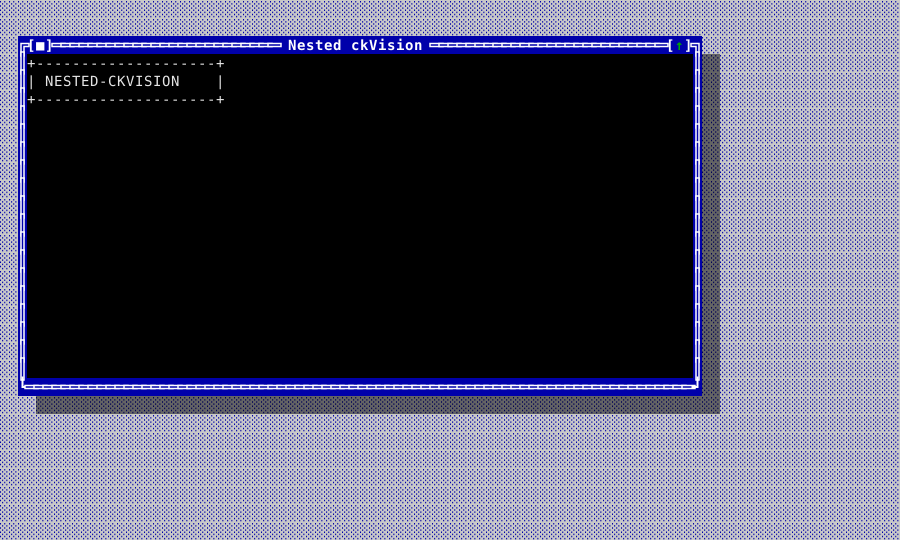
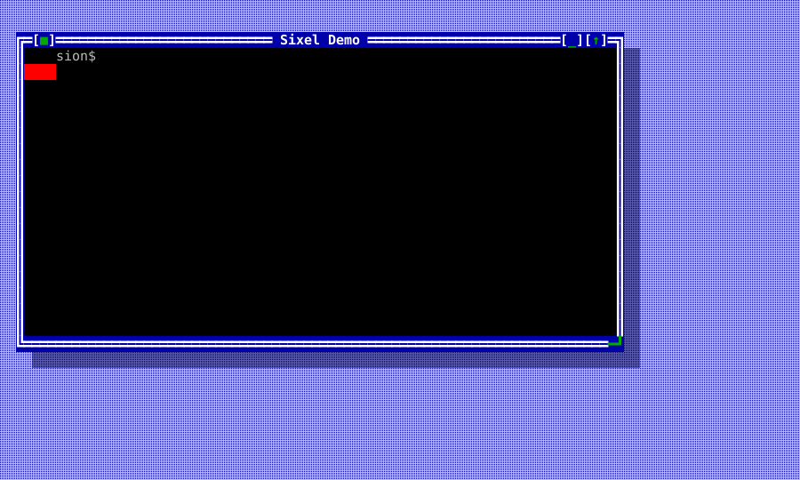
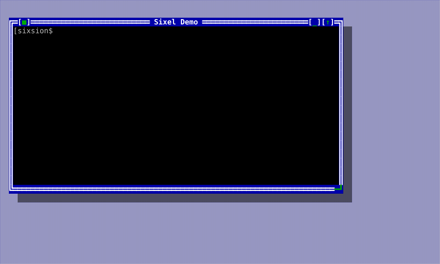
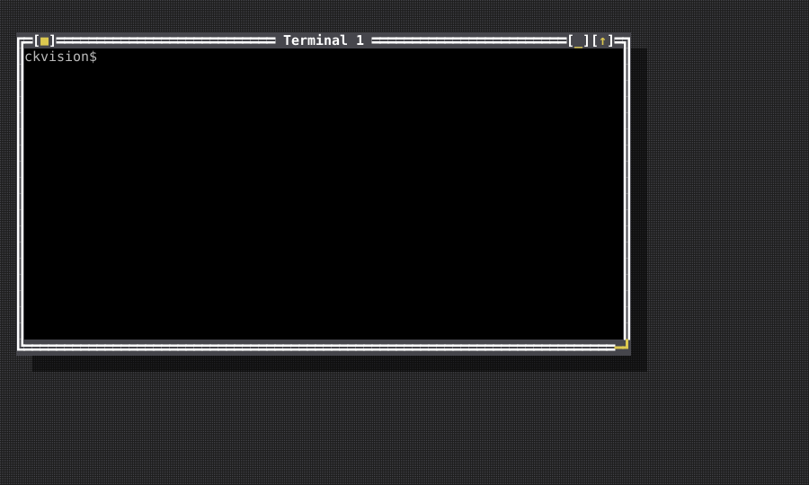
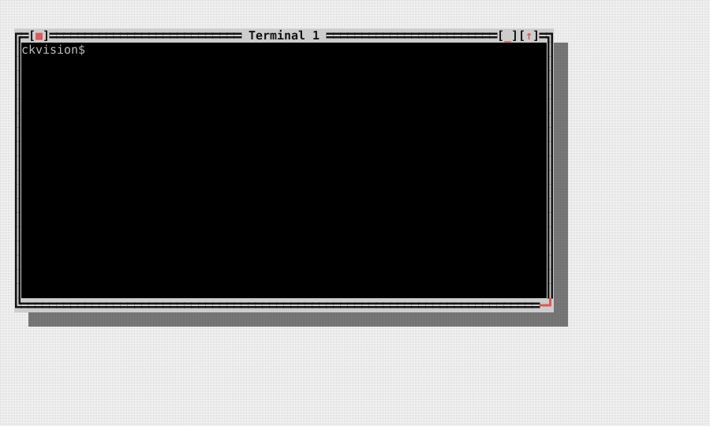
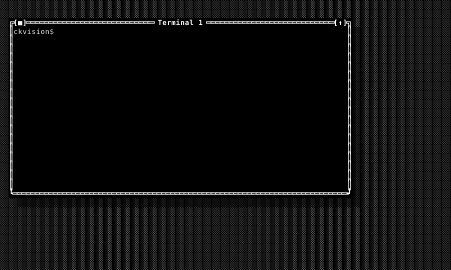
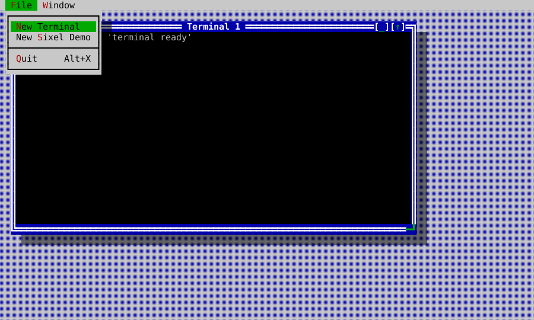

<!-- Copyright (c) 2026 C. Klukas. All rights reserved. -->

# Embedded terminal

`TerminalView` hosts an explicitly launched child terminal session inside a
normal ckVision window. It is not a pass-through to the parent terminal: the
child is connected to a private PTY (or ConPTY on the corresponding platform),
and ckVision alone presents the composed parent frame.

The runnable POSIX example is `ckvision_terminal`. It launches the reader's own
interactive shell — `$SHELL`, falling back to `/bin/sh` — and reserves
`Ctrl+Alt+Space` to return command focus to the parent application. Its child
environment names only `TERM` and `COLORTERM`; the prompt, `PATH` and
everything else arrive from that shell's own startup files, so a window here
looks like a window in any other terminal on the machine. Choose **File → New
Terminal** to create another isolated shell window. `Ctrl+Alt+Space` moves
focus to the parent menu bar without sending that chord to the child. From
there, **Window → Next/Previous** (F6/Shift+F6) changes the active window,
while **Window → Tile** and **Window → Cascade** arrange every open terminal
window. Shift-dragging in a terminal selects visible cells and copies them to
the application clipboard. Choose **File → New Sixel Demo** to open a second
private child that emits a small Sixel sample before starting its interactive
shell. With an outer Sixel profile the sample is a clipped raster; with
`NoGraphics` the same private session uses its deterministic text fallback and
emits no outer raster bytes.

| Initial shell | Full-screen alternate buffer | Nested child | Child Sixel on a graphics-capable outer terminal | Same child with no outer graphics |
|---|---|---|---|---|
|  |  |  |  |  |

The same shell path is exercised through every built-in presentation scheme,
so menu chrome and terminal content remain visible as the application theme
changes:

| Classic | Dark | Light | Mono |
|---|---|---|---|
|  |  |  |  |

The menu is regular ckVision chrome, including its opaque framed dropdown; it
does not ask a child terminal to paint any parent UI. Menu pointer activation
uses the normal press–drag–release contract: moving off an item cancels it,
moving back re-arms it, and dragging across the top-level labels switches the
open dropdown before release.



## Launching a contained child

```cpp
term::TerminalLaunchSpec shell = term::TerminalLaunchSpec::program("/bin/sh", {"-i"});
shell.profile = term::embedded_xterm_sixel_profile();
shell.environment = {{"TERM", "xterm-256color"}, {"COLORTERM", "truecolor"}};

term::TerminalSubsession& session = app.launch_terminal_subsession(std::move(shell));
auto terminal = std::make_unique<widgets::TerminalView>(session);
window->set_content(std::move(terminal));
```

`TerminalLaunchSpec` contains the executable, argv, working directory, child
environment and the policy governing it, child capability profile, and exit
policy. No shell is inserted implicitly.

`argv0` is separate from `executable`, and empty means "the executable path".
It exists for one convention: a shell is told it is a *login* shell by a
leading `-` on its own `argv[0]` (`-zsh`) and by nothing else — no flag every
shell agrees on does it. A host that opens login shells sets it; anything
else leaves it alone.

By default the child inherits the environment the host process is running in,
and the entries in `environment` are applied on top: they replace their
namesakes and add the rest. A terminal is a place to run the programs one
already has, and those programs expect the environment their owner
configured — `HOME`, `USER`, `LANG`, a shell's own settings. Withholding it
does not produce a neutral machine; it produces one where a shell reports its
own builtins as broken (`cd: HOME not set`), which reads as the program
failing rather than as the host having withheld something.

Set `environment_policy` to `TerminalEnvironmentPolicy::ExplicitOnly` for the
sandboxed case, where the child sees exactly what it was handed and nothing
else. The working directory is never inferred: it is whatever the spec says.

The child's signal dispositions are put back to their defaults and its signal
mask emptied, between the fork and the exec. `exec` does only half of that on
its own — it restores the signals the host process *handled* and leaves the
ones it *ignored* ignored — so a host that ignores `SIGPIPE` for its own
sockets, as servers do, would otherwise hand the same `SIG_IGN` to every shell
it opens and to everything that shell runs. An ordinary pipeline whose reader
leaves early then stops ending the way pipelines end, and starts printing
broken-pipe complaints on the reader's screen. Nothing a host does to its own
signals reaches a child through this library.

`WaitForExit` requests a terminal hangup and waits for a graceful
process-group exit during teardown; `TerminateAfterGrace` adds a bounded grace
interval before escalating to process-group termination. Both policies close
the private PTY first. Use `TerminateAfterGrace` when teardown must remain
bounded even if a child deliberately ignores the hangup and termination
signals.

`Application` owns every launched session and drains each session through its
ordinary step loop with a fixed bounded budget. A `TerminalView` borrows the
session, so it must be detached before its owning application is destroyed.
Launch failures are reported in the child view as a stable diagnostic state;
they do not throw through the application's event loop or alter the parent's
terminal session.

The emulator also keeps a bounded child-output queue. If one adapter read is
larger than the parser work budget, its accepted tail is processed on later
steps instead of being silently discarded; bytes beyond the configured queue
limit produce a private limit diagnostic and are dropped at that boundary.

The embedded profile uses an explicit dark terminal default (black background,
a foreground below the palette's brightest white so that the bold a program
asks for has somewhere to go), while SGR and truecolor updates remain
child-local. The POSIX demo overrides only what a terminal itself has an
opinion about — the 256-color and truecolor markers — and opens in the user's
home directory, leaving the prompt, `PATH` and the rest to the environment the
user already has.

Plain PageUp and PageDown navigate the bounded local scrollback, and so does
the mouse wheel whenever the child is not tracking the mouse (three rows to a
notch); under Shift the wheel walks the history even over a mouse-tracking
child, because a Shift-marked gesture is the host's. Modified paging keys
(Shift+PageUp and friends) stay the child's. A view scrolled back is pinned:
new output does not slide the rows under the reader's eyes, while the live
edge keeps following the child — and any key sent to the child returns the
view to the live edge first, so the keystroke lands where the reader can see
it. `scroll_state()` reports where the reader stands and
`on_scroll_state_changed` fires when that answer moves, which is the seam a
scrollbar binds to. Shift-drag selects the rows currently visible (including
scrollback) and invokes the view's copy callback; ordinary pointer events are
forwarded only while the child has enabled mouse tracking. The view emits
legacy X10 or modern SGR mouse bytes according to the child-selected
encoding—it never guesses one protocol for another.

Tracking has three levels and the child gets the one it asked for
(`TerminalStatus::mouse_tracking`, D-054): DEC 1000 is presses and releases,
1002 adds motion while a button is held, and 1003 adds motion with nothing
held. A motion the level does not cover is neither sent nor claimed. Sending
every child the 1003 stream is not generosity — a program parsing for the
reports it asked for reads an unexpected one as something else. A session that
implements the seam itself and reports tracking on without naming a level (a
mirror whose wire carries one bit for the mouse) is read as the coarsest level,
so nothing it delivers is lost.

The shipped profile supports the terminal modes needed by ordinary full-screen
applications: alternate buffer, DEC scrolling margins and origin mode,
index/reverse-index, application cursor keys, bracketed paste, focus reports,
alternate scroll, and the declared cursor-status replies. These remain private
PTY traffic; the outer application's menus, window chrome, and
`Ctrl+Alt+Space` escape chord are always local.

## Scrolling a full-screen child with the wheel

`less` and `man` never ask for mouse reporting, so a wheel over them used to
do nothing at all — which reads as a broken wheel rather than as a mode nobody
enabled. With DEC mode 1007 (`alternate_scroll`, on by default and
child-controllable) a wheel notch over the alternate screen is delivered as
three cursor keys, in the dialect the child selected. On the primary buffer
the wheel belongs to the terminal's own history and scrolls the view itself —
arrow keys sent to a shell prompt would walk its command history instead.

## The scrollbar on the window frame

A terminal window can carry the classic desktop's scrollbar in the classic
place: standing on the window's own right border, between the title's corner
cell and the resize grip's row. `attach_terminal_scrollbar(window, view)`
installs a vertical `Scrollbar` there as a frame overlay (`Edge::Right`,
`Alignment::Fill`) and wires it both ways — dragging, paging or
arrow-clicking the bar moves the view's scrollback, and the view's own
movements (the wheel, PageUp, history growth, the buffer flipping) move the
bar. It is on screen exactly while the terminal is on its primary screen with
more rows than the view can show, and stands down otherwise — on the
alternate screen a full-screen program owns the whole window, so the bar has
nothing to say. Because the bar lives on the border, its coming and going
costs the terminal nothing: not a column of content, and not a resize the
child would have to reflow for.

## Colours a child asks about, and colours it sets

vim and nvim probe `OSC 11` for the background before choosing a colour
scheme; silence makes them guess, and on a dark background they guess light.
The emulator answers `OSC 10`, `OSC 11` and `OSC 4 ; n ; ?` with
`rgb:RRRR/GGGG/BBBB`, using the terminator the child asked with, under the
same `TerminalQueryPolicy` that governs every other reply. *Setting* those is
a different question and is refused: a child that could redefine the palette
could recolour the window it sits in.

A child's colours are stored as what it asked for — a palette index stays an
index all the way to the outer terminal, so the reader's own theme applies to
a child's `SGR 31` exactly as it would outside ckVision. `SGR 4:0`–`4:5` and
`SGR 58`/`59` carry the underline's shape and its own colour, which is how an
editor marks a spelling mistake differently from a type error; where the outer
terminal cannot draw them they degrade to the plain rule.

## The clipboard, and the keyboard protocol

`OSC 52` lets a child put text on the clipboard. It is the one thing a child
can do that reaches outside its own window, so it is **opt-in**:

```cpp
shell.profile.clipboard_policy = term::TerminalClipboardPolicy::AllowWrite;
```

The payload is size-capped (`max_clipboard_bytes`), decoded with a strict
base64 reader, and sanitized for a clipboard rather than for a cell — tabs and
line breaks are content in a document and survive, every other control byte
does not. `TerminalView::on_clipboard_write` delivers the result; what to do
with it is the host's decision. Clipboard *reads* are refused under every
policy, including this one (D-022).

A child may also ask for the kitty keyboard protocol's enhancements
(`CSI > flags u` and friends), which is how a program distinguishes `Ctrl+I`
from `Tab`, sees a lone `Esc` without waiting for a timer, or learns that a
key was released. The flag stack is per screen, so a full-screen program's
settings never follow it out onto the shell's screen. A requested flag is
masked to what this terminal can really deliver before it takes effect, so
what a program reads back with `CSI ? u` is what it will really receive. With
no flags set — the default — keys arrive in the legacy encoding, which remains
correct. A change to the flags is reported as a mode change in
`TerminalDamage`, so a host that forwards this terminal sends the new set
before it sends the next key.

`TerminalView::send_key(event)` delivers a key to the child exactly as a real
press does — the kitty encoding where the child asked for one, the legacy
encoding otherwise, and the same return to the live edge — without `on_key`'s
parent-escape interception or its local paging keys. That is what an
application needs to offer "send the reserved chord through anyway" (otherwise
that chord is unreachable to the child forever), and what anything replaying
keys — a macro, a recorded session, a paste delivered as keystrokes — needs so
that its keys are encoded by the same path as the reader's. It answers whether
the chord produced any bytes; not every one does.

The keypad is the one keyboard mode this terminal declines. `ESC =` and `ESC >`
(DECPAM/DECPNM, terminfo's `smkx`/`rmkx`) are consumed and have no effect,
without a diagnostic: ckVision's input model has no keypad key to send
differently, so there is nothing to record and nothing a child was denied that
it could observe — and every curses program sends both, which would fill a
bounded diagnostic ring with the one thing every child does. D-053 records what
real support would take.

For a full-screen smoke test, launch a child that uses the alternate buffer,
for example `printf '\033[?1049h\033[2J\033[Hfull-screen\033[?1049l'`, and
observe that the child returns to its primary buffer without changing the
parent menu or window chrome. The POSIX test suite runs this sequence through
a real PTY. A nested `ckvision_terminal` child and the Sixel demo are covered
by the separate PTY and pixel-containment tests described below.

## What a host is told changed

`TerminalDamage` answers "what do I have to send" for a host that reads nothing
else when the answer is nothing. Beside the rows, the cursor, the modes, the
title, the rasters and the scrollback count, it flags the things a terminal
does that no cell records: `clipboard`, `bell`, `printer`, `diagnostics` and
`lifecycle` (the child starting, exiting, failing or being closed). The three
payloads a host fetches out of band — the clipboard text, the print jobs, the
diagnostic ring — are deliberately not carried in `TerminalStatus`; each has a
serial or a count there and a flag here, so a host learns there is something
new without fetching on every tick. `clear_damage()` remains the host's alone:
reading never clears (D-052).

## Nested ckVision applications

A ckVision application launched from the shell in a `TerminalView` is an
ordinary private child, not a second attachment to the parent terminal. For
example, after installing `ckvision_terminal` on the child shell's `PATH`, run
`ckvision_terminal` from that shell. Its own menus, alternate screen, input,
and resize handling operate on the private PTY while the parent application
continues to own the user's real terminal. The POSIX integration suite launches
a separately built ckVision child through this same path and verifies its
rendered frame is observed only by the parent session.

## Containment and policies

Child bytes are terminal-emulator input only. Cursor movement, OSC, DCS, and
unsupported controls modify private state or generate a child diagnostic; they
are never written to the outer terminal. The documented profile answers only
declared queries. OSC metadata is denied by default, clipboard writes are
denied by default, clipboard reads are refused outright, and bracketed paste
is encoded only for the child session.

A child only sends a picture when it has been told the terminal can show one,
so the profile's `sixel` flag is answered as well as honoured. DA1 (`CSI c`)
carries parameter 4 whenever the profile declares Sixel — that list is what
`img2sixel`, `chafa`, gnuplot and ckVision's own capability probe read — and
XTSMGRAPHICS (`CSI ? Pi ; Pa ; Pv S`) reports the limits behind it: the
decoder's 256 colour registers, and a maximum geometry of the child's own
window in pixels, since anything past the last cell is cropped away. A request
to *change* a limit is refused, and so is every graphics request under a
profile without Sixel — with a status rather than with silence, which would
leave the asking program waiting out a timeout. XTSMGRAPHICS shares its final
byte with SU (scroll up); it is the private marker that keeps a probe from
scrolling away the screen it was asking about.

`max_image_pixels` bounds the picture — the thing a child controls — and not
the terminal it arrives in. A picture is decoded at its own size, so how large
the reader has made their window has no bearing on whether one can be drawn in
it; a picture wider or taller than the room it has is cut off at the edge of
the screen, the way any terminal cuts one off, rather than refused. What the
budget stops is an absurd geometry reaching the allocator, and a refusal names
the picture and the limit so the reader can raise one or shrink the other.

## What a picture is, once it is on screen

A Sixel paints pixels and nothing takes them off again except writing over the
cells it covers. That is the whole model, and every part of it is observable:

- **Text written over a picture erases it, one cell at a time.** A program
  that repaints the area a picture occupied — closing a dialog, redrawing a
  pane — gets its text, not its text under an image that outlived it. A
  picture with no cells left is gone.
- **Pictures accumulate rather than replace.** A child drawing two of them
  side by side has two; a nested ckVision emitting one Sixel per visible slice
  of an image occluded by a window gets all of its slices. A new picture
  erases only the cells it actually covers.
- **They scroll with the text they were drawn beside**, and leave when they
  would have scrolled off. A cell-anchored picture cannot be shown half-way
  off the top, so it goes rather than sliding under the chrome.
- **Erasing the screen, switching to the alternate buffer, or a reset takes
  them all** — the same points at which a real terminal's graphics go.

The presenter on the other side works to the same rule: a picture already on
the host, on cells nothing repainted, is not sent again. Re-sending one every
frame — re-encoding a quarter of a megabyte to arrive at the pixels already
there — is what made having a picture on screen cost hundreds of milliseconds
per frame instead of microseconds.

Child Sixel data is decoded into an RGBA raster snapshot. Parameterized Sixel
DCS commands are accepted, and graphics payloads have their own bounded limit
separate from ordinary CSI/OSC control strings so realistic images are not
mistaken for malformed control traffic. `TerminalView` adds
that snapshot through the normal scene painter, which supplies a text fallback
when outer graphics are unavailable. The normal compositor consequently owns
clipping, occlusion, resize damage, and removal when the child clears or exits.
The parser suite also decodes the original 256 KiB `snake.six` sample from
libsixel as a raw byte fixture; this guards against accidentally testing an
HTML download or a text-transcribed escape sequence instead of real Sixel.

## Building and checking

Configure and build the example with the standard project build:

```text
cmake -S . -B build
cmake --build build --target ckvision_terminal cvision_tests
ctest --test-dir build -R 'suite_test_(terminal_emulator|terminal_view|posix_terminal_subsession|terminal_app)|terminal_visual_capture' --output-on-failure
```

The Windows ConPTY adapter and its host matrix are a separate platform
acceptance requirement. A deterministic failure state is used on a build where
that adapter is unavailable; it is not a substitute for Windows evidence.
