# Example applications

ckVision ships small, complete example applications that exercise the
library end to end rather than isolated widget demos. Each one lives
under `examples/<name>/` as a plain library-linkable static target
(`<name>_app`) plus a thin `main.cpp` that attaches it to a real
terminal, so the exact same object graph an interactive user runs is
also what the headless test suite drives — a documentation screenshot
or a test failure both describe the real application, never a
simplified stand-in.

## Start with the pattern you need

This page is a visual tour. For construction and ownership, begin with the
[Hello tutorial](tutorial-hello.md) and [object model](object-model.md); then
use the table below to choose a complete, compiled application to adapt. The
source links are the actual files used by the interactive executable,
headless tests, and screenshot capture tools.

| Example | Reuse this pattern | Main source | Visual guide |
|---|---|---|---|
| Hello | minimal shell, local commands, info dialog | [`hello_app.cpp`](../examples/hello/hello_app.cpp) | [Hello tutorial](tutorial-hello.md) |
| Gallery | general application shell with form/window/image | [`gallery_app.cpp`](../examples/gallery/gallery_app.cpp) | this page |
| File Browser | injected filesystem master/detail panes | [`filebrowser_app.cpp`](../examples/filebrowser/filebrowser_app.cpp) | [Platform services](platform-services.md) |
| Layouts | responsive relationships and user splitter | [`layouts_app.cpp`](../examples/layouts/layouts_app.cpp) | [Layout guide](layout-guide.md) |
| Forms | validation, help, standard strings, wizard | [`forms_app.cpp`](../examples/forms/forms_app.cpp) | [Dialogs](dialogs-and-commands.md) |
| Workbench | text/data/utility tabs | [`workbench_app.cpp`](../examples/workbench/workbench_app.cpp) | [Widget gallery](widget-gallery.md) |
| Editor | shared document, YAML profile, gutter, editable source view | [`editor_app.cpp`](../examples/editor/editor_app.cpp) | [Editor](editor.md) |
| Terminal | isolated child sessions, multi-window desktop controls, focus escape, scrollback, Sixel containment | [`terminal_app.cpp`](../examples/terminal/terminal_app.cpp) | [Embedded terminal](embedded-terminal.md) |
| Graphics | ImageView/Canvas capability fallback | [`graphics_app.cpp`](../examples/graphics/graphics_app.cpp) | [Graphics](graphics.md) |
| Spin | animated raster content rendered off the owning thread | [`spin_app.cpp`](../examples/spin/spin_app.cpp) | [Graphics](graphics.md) |

### Layouts

The Layouts app is a compact reference for containers rather than a synthetic
test: it places the whole tree in a real Desktop window and is captured across
resize states.

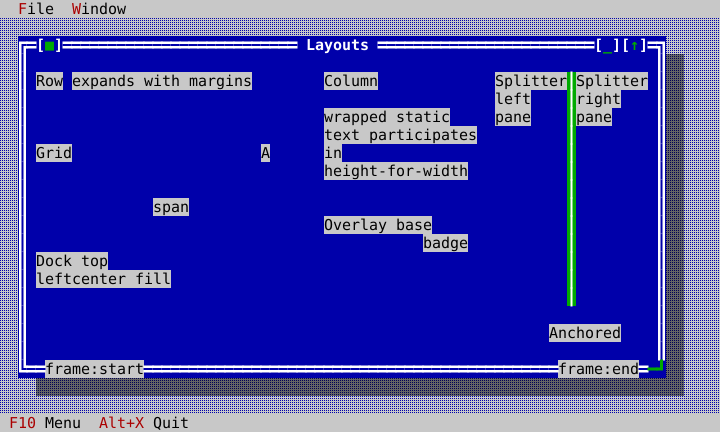

### Forms

Forms puts field controls, a localized modal message, descriptor validation,
context help, and state-dependent wizard flow into one normal application.

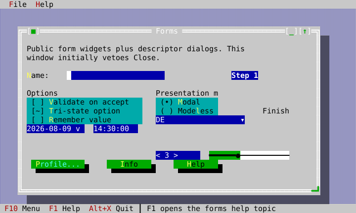

### Workbench

Workbench is an application template with text editing, data browsing, and
utility components on separate tabs.

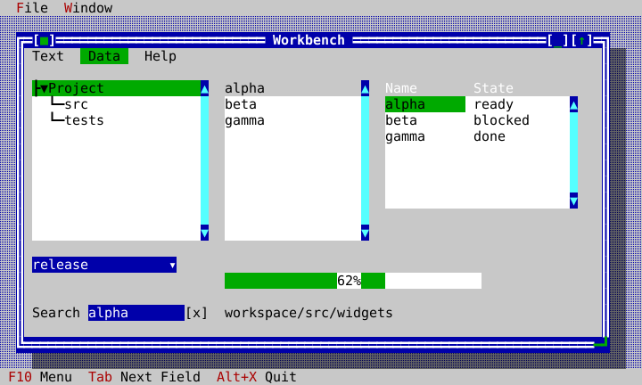

### Editor

Editor is the source-editing reference: a shared revisioned document, YAML
profile selection, line-number gutter, and regular application chrome.


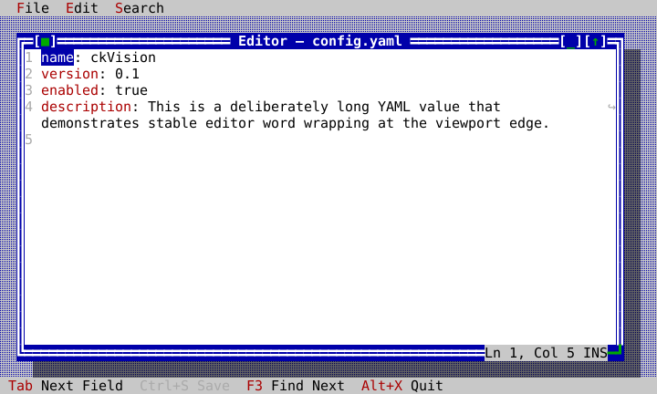

### Graphics

Graphics is the capability-paired reference: it presents the same public view
tree under a Sixel profile and no-graphics profile.

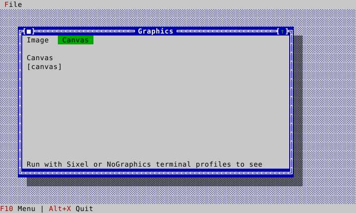

### Spin

Spin is the moving-picture reference: a window per rotating solid, each frame
rendered on a worker thread and shown by invalidating one view. Every frame is
painted on its own window's resolved background color and sized to whole cells
of the terminal's own metric, so the object sits in the window rather than on a
rectangle laid over it.

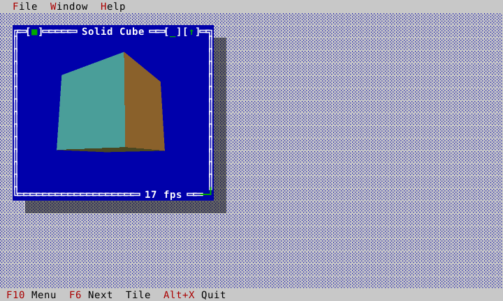

`File ▸ New` opens a window on any of six solids, and each window carries its
own delivered frame rate on its bottom border.

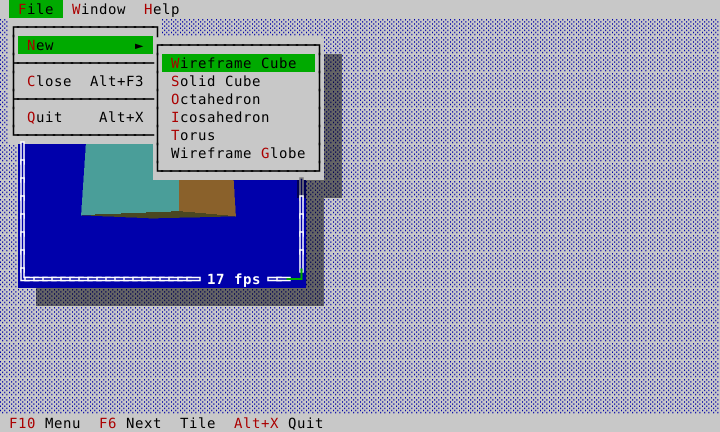

Windows are ordinary desktop windows: move them, resize them, tile them, and
the next frame is rendered at the new pixel size.

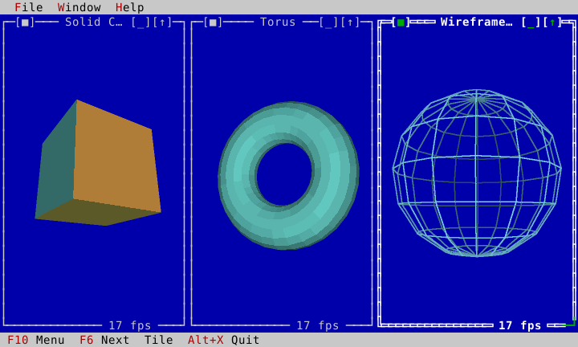

This page is generated documentation in the sense that its screenshots
are: they come from `tools/docgen/capture_gallery_screenshots`, which
builds an example app on a `HeadlessTerminal`, scripts a short
interaction, and renders the HeadlessTerminal virtual display to SVG via
`tools/docgen/frame_svg`. The virtual display consumes the exact VT/Sixel bytes
written by Presenter and independently reconstructs styled cells plus decoded
raster pixels; the screenshot path does not read the source `Image` directly.
Under the Sixel profile, Presenter first writes clean panel-colored blank cells
through the visible image region—never the `[image]` fallback text—and emits an
explicitly opaque Sixel raster. The SVG stores that decoded raster as one
lossless embedded bitmap, avoiding the hairline transparency artifacts that
adjacent per-pixel SVG rectangles can acquire during PDF conversion; equal
neighboring cell backgrounds are likewise merged so the surrounding panel
remains a clean solid color in PDF output. Recognized box-drawing glyphs are
rendered as cell-edge-aligned SVG geometry instead of font text, preventing
host-font metrics from introducing false gaps at frame corners.
Regenerate them (and this page's HTML/PDF
output) with `tools/docgen/generate_docs.sh` — never hand-edit an SVG
under `docs/generated/`.

The same Sixel and no-graphics images are also emitted as test artifacts. Run
`ctest --test-dir build -R gallery_visual_capture -V`; its output names the
SVGs under `build/test-artifacts/gallery/`. This visual test is separately
labelled `visual` and `artifact`, while the unit suite independently checks the
decoded pixel plane and raw protocol bytes. These artifacts are review aids;
WP-32A still owns the broader byte/hash-pinned pixel-golden matrix listed in
the corrective plan.

Standard dialog factories keep their built-in English labels by default and
also accept a `widgets::StandardStrings` table when an application needs
localized button text or standard window titles. The table covers message-box
buttons, file dialog titles/actions, directory picker labels, the Window List,
and Help Viewer chrome without installing any global mutable localization
state.

## Gallery (`examples/gallery`)

Gallery is the baseline example: a `Desktop` with a menu bar, a status
line, and two windows, driven entirely through the public `ui::View` /
`ui::Application` / `widgets::*` surface — nothing in `gallery_app.cpp`
reaches past those headers.

- **Menu bar** (`File`, `Window`) bound to real `ui::CommandRegistry`
  commands, activated via F10 (a bound command, not a MenuBar special
  case — see `include/cvision/widgets/menu.hpp`'s own file comment for
  why), with Esc restoring whatever was focused before activation.
- **Controls window**: a `Label` with a mnemonic, an `InputLine`, and a
  default `Button` — Tab traversal, typed text, and a click all reach
  their target through the ordinary focus/dispatch machinery
  (`ui::Application::dispatch`), the same path any application's own
  widgets use.
- **Sixel Demo window**: an `ImageView` showing a generated RGBA
  gradient, proving the raster path — `Painter::draw_image` through
  `scene::Compositor`'s occlusion slicing through `term::Presenter`'s
  Sixel encoder — actually reaches terminal bytes when the terminal
  capability advertises Sixel support.
- **Window shadows**: both windows cast a real, composited shadow
  (`widgets::Desktop::paint_children` interleaves
  `Painter::apply_shadow` with the z-ordered window paint — see
  that method's doc comment for why a naive whole-tree post-pass
  cannot get shadow occlusion right). Shadow coverage is binary: one
  or several overlapping casters apply the dim transform exactly once.
- **Move/resize**: `Window`'s own mouse handling supports dragging the
  title bar to move and the one-cell lower-left or lower-right corner grip
  to resize, clamped to `Window`'s declared min/max size. A focused,
  resizable window keeps those two lower corners single-line inside its
  otherwise double-line frame; a non-resizable window keeps all four
  double-line corners.

### What's verified, and how

Every claim above is backed by a real, green test — not just "the code
exists":

| Behavior | Test |
|---|---|
| Both windows render, with their titles | `test_gallery_smoke.cpp`: `the_gallery_renders_both_windows_titles_on_first_frame` |
| Menu bar + status line render | `the_menu_bar_and_status_line_both_render` |
| Typed keyboard input reaches the field and repaints | `typing_into_the_name_field_reaches_it_and_repaints` |
| F10 activates the menu bar via the command keymap | `f10_activates_the_menu_bar_via_the_command_keymap` |
| Esc after F10 restores prior focus | `escape_after_f10_returns_focus_to_where_it_was` |
| Alt+X quits via the documented shortcut | `alt_x_quits_via_the_status_lines_documented_shortcut` |
| A mouse click on Greet opens a message box with the typed name | `clicking_greet_opens_a_message_box_that_renders_the_typed_name` |
| Sixel bytes reach the terminal and decode into the virtual display's RGBA plane | `the_image_window_content_reaches_the_terminal_as_sixel_data_under_full_capabilities` |
| Sixel mode emits no `[image]` text and decodes to a solid, fully opaque 64×32 pixel rectangle | `the_image_window_content_reaches_the_terminal_as_sixel_data_under_full_capabilities`; `sixel_presentation_replaces_fallback_text_with_clean_background_cells` |
| The same frame has no raster pixels under NoGraphics | `the_same_gallery_frame_uses_only_the_cell_fallback_without_graphics` |
| Runtime Sixel → NoGraphics → Sixel changes remove and restore pixels without stale content | `runtime_graphics_capability_changes_remove_and_restore_virtual_raster_pixels` |
| Window shadow cells are actually dimmed (exact expected style) | `tests/test_desktop.cpp`: `a_shadow_casting_windows_footprint_is_dimmed_on_the_desktop` |
| A higher window is never dimmed by a lower window's shadow | `a_higher_window_painted_afterward_is_not_dimmed_by_a_lower_windows_shadow` |
| One or several overlapping window shadows remain one uniform shadow, including the lower-right footprint corner | `a_single_shadow_footprint_is_a_non_overlapping_union`; `overlapping_shadows_are_a_binary_union_not_cumulative_dimming`; `overlapping_window_shadows_dim_the_desktop_exactly_once` |
| A foreground frame crossing a lower window's frame stays a plain foreground border, never a merged junction | `a_foreground_window_frame_does_not_merge_with_a_background_window_frame`; `tests/golden/window_z_order_junction.dump` |

### Screenshots

Initial frame under the fixed-metrics Sixel profile — menu bar, status line,
both windows, and the decoded, fully opaque gradient emitted by Presenter over
clean panel-colored backing cells:

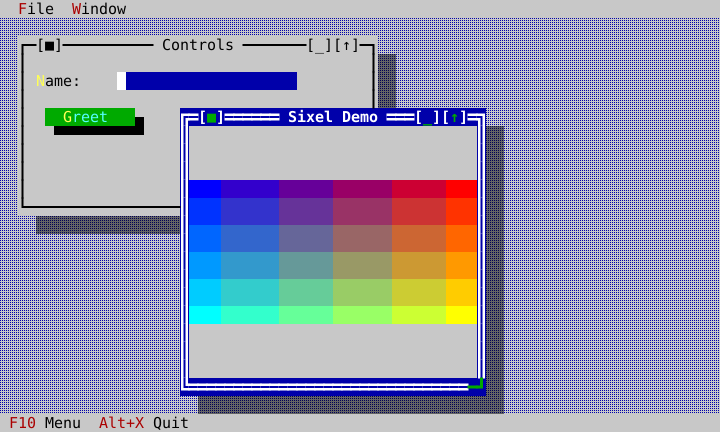

The identical initial application state under NoGraphics — no Sixel DCS is
emitted and ImageView's mandatory textual fallback remains visible:

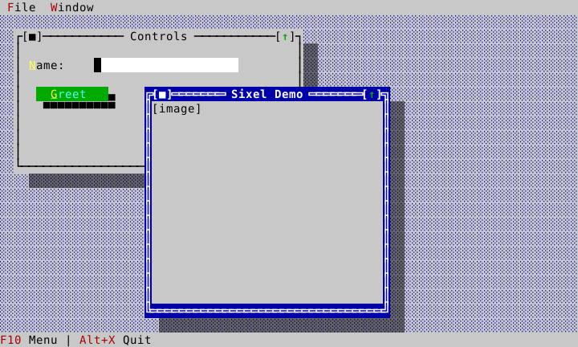

After typing a name into the input field:

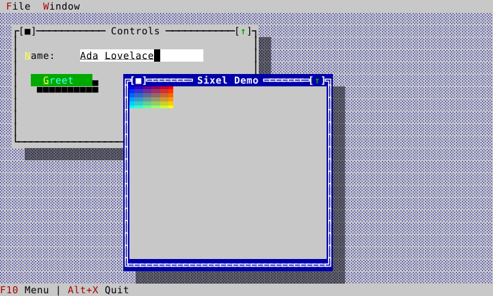

With the menu bar activated (F10):

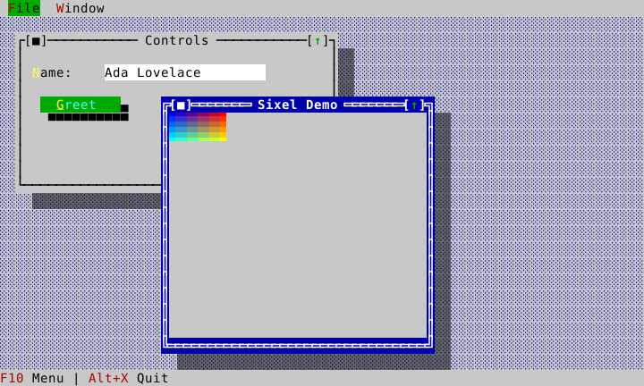

### Running it yourself

```bash
cmake -B build -DCMAKE_BUILD_TYPE=Release
cmake --build build -j8
./build/examples/ckvision_gallery
```

Requires a real terminal (macOS Terminal.app, iTerm2, or any VT100+
terminal); Sixel image content additionally requires a Sixel-capable
terminal (iTerm2 with Sixel enabled, or a recent xterm build). On an
unsupported terminal, `ImageView`'s mandatory fallback (D-017) still
renders equivalent cell content in place of the image — never a blank
or broken region.

## File Browser (`examples/filebrowser`)

File Browser is the master-detail example: a folder-hierarchy
`TreeView` in one pane drives a `ListView` showing the selected
folder's contents in a second pane — a `TreeView::on_selection_changed`
callback (receiving the newly-selected `TreeNode&` directly, M10/
WP-22) is the entire wiring between them. It also demonstrates
`Desktop::dock_top`/`dock_bottom` (the menu bar and status line
reposition themselves automatically across a real terminal resize,
not just when the application recomputes their bounds by hand — a live
`ResizeEvent` enters through the terminal and `Application::step`; the
Application-owned root layout then applies `View::fills_root()`'s default to
the Desktop, whose own `on_resized()` repins both docks and reclamps every
window. See `tests/test_m8_integration.cpp` and
`tests/test_root_resize_golden.cpp`.) and `Window::add_frame_overlay`
(the selected directory's full path shown live on the window's own
bottom border — the general mechanism a text editor would use for a
"line: N, col: M" indicator; M10/WP-20's plural, positioned overlays
replace this app's original single-slot `set_frame_overlay` call with
no change in the app's own observable behavior).

- **Real disk access**: the interactive binary browses the actual
  filesystem via `term::PosixFileSystem` — previously the only
  `core::FileSystem` implementation anywhere in the repo was
  `MemoryFileSystem` (test-only), so no application could browse a
  real directory without writing that backend itself first.
- **Two-pane layout**: `widgets::Splitter` (M10/WP-19) holding the tree
  and file-list panes, starting at an exact 50/50 split — the same
  ratio the app's original `ui::Row` with two `Expanding` items gave,
  now keyboard-adjustable (Tab to the Splitter, then Left/Right) rather
  than fixed.
- **Lazy tree population** (M10/WP-22): only the root's own direct
  subdirectories are listed eagerly, so it can start expanded; every
  deeper level is listed on demand the first time the user expands it,
  via `TreeView::on_expand_request`. `populate_children()` in
  `filebrowser_app.cpp` is the one function both the root's initial
  listing and every later lazy expansion call — no depth cap needed,
  since nothing is ever recursed into ahead of the user actually
  asking to see it. Each node's own full path lives in
  `TreeNode::user_data` (a `std::any` holding a `std::string`),
  replacing what used to be a separate sidecar
  `std::unordered_map<const TreeNode*, std::string>`.
- **Focus traversal**: Tab cycles through the tree pane, the Splitter
  (M10/WP-19 — Left/Right there adjusts the pane split), and the file-
  list pane — the library's own default keymap (the decision log D-029, M9/
  WP-13), with nothing bound explicitly in `FileBrowserApp`'s own
  constructor. An application that wants Tab for something else (a
  text editor inserting a literal tab) keeps that freedom, because a
  focused view consuming Tab already preempts the keymap by routing
  order.

### What's verified, and how

| Behavior | Test |
|---|---|
| The tree starts with the root expanded and the file list showing its direct children | `test_filebrowser_smoke.cpp`: `the_tree_starts_with_root_selected_and_the_file_list_showing_its_direct_children` |
| Directories in the file list are suffixed with `/` | `directories_in_the_file_list_are_suffixed_with_a_trailing_slash` |
| Navigating the tree to a different folder updates the file list | `navigating_the_tree_to_a_different_folder_updates_the_file_list` |
| A nested subdirectory shows up suffixed too | `navigating_to_a_folder_with_a_nested_subdirectory_shows_it_suffixed` |
| Both panes, the menu bar, and the status line all render | `the_first_frame_renders_both_panes_and_the_menu_status_chrome` |
| The frame overlay shows the currently selected directory's full path, and updates live | `the_frame_overlay_shows_the_currently_selected_directorys_full_path` |
| Alt+X quits | `alt_x_quits` |
| Tab moves focus from the tree pane to the file-list pane | `tab_moves_focus_from_the_tree_to_the_file_list_pane` |
| The tree and file-list panes start at an even 50/50 split | `the_tree_and_file_list_panes_start_at_an_even_50_50_split` |
| The panes are children of a Splitter positioned between them | `the_panes_are_children_of_a_splitter_positioned_between_them` |
| Adjusting the Splitter resizes both panes and keeps them contiguous | `adjusting_the_splitter_resizes_both_panes_and_keeps_them_contiguous` |
| A directory never expanded starts with unknown, unpopulated tree children | `a_directory_never_expanded_starts_with_unknown_unpopulated_tree_children` |
| Expanding a never-listed directory populates it on demand through the filesystem | `expanding_a_never_listed_directory_populates_it_on_demand_through_the_filesystem` |
| A lazily populated child is itself still lazy until expanded | `a_lazily_populated_child_is_itself_still_lazy_until_expanded` |

### Screenshots

Initial frame — the root folder expanded, its files and subfolders in
the right-hand pane, the current path shown on the window's own bottom
border:


After navigating to the `src` folder:

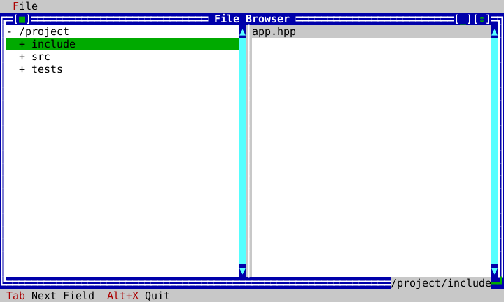

After navigating to the `include` folder — the file list and the
border's path indicator both updated:

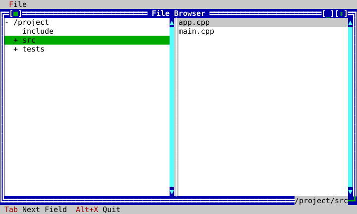

### Running it yourself

```bash
cmake -B build -DCMAKE_BUILD_TYPE=Release
cmake --build build -j8
./build/examples/ckvision_filebrowser [path]   # defaults to the current directory
```

## WP-36A comprehensive demo suite

WP-36A turns the example directory into a client-facing demo suite with a
checked-in traceability matrix at the example coverage matrix. `hello`,
`gallery`, and `filebrowser` remain the established integration examples;
`layouts`, `forms`, `workbench`, and `graphics` add focused coverage for the
major public layout, dialog, data/text, and raster surfaces.

The suite is:

| Example | Purpose |
|---|---|
| `hello` | Minimal one-screen application: desktop, File menu, status line, command presentation, modal info dialog, and clean loop ownership. |
| `gallery` | Main showcase shell for chrome, forms, windows, commands, message boxes, themes, and ImageView. |
| `filebrowser` | Practical master/detail app over a real or injected filesystem: tree/list coordination, Splitter, frame overlays, menu/status chrome, and lazy expansion. |
| `layouts` | Resize-focused layout lab: Row, Column, Grid, Dock, AnchorPane, Overlay, Splitter, alignment, margins, frame overlays, shrink, and recovery. |
| `forms` | Dialog and form patterns: descriptor dialogs, validation veto, default/cancel buttons, focus restore, localized `StandardStrings`, help/status context, option groups, combo boxes, and close veto. |
| `workbench` | Application template: Memo, TextView links/OSC8 export, InputLine history, Table, TreeView, ListView, TabControl, Progress, clipboard-ready editing, commands, and status presentation. |
| `graphics` | Raster and capability demo: ImageView, Canvas, Sixel/fallback switching, raster occlusion/scrolling, cell/pixel mouse, and deterministic degradation. |

Each example keeps the existing tested-artifact shape:

1. A public-API object graph in `examples/<name>/<name>_app.{hpp,cpp}`.
2. A thin terminal `main.cpp`.
3. A headless script suite that drives the same object graph.
4. Screenshot/visual capture states where the example teaches visible behavior;
   the exhaustive state/theme visual matrix is WP-38 scope.
5. A row in the checked-in coverage matrix:
   public widget/layout/capability → example → scripted interaction → golden or
   visual artifact → documentation section.

### Layouts (`examples/layouts`)

`ckvision_layouts` is the resize lab. Its single window combines every layout
container in one public object graph: `Row`, `Column`, `Grid`, `Dock`,
`AnchorPane`, `Overlay`, `Splitter`, and `Window::add_frame_overlay`. The smoke
suite renders the labels, adjusts the splitter through keyboard dispatch, and
resizes the terminal to prove docked chrome and anchored content recover.

Run:

```bash
./build/examples/ckvision_layouts
```

### Forms (`examples/forms`)

`ckvision_forms` demonstrates form-level client patterns: `InputLine`,
`CheckGroup`, `RadioGroup`, editable `ComboBox`, descriptor dialogs with accept
validation veto, localized `StandardStrings`, modal message boxes, help viewer
presentation, status hints keyed by help context, common date/time/numeric
components (`DatePicker`, `TimePicker`, `SpinBox`, `Slider`), `Wizard`, and a
vetoable window close protocol. The smoke suite opens the descriptor dialog
through the example object graph, verifies invalid accept is vetoed, completes a
valid dialog, and checks the close-veto path plus the WP-36B component state.

Run:

```bash
./build/examples/ckvision_forms
```

### Workbench (`examples/workbench`)

`ckvision_workbench` is the practical application template. It combines
`TabControl`, `Memo`, `InputLine` history, `TextView` links and OSC 8 export,
`TreeView`, multi-select `ListView`, sortable `Table`, `ComboBox`, and
`Progress` inside ordinary menu/status chrome. WP-36B extends it with
`SearchBox`, `ToolBar`, `CommandPalette`, `BreadcrumbBar`,
`PropertyInspector`, `NotificationCenter`, and `Tooltip`. The smoke suite
verifies the text page, activates the public TextView link path, switches to the
data page, and checks the table/tree/list/combo/progress/common-component
surface.

Run:

```bash
./build/examples/ckvision_workbench
```

### Graphics (`examples/graphics`)

`ckvision_graphics` isolates raster behavior from the broader gallery:
`ImageView` shows caller-owned RGBA image data, `Canvas` derives its backing
pixels from caller-supplied cell metrics, both expose full mouse events, and
the same frame is tested under Sixel and NoGraphics terminal profiles. The
exhaustive paired visual captures remain WP-38 release-gate work; WP-36A adds
the executable public-path example and coverage matrix row.

Run:

```bash
./build/examples/ckvision_graphics
```

### Spin (`examples/spin`)

`ckvision_spin` is the animation reference: `File ▸ New` opens a window on any
of six rotating solids — two wireframes and four shaded ones — and each window
keeps drawing itself while the application stays responsive. It is the example
to read for three separate questions.

**Where the work happens.** `examples/spin/mesh.cpp` and
`examples/spin/renderer.cpp` are ordinary library code: no view, no terminal,
no clock, and no thread. `RenderService` owns the worker threads and is the
only file that crosses between them, in the one direction the architecture §9
sanctions — a request goes out carrying everything the renderer needs, and the
finished `Image` comes back through `Application::post`. Nothing on a worker
thread touches a `View`, a `Theme`, or a `Terminal`.

**How the redraw is driven, and why it stays responsive.** One
`Application::start_timer` serves the whole application, armed when the first
window opens and gone when the last one closes, so an idle Spin has no timer at
all and `step()` blocks on input like any other program. It is a *one-shot that
arms the next one after it has run*: the loop can never owe a backlog of ticks,
which is exactly what a repeating timer delivers after a stall, all at once. A
tick that finds a window's previous frame still rendering asks that window for
nothing, so at most one frame per window is ever outstanding — the posted-work
queue is bounded by the number of open windows however slow the host is.
Angles come from the injected `Clock`, so a skipped frame costs smoothness and
never speed. And the interval itself follows the loop: a tick that arrives much
later than it asked for widens it, down to a documented floor, and ticks
landing on time ease it back. The cost of an overloaded moment is a slower
rotation rather than a sluggish application. Presenting a finished frame is one
`ImageView::set_image` call — that invalidates one view, the window repaints its
own backing store, the compositor touches the cells that changed, and Presenter
re-encodes one raster. Nothing in the example forces a full redraw.

**What a readout on the frame costs.** Each window carries its delivered frame
rate in the bottom-right of its own border, through
`Window::add_frame_overlay` — the same mechanism `widgets::EditorWindow` uses
for its "Ln 1, Col 1" indicator. `FrameReadout` is worth copying for any value
that changes as often as the content does: it pulls its text in `draw()`
instead of being pushed a string per frame (a pushed `set_text()` is a
size-hint change, and the window re-lays-out its overlays for each one), keeps
a fixed width so that re-layout never happens at all, draws in its window's own
frame role so the border reads as one line, and is invalidated by the frame it
describes rather than by a clock of its own — so both land in the same
presented frame.

**Why it looks like part of the window.** Sixel carries no alpha channel, so
each frame is painted on the background its own window currently resolves —
`ckv.window.frame.active` or `.inactive`, through `resolved_color` — and the
same role is set as the view's fallback override, which is what a terminal
without graphics then shows instead. The frame is rendered at exactly
`cells × terminal_cell_pixels()`, so it lands on whole cells and neither
stretches nor leaves a margin; a resize simply produces the next frame at the
new size. The renderer also keeps each frame inside the host's reported Sixel
register budget, because a picture that exceeds it makes the encoder quantize
the *whole* image — the background included — to its fallback color cube, and
the seam that was invisible becomes a visible rectangle.

`test_spin_smoke.cpp` pins all of it: the renderer's background fidelity,
centring, framing, determinism, and color budget with nothing else running; and
then, on a `HeadlessTerminal`, that a window presents its frame as a raster,
re-renders at its own pixel size across a resize, paints on the window's own
background, keeps exactly one outstanding frame per open window, runs its
animation clock only while a window is open, never leaves the loop owing a
backlog of ticks however long it stalled, widens and recovers its frame
interval, shows the delivered rate on its own border in a box that never
changes width, and drives the identical object graph to the documented cell
fallback on a terminal without graphics.

Run:

```bash
./build/examples/ckvision_spin
```

## Adding another example

New examples should follow the WP-35 public-surface rules enforced by
`example_hygiene`: construct Desktop through context rather than theme/role
constructor plumbing, use typed insertion surfaces instead of
`static_cast<widgets::...>`, declare each command id/chord once, and use
`widgets::CommandPresentation` when a menu or status surface needs
surface-specific wording for the same command.

1. `examples/<name>/<name>_app.{hpp,cpp}` — the object graph, taking
   `ui::Application&` in its constructor, exposing whatever accessors
   a headless test needs (see `gallery_app.hpp`'s own accessor list for
   the pattern).
2. `examples/<name>/main.cpp` — a `PosixTerminal` + `PosixClock` +
   `Application`, a `step()` loop, nothing else.
3. `examples/CMakeLists.txt` — one more `add_library(<name>_app
   STATIC ...)` / `add_executable(ckvision_<name> ...)` pair, following
   `gallery_app`'s.
4. `tests/test_<name>_smoke.cpp` — drive the SAME `<name>_app` target
   headlessly; this is what makes the example a tested artifact rather
   than a demo nobody runs in CI.
5. A section on this page, plus a `capture_<name>_screenshots` tool
   under `tools/docgen/` if the example's states are worth showing.
