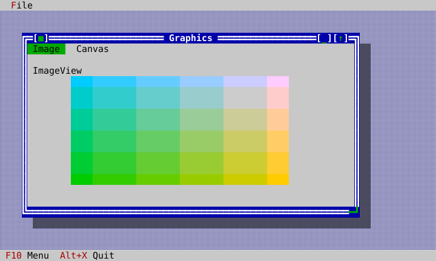
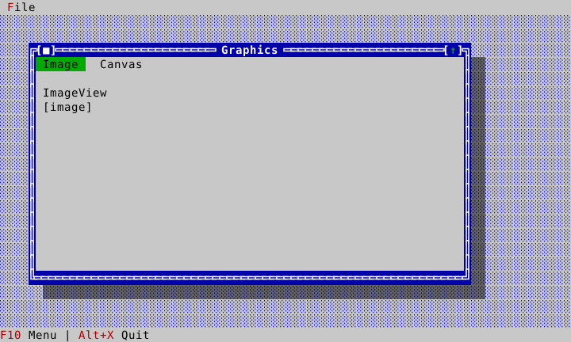
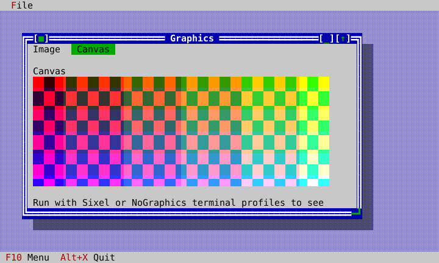
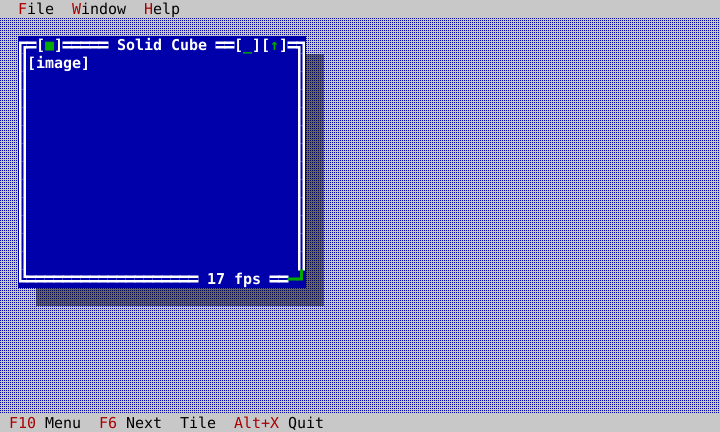

# Graphics

`ImageView` presents an immutable `Image`; `Canvas` owns a raster and asks its
draw callback to render it. Both are ordinary views, so they can live in tabs,
windows, layouts, and Desktop surfaces. On a terminal with Sixel capability the
Presenter emits a raster overlay. With no graphics capability it renders the
documented cell fallback instead of a blank area.

| Sixel ImageView | No-graphics ImageView |
|---|---|
|  |  |

The same app gives each view a click callback and switches pages through a
normal `TabControl`:

<!-- ckvision-snippet source="examples/graphics/graphics_app.cpp" lines="50-105" -->
```cpp

    auto status = std::make_unique<widgets::StatusLine>();
    status->set_items({widgets::StatusLineItem{widgets::CommandPresentation{app_.commands().standard().menu}},
                       widgets::StatusLineItem{widgets::CommandPresentation{app_.commands().standard().quit}}});
    desktop_->dock_bottom(std::move(status));
}

void GraphicsApp::build_window() {
    demo_image_ = make_demo_image();

    auto window = std::make_unique<widgets::Window>("Graphics");
    window->set_bounds(Rect{4, 3, 62, 17});
    auto tabs = std::make_unique<widgets::TabControl>();
    tabs->set_bounds(Rect{0, 0, 60, 15});
    tabs_ = tabs.get();

    auto image_page = std::make_unique<ui::View>();

    auto image_label = std::make_unique<widgets::Label>("ImageView");
    image_label->set_bounds(Rect{1, 1, 16, 1});
    image_page->add_child(std::move(image_label));

    auto image = std::make_unique<widgets::ImageView>();
    image->set_bounds(Rect{1, 2, 54, 10});
    image->set_image(demo_image_);
    image->on_click = [this](const MouseEvent&) { ++image_clicks_; };
    image_view_ = image.get();
    image_page->add_child(std::move(image));

    auto canvas_page = std::make_unique<ui::View>();

    auto canvas_label = std::make_unique<widgets::Label>("Canvas");
    canvas_label->set_bounds(Rect{1, 1, 16, 1});
    canvas_page->add_child(std::move(canvas_label));

    auto canvas = std::make_unique<widgets::Canvas>();
    canvas->set_bounds(Rect{1, 2, 54, 10});
    canvas->set_cell_metrics(Size{2, 3});
    canvas->set_draw_callback([](Image& target) {
        for (int y = 0; y < target.height(); ++y) {
            for (int x = 0; x < target.width(); ++x) {
                const bool stripe = ((x / 4) + (y / 4)) % 2 == 0;
                target.set_pixel(x, y,
                                 Image::Rgba{stripe ? std::uint8_t{240} : std::uint8_t{40},
                                             std::uint8_t(x * 255 / (target.width() > 1 ? target.width() - 1 : 1)),
                                             std::uint8_t(y * 255 / (target.height() > 1 ? target.height() - 1 : 1)),
                                             255});
            }
        }
    });
    canvas->on_click = [this](const MouseEvent&) { ++canvas_clicks_; };
    canvas_ = canvas.get();
    canvas_page->add_child(std::move(canvas));

    auto note = std::make_unique<widgets::StaticText>(
        "Run with Sixel or NoGraphics terminal profiles to see raster output and fallback.");
```
<!-- /ckvision-snippet -->

| Sixel Canvas | No-graphics Canvas |
|---|---|
|  |  |

For a Canvas, set cell metrics before drawing so cell and raster geometry agree.
The callback receives its target image; do not bypass the view to write terminal
protocol directly. Mouse events reach `on_click`; pixel coordinates are
available only when the injected terminal capability advertises pixel mouse.
The HeadlessTerminal captures above test both Sixel and no-graphics profiles
through Presenter bytes and a virtual display, rather than reading image memory.

## Animated raster content

A picture that changes needs four things a still one does not: somewhere to
render it that is not the owning thread, a way back into the application that
does not touch the view tree from outside, a redraw that costs one view rather
than one screen, and a frame rate that yields to the reader when the loop is
busy. The [Spin example](example-apps.md) is the reference for all four.

### Publishing a frame

`SpinView` is the whole of the application-side contract:

<!-- ckvision-snippet source="examples/spin/spin_app.cpp" lines="105-168" -->
```cpp
void SpinView::request_frame(RenderService& service, std::int64_t now_nanos) {
    // The back-pressure, and the whole of it: while a frame is being
    // rendered this view asks for nothing. Ticks are opportunities, not
    // obligations.
    if (in_flight_) return;
    const ui::Application* const app = context().app;
    if (app == nullptr) return;
    const Size pixels = target_pixels();
    if (pixels.width <= 0 || pixels.height <= 0) return;

    adopt_surface_role();

    FrameSpec spec;
    spec.pixels = pixels;
    spec.background = surface_color();
    // Angles come from the clock, so a frame that took too long leaves a
    // gap in the animation rather than slowing the rotation down.
    const double seconds = static_cast<double>(now_nanos - phase_nanos_) * 1e-9;
    spec.yaw = seconds * kYawRateRadiansPerSecond;
    spec.pitch = seconds * kPitchRateRadiansPerSecond;
    const int registers = app->terminal_capabilities().sixel_color_registers;
    spec.color_budget = registers > 0 ? registers : 256;

    in_flight_ = true;
    service.submit(shape_, spec, lifetime_token(),
                   [this](std::shared_ptr<const Image> frame) { accept_frame(std::move(frame)); });
}

double SpinView::frames_per_second() const noexcept {
    return smoothed_interval_seconds_ > 0.0 ? 1.0 / smoothed_interval_seconds_ : 0.0;
}

void SpinView::accept_frame(std::shared_ptr<const Image> frame) {
    in_flight_ = false;
    if (frame == nullptr) return;
    frame_pixels_ = Size{frame->width(), frame->height()};
    ++frames_shown_;

    // Measuring the rate is what an unattached view cannot do; showing the
    // frame is not. Publishing comes first for that reason — a frame is
    // never withheld because something about the readout was unavailable.
    if (context().app != nullptr) {
        const std::int64_t now = context().app->clock().now_nanos();
        if (last_frame_nanos_ && now > *last_frame_nanos_) {
            const double interval = static_cast<double>(now - *last_frame_nanos_) * 1e-9;
            // Smoothed rather than instantaneous: the rate is there to be
            // read, and a readout flickering between 9 and 21 says less
            // than a steady 15 does.
            smoothed_interval_seconds_ = smoothed_interval_seconds_ > 0.0
                                             ? smoothed_interval_seconds_ * 0.75 + interval * 0.25
                                             : interval;
        }
        last_frame_nanos_ = now;
    }

    // One call, and the framework does the rest: this view is invalidated,
    // its window repaints its own backing store, and the Presenter
    // re-encodes exactly one raster region.
    set_image(std::move(frame));
    // Anything showing a number about this animation is repainted with the
    // frame it describes, in the same batch and therefore in the same
    // presented frame — never on a clock of its own.
    if (on_frame_shown) on_frame_shown();
}
```
<!-- /ckvision-snippet -->

*One frame in flight.* The first line is the back-pressure, and the only
back-pressure there is. A tick that arrives while a frame is still rendering
asks for nothing, so the render queue is bounded by the number of animated
views however slow the host is. Angles come from the injected `Clock` rather
than from a frame counter, so a skipped frame leaves a gap in the animation
instead of slowing the rotation down.

*The size is the view's own.* `bounds()` in cells multiplied by
`Application::terminal_cell_pixels()` is a picture that lands on whole cells at
its true proportions — the same reasoning `Canvas` applies to its own backing
image, including falling back to `widgets::kAssumedCellPixels` when a terminal
draws pictures but never measured a cell. A resized window simply produces the
next frame at the new size.

*The background belongs to the window.* Sixel carries no alpha channel, so a
frame that does not bring its surroundings with it arrives as a rectangle of
some other color pasted over the window. Resolving the window's own frame role
through `resolved_color` — and setting that same role as the view's fallback
override — is what makes the picture end where the window's cells carry on, in
every theme, and on a terminal that shows the cell fallback instead.

*The redraw is one call.* `set_image` invalidates this view; the window
repaints its own backing store, the compositor touches the cells that changed,
and Presenter re-encodes one raster region. An animated view never needs
`invalidate_all`.

Two further constraints belong to the host rather than to the view, and an
application that renders its own rasters has to respect both.

*Colors.* `encode_sixel` reproduces colors exactly while it has a register per
color, and otherwise quantizes the whole image — background included — to a
fixed color cube. A frame whose palette exceeds the host's reported
`sixel_color_registers` therefore loses the very background match the seam
depends on, which is why Spin's renderer builds each frame from a bounded color
table instead of shading freely.

*Size.* A terminal may answer XTSMGRAPHICS with a maximum Sixel geometry —
`Capabilities::sixel_max_geometry`, commonly 1000×1000 px. An image larger than
that is not clipped and not scaled: Presenter refuses it, and the view shows its
cell fallback where a picture should be. The limit applies to the image handed
over, not to the cells it occupies, so the answer is to render within it and let
the term layer scale the smaller picture back across the whole cell box —
`SpinView::target_pixels()` does exactly that, and gives up sharpness rather
than the picture. This is the failure worth knowing about by name: a window that
was showing a picture stops as soon as it is resized past the host's limit.

*Diagnosing a missing picture.* Set `CKVISION_GRAPHICS_LOG` to `stderr` or a
file name and Presenter reports every frame's raster traffic — including, on the
frame it happens, why a picture the scene placed did not reach the terminal
("this host reports no Sixel graphics", or the image size against the stated
maximum). `term::capability_report()` prints the same facts as a table an
application can show or a user can paste into a bug report; Spin's own About box
states them in a sentence.

### A readout on the frame border

`Window::add_frame_overlay` puts a small view on a border row — the mechanism
behind `widgets::EditorWindow`'s own "Ln 1, Col 1" indicator. Spin uses it for
a frame-rate readout in the bottom-right corner, and it is worth copying for
any value that changes as often as the content does:

- It **pulls** its text in `draw()` instead of being handed a new string
  whenever the value changes. A pushed `set_text()` per frame is a size-hint
  change, and every one of those makes the window re-lay-out its overlays — a
  layout pass to display a number that is about to change again.
- Its width is **fixed**, so that re-layout never happens and a number gaining
  a digit cannot shuffle the readout along the border. The text is
  right-aligned inside that box.
- It draws in its window's own frame role, active or inactive, so the border
  reads as one line with a number set into it.
- It is invalidated **by the frame it describes** — `SpinView::on_frame_shown`
  fires immediately after `set_image` — so both land in the same batch, and
  therefore in the same presented frame. A readout on a timer of its own would
  instead wake the loop on its own schedule to repaint eight cells.

### Pacing, and staying responsive

An animation that always asks for the same frame rate makes the terminal's
worst case its normal case. Everything an animated raster costs the OWNING
thread — composing the damaged cells, scaling the image to the cell box,
encoding the Sixel, writing it — grows with the window, and a maximized window
full of raster can cost more per frame than the interval it was asked for. The
loop then never catches up, and what the reader notices is not a slow
animation but a slow application.

Spin answers that with two rules and no polling at all:

<!-- ckvision-snippet source="examples/spin/spin_app.cpp" lines="461-496" -->
```cpp
    last_tick_nanos_.reset();
}

void SpinApp::arm_next_tick() {
    // Self-clocking, and the reason this is a one-shot rather than a
    // repeating timer: the next tick is scheduled once the previous one
    // has run, so the loop cannot accumulate a backlog of ticks it owes
    // while it was busy. A repeating timer reschedules from its own fire
    // time and would deliver that backlog all at once afterwards.
    if (panels_.empty() || timer_) return;
    timer_ = app_.start_timer(interval_nanos_, /*repeating=*/false, [this] { tick(); });
}

void SpinApp::pace(std::int64_t now_nanos) {
    const std::int64_t observed = now_nanos - *last_tick_nanos_;
    last_tick_nanos_ = now_nanos;
    if (observed <= 0) return;

    if (observed > interval_nanos_ * 3 / 2) {
        // The loop is running late, and the only honest response is to ask
        // for less. Asking at the rate it is actually managing leaves
        // everything it was busy with — keystrokes, a window drag, a large
        // raster to encode — the room it was already taking.
        interval_nanos_ = std::min(kSlowestFrameIntervalNanos, observed);
    } else if (observed >= interval_nanos_ * 3 / 4) {
        // On time: ease back towards the target, geometrically rather than
        // at once, so one quiet tick after a busy stretch does not put the
        // load straight back.
        interval_nanos_ = std::max(target_interval_nanos_, interval_nanos_ * 7 / 8);
    }
    // And never faster than the terminal can paint what is already on it.
    // A loop that is keeping up perfectly says nothing about a decoder that
    // is not, because nothing in the protocol reports a picture drawn.
    interval_nanos_ = std::max(interval_nanos_, raster_paced_interval_nanos());
    // Anything much EARLIER than asked for is not a measurement of the
    // loop's health at all — it is a clock that jumped, or a host that
```
<!-- /ckvision-snippet -->

The timer is a **one-shot that arms the next one after it has run**, so the
loop can never owe a backlog of ticks: a repeating timer reschedules from its
own fire time, and after a stall it comes due once per missed interval, all at
once. And the interval **follows the loop**: a tick that arrives much later
than it asked for is the loop reporting that it had something better to do, so
the next one is asked for at the rate the loop is actually managing, down to a
documented floor. Ticks landing on time again ease it back geometrically. The
cost of an overloaded moment is therefore a slower rotation, never an
unresponsive window.

### Knowing the terminal took it

Writing a frame proves its bytes left this side, and nothing more. A terminal
that accepts them faster than it draws them lets an application produce frames
nobody will ever see — the picture on screen falls further behind every one of
them, and what the reader notices is an application that has stopped answering.

`Application::set_frame_completion_tracking(true)` closes that loop. Each
presented frame carries a Device Status Report after it; a terminal reads its
input in order, so its `CSI 0 n` reply says that frame has been taken in.
Nothing blocks — `frames_awaiting_terminal()` is a fact to consult, like the
cost counters beside it, and `last_terminal_round_trip_nanos()` says how long
the answer took.

**What that reply is worth.** More than the protocol promises, and less than
it looks. On a host examined for this (iTerm2), Sixel is decoded by a
*blocking* call inline on the same path that answers the status report, so the
reply is ordered after the picture in front of it has been decoded and applied
to the screen model — real back-pressure against the decoder, which is the
expensive part. It still says nothing about presentation: drawing happens
afterwards, on the host's own schedule. An application that paces on the reply
ALONE therefore runs at the host's decode-saturation rate — which is, on the
host measured, also the rate at which its renderer visibly starts losing
pictures to replacement races. Use the reply as a brake, never as permission:
Spin keeps its raster pixel-rate budget in charge and lets the reply only slow
things further.

**Waiting is the point.** A host that has answered once must be waited for
however slowly it answers afterwards — a decoder taking half a second over a
full-screen picture is not a host without the facility, and writing its answer
off removes the very back-pressure that was keeping the picture whole. That is
why the deadline stretches to a multiple of the slowest answer a host has
shown (`kFrameCompletionPatienceFactor`), and why only a terminal that has
*never* answered is concluded not to implement the query.

**While a window is being dragged or resized**, every window's pictures are
left out — not only the moved window's. A moving occluder re-slices whatever
it passes over, and each slice is a replacement the host pays to decode, so
one gesture rests the whole desktop's pictures and the drop brings them back
at once. `Window` suspends them for the duration of the gesture
(`scene::Surface::set_rasters_suppressed`) and brings them back where the
gesture ended — a picture per pointer report is a decode per position for
pixels that are wrong before they are drawn, and a window whose content is
text pays nothing for this because there is nothing to suspend. The reader
sees the widget's own fallback while the window moves, and the picture once
it lands.

**Where no reply comes**, an application has to guess, and the only useful
currency is raster pixels per second — the cost is in decoding pixels, not in
transmitting bytes, so a compact run-length-encoded picture is not a cheap
one. Spin carries such a budget, and keeps it in charge even where the reply
arrives — see above for why the reply must not become permission.

An application then gives the terminal the same one-deep rule it gives its
renderer, which in Spin is one line in the tick:

```cpp
if (app_.frames_awaiting_terminal() == 0)
    for (const Panel& panel : panels_) panel.view->request_frame(frames_, now);
arm_next_tick();
```

A terminal that never answers must not stall anything, so an unanswered frame
is written off after `kFrameCompletionTimeoutNanos`, and a host that misses
`kFrameCompletionGiveUpCount` in a row is taken at its word: tracking turns
itself off, a diagnostic records it, and pacing falls back to tick lateness. An
absent optional reply is never evidence of a missing capability.

**Asking obliges you to stay for the answer.** A session that stops reading
with a question outstanding does not cancel the reply: restoring a terminal
hands its input queue on rather than emptying it, so `CSI 0 n` is delivered to
whatever reads next. In an ordinary session that is the shell, which discards
`ESC [ 0` as an unknown key sequence and shows the trailing `n` as typed input
— one stray character at the prompt for the last frame nobody waited for.
`~Application` therefore calls `Application::settle_frame_completion()` before
it restores; a host that hands the terminal back while the Application lives
on calls it itself. It waits only on a host that has answered before, only as
long as that host's own slowest answer suggests it needs, and drops whatever
else arrives meanwhile — the session's reading is over, and there is nothing
left to deliver it to.

It is off by default. It adds bytes to the presented stream, and a byte-exact
golden is entitled to the frame it asked for and nothing else.

The other signals available for pacing are `Clock` (how late a tick was) plus
`Application::last_compose_cells_touched()` and
`Application::last_bytes_emitted()`.

| Sixel Spin | No-graphics Spin |
|---|---|
|  |  |
