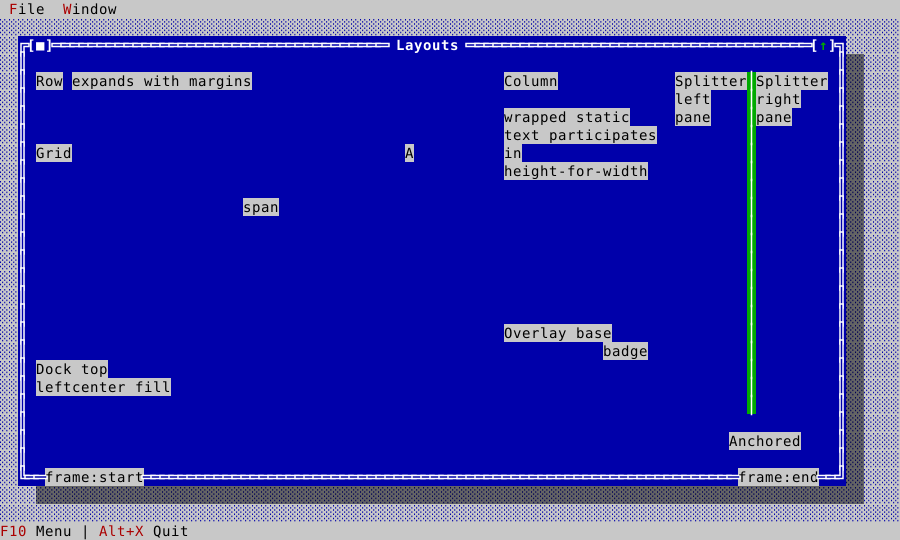
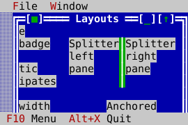
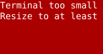
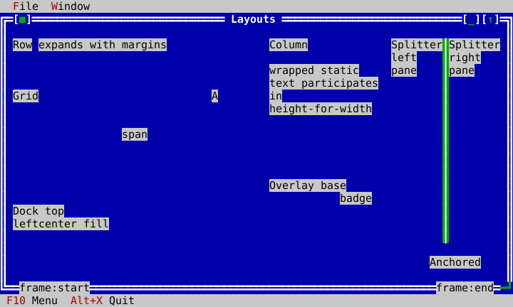

# Layout guide

Use layout objects to describe relationships between controls. All of them are
ordinary `ui::View` containers, owned by the window/content tree, and they
recompute child bounds after a terminal resize. The Layouts example places the
main families in one resizable window.


## Pick the container from the relationship

| Container | Use when | Key idea |
|---|---|---|
| `Row` / `Column` | items share a horizontal/vertical band | fixed and expanding items, spacing, alignment, margins |
| `Grid` | controls align in rows and columns | cells can span rows/columns |
| `Dock` | chrome consumes edges around a central body | top/bottom/left/right are carved in order; center fills |
| `AnchorPane` | a child follows selected edges | anchors preserve edge relationships |
| `Overlay` | children stack | fill base plus manual-positioned badges/popups |
| `Splitter` | users must resize two adjacent panes | it owns exactly two panes and handles keyboard/mouse adjustment |

The following source-backed slice creates a Row, Column, and Grid. It is part
of `LayoutsApp::build_window`, so it compiles as the real example.

<!-- ckvision-snippet source="examples/layouts/layouts_app.cpp" lines="69-93" -->
```cpp
    window->set_grow_policy(widgets::DesktopGrowPolicy::AnchorEdges);

    window->add_frame_overlay(std::make_unique<widgets::Label>("frame:start"),
                              widgets::FrameSlot{widgets::Edge::Bottom, ui::Alignment::Start, 1});
    window->add_frame_overlay(std::make_unique<widgets::Label>("frame:end"),
                              widgets::FrameSlot{widgets::Edge::Bottom, ui::Alignment::End, -1});

    ui::AnchorPane& pane = window->content_pane();

    auto row = std::make_unique<ui::Row>(Rect{1, 1, 30, 3});
    row->set_spacing(1);
    row_ = row.get();
    row->add_item(std::make_unique<widgets::Label>("Row"), ui::LayoutSpec{ui::SizePolicy::Fixed});
    row->add_item(std::make_unique<widgets::StaticText>("expands with margins"),
                  ui::LayoutSpec{ui::SizePolicy::Expanding, 1, ui::Alignment::Fill, 0, 0});
    pane.add_item(std::move(row), ui::Anchors{true, true, true, false});

    auto column = std::make_unique<ui::Column>(Rect{33, 1, 18, 7});
    column->set_spacing(1);
    column_ = column.get();
    column->add_item(std::make_unique<widgets::Label>("Column"), ui::LayoutSpec{ui::SizePolicy::Fixed});
    column->add_item(std::make_unique<widgets::StaticText>("wrapped static text participates in height-for-width"),
                     ui::LayoutSpec{ui::SizePolicy::Expanding});
    pane.add_item(std::move(column), ui::Anchors{false, true, true, false});

```
<!-- /ckvision-snippet -->

Dock, Overlay, Splitter, and anchors complete the same window. Frame overlays
are owned by `Window`, not painted by the content manually.

<!-- ckvision-snippet source="examples/layouts/layouts_app.cpp" lines="95-121" -->
```cpp
    grid->set_spacing(1);
    grid_ = grid.get();
    grid->add_item(std::make_unique<widgets::Label>("Grid"), ui::GridSpec{0, 0, 1, 2});
    grid->add_item(std::make_unique<widgets::Label>("A"), ui::GridSpec{0, 2, 1, 1, ui::Alignment::Center});
    grid->add_item(std::make_unique<widgets::Label>("span"), ui::GridSpec{1, 0, 1, 3, ui::Alignment::Center});
    pane.add_item(std::move(grid), ui::Anchors{true, true, true, false});

    auto dock = std::make_unique<ui::Dock>(Rect{1, 11, 30, 5});
    dock_ = dock.get();
    dock->add_item(std::make_unique<widgets::Label>("Dock top"), ui::DockEdge::Top);
    dock->add_item(std::make_unique<widgets::Label>("left"), ui::DockEdge::Left);
    dock->add_item(std::make_unique<widgets::StaticText>("center fill"), ui::DockEdge::Center);
    pane.add_item(std::move(dock), ui::Anchors{true, false, true, true});

    auto overlay = std::make_unique<ui::Overlay>(Rect{33, 9, 18, 5});
    overlay_ = overlay.get();
    overlay->add_item(std::make_unique<widgets::StaticText>("Overlay base"), ui::OverlayMode::Fill);
    auto badge = std::make_unique<widgets::Label>("badge");
    badge->set_bounds(Rect{11, 1, 5, 1});
    overlay->add_item(std::move(badge), ui::OverlayMode::Manual);
    pane.add_item(std::move(overlay), ui::Anchors{false, false, true, true});

    auto first = std::make_unique<widgets::StaticText>("Splitter left pane");
    auto second = std::make_unique<widgets::StaticText>("Splitter right pane");
    auto splitter = std::make_unique<widgets::Splitter>(Rect{52, 1, 17, 13}, std::move(first), std::move(second));
    splitter_ = splitter.get();
    pane.add_item(std::move(splitter), ui::Anchors{false, true, true, true});
```
<!-- /ckvision-snippet -->

## Width decides height

Wrapped content answers a different height at every width, and `Row` and
`Column` pass that question through: each answers `height_for_width` from what
its children answer at the widths it would give them, so a container holding a
paragraph reports the rows the paragraph really needs. That is what a window
sized from its own content is sized by — a message box, or any window added to
a Desktop without bounds of its own. Such a window opens at the width its
content asks for, widened only as far as it must be for the content to fit the
height available, and centred in what is left.

`Grid`, `Dock`, `Overlay` and `AnchorPane` do not report intrinsic sizes at
all; give a window built from those an explicit size.

## Resizing is part of the design

The application is tested at normal, wide, narrow, below-hard-floor, and
recovered sizes. The docked chrome stays at the terminal edges; anchored
content follows its requested edges; unavailable space degrades to the
application's small-terminal indication and recovers cleanly.

| Wide | Narrow | Below hard floor | Recovered |
|---|---|---|---|
|  |  |  |  |

## Common choices

- Use `Row`/`Column` for ordinary form bands; use a `Grid` when labels and
  fields must align across bands.
- Use `AnchorPane` for a small number of independently edge-pinned regions.
- Use `Dock` for menu/status/tool areas around a large central document.
- Use `Splitter` rather than a fixed 50/50 row when the user should control
  the balance. The File Browser is the reusable master/detail pattern.
- Put a small visual badge in `Overlay`; use a real Desktop popup/dialog when
  it needs focus, dismissal, or modality.

See [widget gallery](widget-gallery.md#splitter) for interaction details and
[object model](object-model.md) for ownership.
