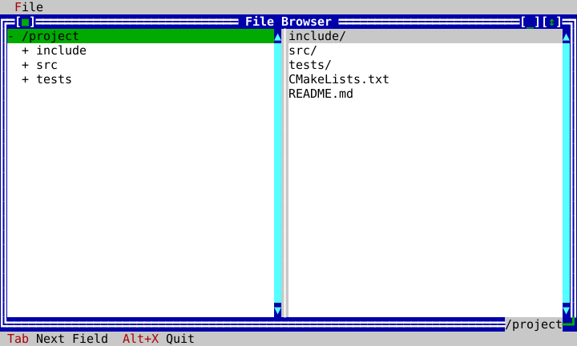

# Platform services

The UI library is intentionally host-driven. Your application chooses the
terminal backend and clock; filesystem and clipboard operations are explicit
services. This keeps UI code deterministic and makes a real application and a
headless test share the same view graph.

| Service | Interactive POSIX host | Interactive Windows host | Deterministic test host | Client use |
|---|---|---|---|---|
| terminal | `term::PosixTerminal` | `term::WindowsTerminal` | `term::HeadlessTerminal` | construct `Application`; run/poll/present |
| clock | `term::PosixClock` | `term::WindowsClock` | `ManualClock` | timers and application time |
| clipboard | `TerminalClipboardWriter` (OSC 52) | `WindowsClipboardWriter` or the default terminal adapter | Application internal clipboard | text editor controls |
| filesystem | `term::PosixFileSystem` | `term::WindowsFileSystem` | `MemoryFileSystem` | File Browser, file/directory dialogs |

The File Browser accepts `FileSystem&`, so its master/detail wiring is
identical against a real disk and the deterministic tree used for screenshots.
It never lets TreeView or ListView query the disk themselves.

On Windows, `term::WindowsClipboardWriter` exports UTF-8 as native
`CF_UNICODETEXT`. Each write owns an invisible message-only window on the
constructing thread, rather than borrowing a console-host window or registering
a global window class. Construct, call and destroy the adapter on that thread. It can be injected
directly into `Application`; `WindowsTerminal` owns the same adapter for the
default clipboard path. The publication window is destroyed before returning:
the system retains the immediately rendered Unicode data, and later writers
need not send ownership messages to an unpumped terminal application's window.
Writes are best-effort and never retry waiting for another application to unlock the
clipboard. Invalid UTF-8 and embedded NUL are rejected before opening it;
Application's internal copy remains available when native export fails.
After `EmptyClipboard` succeeds, a later OS publication failure may leave the
system clipboard empty. No read/import or delayed-rendering message loop is
introduced. Native tests use a separate window station so they never replace
the user's desktop clipboard.

`FileEditorController` uses the same injected boundary for `read_file()`,
`fingerprint()`, and `write_file_atomic()`. A save supplies the fingerprint it
loaded; a changed-on-disk file returns a conflict rather than being silently
overwritten. `MemoryFileSystem` implements these operations for deterministic
editor lifecycle tests. Applications that own a directory tree can call
`create_directories()`; it creates missing parents idempotently and remains
behind the same injected platform boundary. See [Editor](editor.md) for the
document/controller composition.

`term::WindowsFileSystem` supplies the real disk service on Windows. Names
are strict UTF-8, converted to native wide drive/UNC paths; long paths use
extended spelling without requiring an application manifest. `normalize_path`
resolves native relative names and dot components, retains the drive/share
root, and uses '/' separators. `parent` never navigates above that root;
`join` accepts a child fragment, not an absolute second argument. Invalid
UTF-8/NUL, wildcards, device namespaces and alternate streams are rejected.

Listing sorts directories first and then files in UTF-8 byte order. Queries
and reads follow links. Whole-file reads fingerprint the opened handle, not
the replaceable path; ordinary write handles are excluded during the read.
Conditional saves hold a persistent `.ckvision-write.lock` per directory,
check the expected revision, write/flush an exclusive random sibling and
publish by native rename. Cooperating adapters/processes therefore cannot
both save the same stale revision. Opaque revision tokens include native file
identity, size/timestamps and streamed SHA-256 bytes, detecting same-size
changes even when native timestamps are identical. Fingerprint-only queries
read/hash the file without retaining its contents; whole-file reads hash the
same chunks they return. This is not a portable content-addressing format.
The lock basename is reserved and the service does not clean or replace it.

Writes refuse a final-component reparse point, directories and native
access/read-only/sharing failures. On failure the target is never partially
copied over or removed as a fallback. Existing discretionary permissions
(DACL) are preserved; new files inherit directory permissions. The new file's
owner is its creator, and other metadata/alternate streams are not preserved
by this byte-file service. Native filesystems must support the revision and
rename operations; unsupported operations report failure. No administrator
privileges are enabled. This is cooperative serialization: arbitrary external
path replacements or mapped-memory writes are not locked by the adapter.

<!-- ckvision-snippet source="examples/filebrowser/filebrowser_app.cpp" lines="107-146" -->
```cpp
    window->set_min_size(Size{40, 10});
    // Keeps filling the content area as the terminal grows, rather
    // than staying pinned at whatever size it happened to be created
    // at (M8 WP-4) — the natural policy for a single-window,
    // fills-the-desktop application like this one.
    window->set_grow_policy(widgets::DesktopGrowPolicy::KeepFilling);

    auto tree = std::make_unique<widgets::TreeView>();
    tree_ = tree.get();

    widgets::TreeNode root;
    root.label = root_path_;
    root.user_data = root_path_;
    populate_children(fs_, root);  // eager for the root only, so it can start expanded
    root.expanded = true;
    std::vector<widgets::TreeNode> roots;
    roots.push_back(std::move(root));
    tree_->set_roots(std::move(roots));

    auto file_list = std::make_unique<widgets::ListView>();
    file_list_ = file_list.get();

    tree_->on_selection_changed = [this](widgets::TreeNode&) {
        refresh_file_list_for_selected_node();
    };
    // Lazy population (M10/WP-22): fires the first time the user
    // expands a node whose children were never listed.
    tree_->on_expand_request = [this](widgets::TreeNode& node) { populate_children(fs_, node); };

    // Splitter (M10/WP-19) replaces the old fixed 50/50 Row: the split
    // starts at the same exact 50/50 ratio (Splitter's own default),
    // and Left/Right now lets the user adjust it.
    auto content = std::make_unique<widgets::Splitter>(window->content_rect(), std::move(tree),
                                                         std::move(file_list));
    splitter_ = content.get();
    window->set_content(std::move(content));

    // The selected directory's full path, shown live on the window's
    // own bottom border via Window::add_frame_overlay — exactly the
    // "current line in a text input window" pattern the overlay slot
```
<!-- /ckvision-snippet -->



Terminal profiles describe what the host is known to support; they are not a
license to inspect environment variables inside a widget. See
[terminal profiles](terminal-profiles.md), [graphics](graphics.md), and
[input decoding](input-decoder.md) for the protocol-facing reference material.
