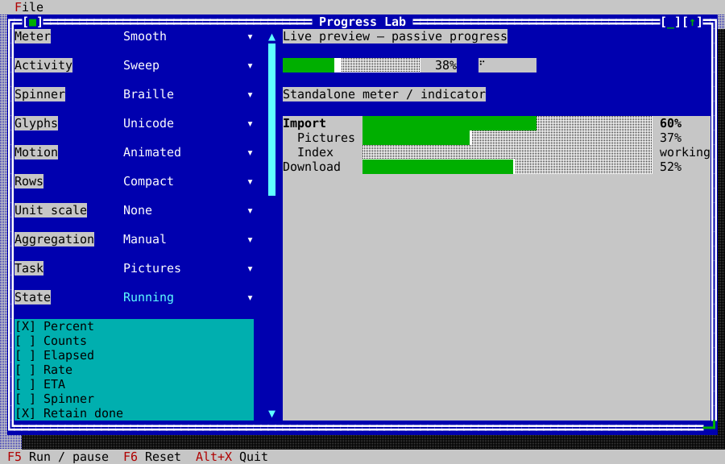

# Advanced progress

ckVision offers a small meter (`Progress`), an activity glyph
(`ActivityIndicator`) and a task display (`ProgressView`). Presentation and
measurement are separate: changing a style never changes the underlying work.
The [widget gallery](widget-gallery.md#progress) shows every display variant
with figures captured from compiled public-API examples.

## Interactive Progress Lab

Build the examples and run `ckvision_progress` from a terminal. The left pane
contains the controls and scrolls to reveal additional options; the right pane
shows the standalone meter, indicator and main/subtask display. Use Tab to move
focus, the combo boxes to select variants, and the settings scrollbar, mouse
wheel or focused viewport's scrolling keys to reach the lower controls.
F5 runs/pauses the selected task; F6 resets the sample operation; Alt+X exits.
The Step button advances one simulation step.

Test all four meter styles (Solid, Block, Segmented, Smooth), the Sweep/Bounce/
Pulse activity patterns, Dots/Braille/ASCII indicators and comma-separated custom
frames. Unicode/ASCII and Animated/Static are explicit choices. Compact and
Detailed change row geometry. Percentage, counts, elapsed, rate, ETA and spinner
columns can be selected independently. The lab also exposes manual/weighted
aggregation, task state, unknown totals, hidden tasks, child-set finalization,
completed-child retention, unit scaling, completed/total values, weights,
refresh interval, step amount/interval and row range. Edit the task title/unit, detail message, standalone caption/percentage and
standalone fraction while observing the display.




The lab creates and binds all three displays with the public API:

<!-- ckvision-snippet source="examples/progress/progress_lab_app.cpp" region="progress-lab-display" -->
```cpp
display_ = preview->make<widgets::ProgressView>(model_);
controller_.bind(*display_);
meter_ = preview->make<widgets::Progress>();
meter_->set_bounds(Rect{0, 2, 24, 1});
meter_->set_presentation(widgets::ProgressPresentation::Smooth);
meter_->set_fraction(0.375);
meter_->set_show_percentage(true);
controller_.bind(*meter_);
indicator_ = preview->make<widgets::ActivityIndicator>();
indicator_->set_bounds(Rect{27, 2, 8, 1});
controller_.bind(*indicator_);
```
<!-- /ckvision-snippet -->

## Data, ownership and state

Include `cvision/widgets/progress_tasks.hpp`. A `ProgressModel` owns titles,
messages, units and task records. `add_task` returns a stable nonzero ID;
invalid configuration returns zero. Setters return false for invalid IDs or
values. Totals and completed amounts are finite and nonnegative; weights are
finite and strictly positive. Missing totals mean unknown work. Zero total
remains 0% until explicit completion. Reaching a total does not complete a task:
call `complete`, `fail` or `cancel`. Terminal states require `reset` before
restarting. `pause` excludes paused time and clears the rate history; `start`
resumes it. Changing an amount backwards restarts measurement.

Tasks form an explicit tree, limited to 64 levels. Reparenting rejects cycles;
removal removes the subtree. `finalize_children` prevents changing that parent's
child set. Visibility affects presentation rather than accounting.
`set_retain_completed(false)` collapses completed child rows into a parent completion summary while failed
and cancelled rows remain visible. `set_first_row` and `set_max_rows` bound the
prepared display. Models and controllers belong to the UI thread. Use
`begin_update` / `end_update` to notify observers once for a batch; subscription
callbacks may inspect or disconnect but must not mutate the model.

Manual parents use their own amount and total. Weighted parents combine child
fractions using explicit weights, never by summing incompatible units. An
unknown child keeps the exact aggregate unknown. `known_lower_bound` records
the known contribution; the view does not pretend this is an exact percentage.
A child's failure or cancellation remains visible on its parent. A weighted
parent's count field reports completed children rather than fabricated units.

## Rendering and time

Smooth meters use eight Unicode subcell steps, with exact empty/full endpoints.
ASCII uses whole-cell `#` and `-`. Segmented meters leave a gap between units.
Unknown activity carries a state label; narrow layouts discard optional fields
in order: rate, ETA, elapsed, counts, spinner, then percentage. Very narrow
rows retain a lifecycle/activity glyph. Detailed rows add a clipped message.
All fields use the central grapheme-width policy and existing progress theme
roles; the widgets add no frame or brackets.

Construct `ProgressController(app, model)` and bind each display, indicator or
standalone meter with `bind`. Task views must observe that controller's model,
and bound widgets must belong to the same application. It shares one one-shot timer for active bound
widgets. The application's injected clock drives phases, elapsed time and rate;
there are no clock reads inside widgets. Hidden, detached, static and finished
widgets do not request animation. Late callbacks advance to the current phase
without replaying missed frames. `set_interval` controls refresh frequency.
Binding a standalone meter or indicator advances its phase; its fraction and
state remain caller-owned. Animation-only updates reuse prepared text. Time
metadata refreshes when the whole-second clock value changes, work updates or
a rate expires. Manual clients can supply monotonic nanoseconds with `model.set_time` and
explicit phases with `set_phase` / `set_pulse`.

Rates use at most eight samples and need two distinct timestamps plus positive
advancement. They expire after three seconds without work. ETA needs a known
manual total and a current rate; ETA is unavailable for weighted, paused, stalled and unknown-total tasks.
Unknown-total manual tasks can still show an observed rate. Static motion keeps stable activity markers and
requests no animation timer; metadata refreshes on explicit data/time updates.

Controllers, subscriptions and views tolerate model destruction: callbacks
become inert and the task display clears. Bound views also have lifetime tokens,
so deleting a widget does not leave a timer targeting it. The application must
outlive its controller and mailbox.

## Worker updates

`ProgressMailbox(app, model, capacity)` accepts `submit(id, completed, total)`
from workers. It coalesces the latest update per task, holds at most `capacity`
distinct pending tasks and posts one UI callback. A full mailbox rejects new
task IDs; existing pending IDs can still be replaced. Invalid numeric values
are rejected. Its UI callback batches updates and ignores IDs removed before
delivery. `shutdown` rejects future work and makes pending callbacks inert.
Keep the mailbox alive while producers call it, stop/join producers before
its destruction, and keep the application alive through delivery or shutdown.
