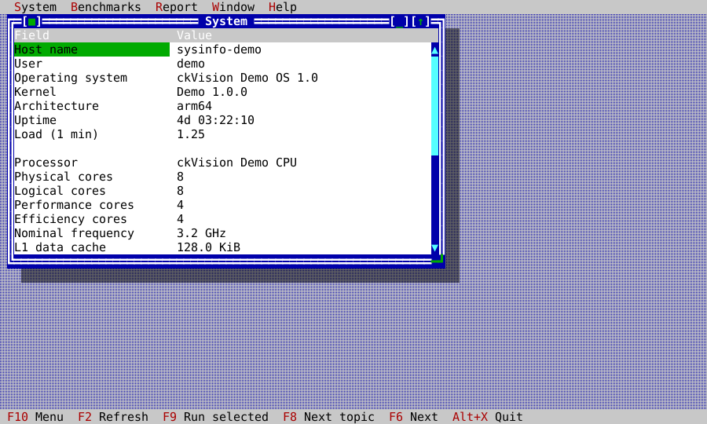
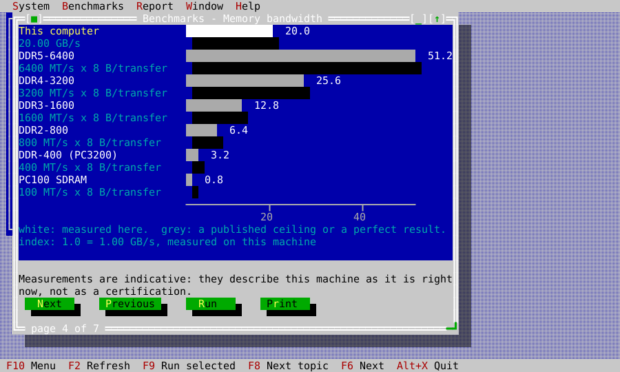
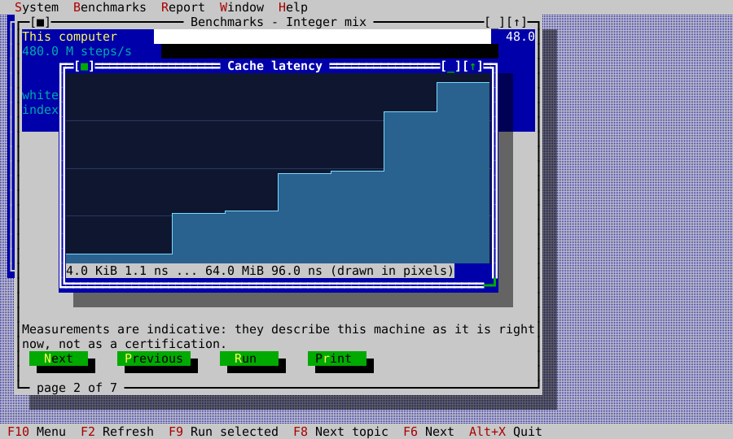
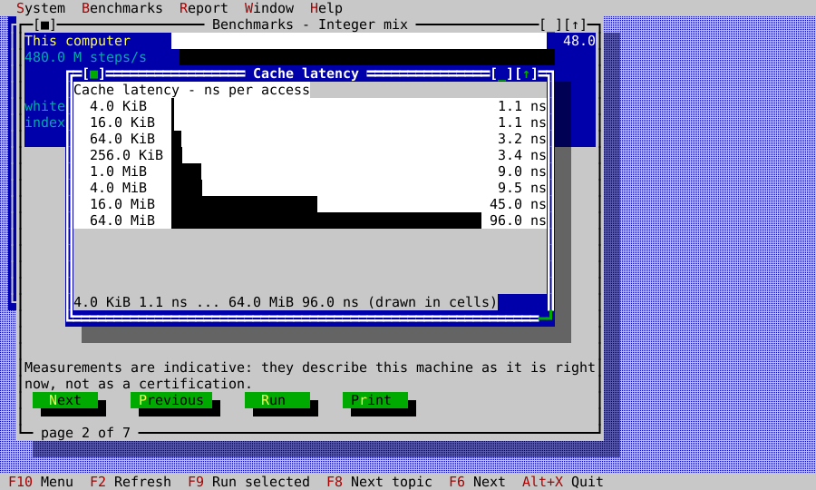
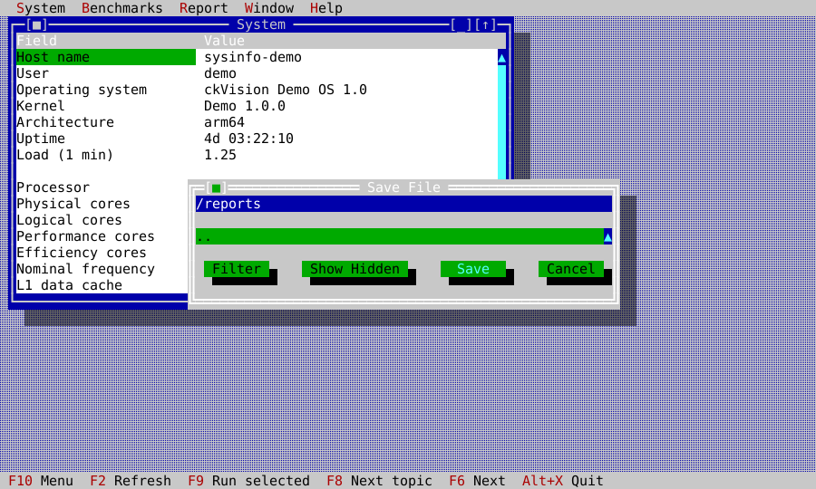
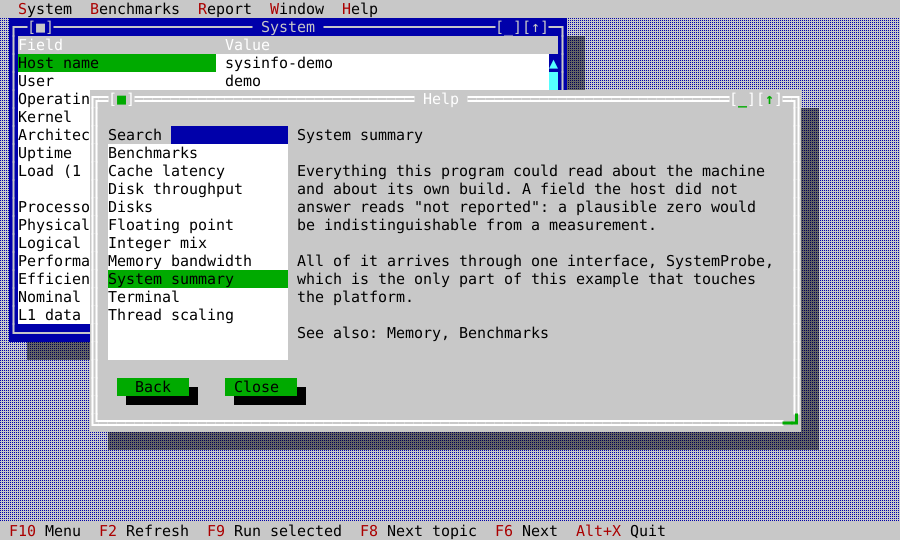

# SysInfo: what this machine is, and how fast

`examples/sysinfo` is a system information and benchmarking application in the
interaction grammar of the diagnostic tools of the early 1990s: a desktop of
windows under a menu bar, every figure named, and a bar chart comparing what
was measured against what was published.

It is in this repository for three patterns the other examples do not show:

| Pattern | Where to look |
|---|---|
| A second injected platform service, differently shaped from `FileSystem` | `system_probe.hpp`, `posix_system_probe.cpp` |
| Long, cancellable work on a worker thread, delivered through `Application::post` | `benchmark_service.cpp` |
| Comparative data visualization with a capability-chosen rendering | `bar_chart_view.cpp`, `latency_plot.cpp` |

## The platform boundary

Everything this application reports about the machine arrives through one
interface. No other file in the reporting path includes a platform header,
reads the environment, or probes host files. The separately opt-in disk
benchmark writes only to the directory the reader chooses and is described
under the measurement rules below:

<!-- ckvision-snippet source="examples/sysinfo/system_probe.hpp" region="system-probe" -->
```cpp
class SystemProbe {
public:
    virtual ~SystemProbe() = default;

    // Cheap and re-readable: the application calls host() and memory() on a
    // refresh timer, so an implementation must not cache them.
    virtual HostReport host() const = 0;
    virtual MemoryReport memory() const = 0;

    virtual ProcessorReport processor() const = 0;
    virtual std::vector<VolumeReport> volumes() const = 0;
    virtual PowerReport power() const = 0;
    virtual BuildReport build() const = 0;
};
```
<!-- /ckvision-snippet -->

`PosixSystemProbe` implements it for macOS (sysctl, mach, `getmntinfo`) and for
Linux (`/proc`, `/sys`, `/etc/os-release`). `FixedSystemProbe` returns a
scripted machine, which is what the tests and the generated screenshots run
against — so every pane renders identically on every host. A Windows probe is
the same shape and belongs to the Windows host package; the application above
the interface does not change when it arrives.

**Absence is expressed as absence.** A host that cannot answer "how many
physical cores" must not be made to say zero: a plausible wrong number is
indistinguishable from a measurement, and this is a program whose entire
purpose is to be believed about numbers. Every unavailable field reads
`not reported`.

## The panes

- **System** — host, operating system, processor, power, and the build's own
  facts, including which build configuration took the measurements.
- **Memory** — total and available, then the host's own accounting in the
  host's own words. Operating systems disagree deeply about what "used" means,
  so this pane does not translate their categories into a vocabulary it would
  have had to invent.
- **Disks** — the volumes a reader means by "disks". The operating system's own
  bookkeeping (preboot and recovery volumes, simulator images, container
  overlays) is hidden by default, counted in the window's footer, and one
  checkbox away. The discriminator is `MNT_DONTBROWSE` on macOS — the flag the
  kernel already keeps for this question — and a stated rule about block
  devices on Linux.
- **Terminal** — the capability report, the cell metric, and whether this
  terminal decodes pictures. The one report here that is about the terminal
  rather than the machine.
- **Benchmarks** — the chart, described below.

The summary below is the actual application driven against
`FixedSystemProbe`. The obviously fictional host makes the capture honest: it
is evidence of layout and presentation, never a claim about the machine that
generated this page.



## Measurements, and what makes them honest

Six kernels: an integer mix, a naive double-precision matrix multiply, STREAM's
triad, a pointer-chase latency walk, a thread-scaling run, and a disk
write/read. The first five are functions over memory owned by the run, which is
why their **answers** can be tested independently of their speed —
`integer_mix(seed, 2)` against the xorshift and fold worked out by hand, the
multiply against identity and a 2×2 done on paper, and the triad against its
arithmetic. The disk path is deliberately different: its negative test proves
that an empty directory selection performs no I/O, while interactive storage
measurement remains explicit and opt-in.

Four rules hold everywhere in the example, and each is enforced by a test:

1. **No test asserts a score.** A benchmark number is a fact about a machine's
   afternoon — its thermal state, its power source, what else is running. The
   suites assert what the kernels compute, that progress advances, and that
   cancel stops a run.
2. **The scale is stated where the bars are.** Each metric's group heading
   names its own 1.0 ("Disk throughput — index, 1.0 = 100 MB/s"), because one
   caption can only name one scale.
3. **A bar this program did not measure is drawn in different ink.** Measured
   bars are solid and drawn to an eighth of a cell; published ceilings are
   shaded and drawn in whole cells, because a figure computed from a standard
   is exact to the standard and to nothing finer. Every reference row carries
   its arithmetic and its source — `DDR4-3200`, `3200 MT/s × 8 B/transfer`,
   `JEDEC DDR4 (JESD79-4)` — and the test redoes the arithmetic rather than
   pinning the number. A kernel with no published figure, such as this
   program's own integer mix, has no comparison bars at all.
4. **An unoptimized build says so.** `CKV_SYSINFO_BUILD_TYPE` arrives from
   CMake; a Debug build marks every bar it measured with an asterisk and
   answers it under the chart. On the machine this was written on, the same
   code scores between 3.7× and 12.8× lower unoptimized.

The comparison page puts a measured memory-bandwidth result and published
interface ceilings on the same metric-specific scale. The solid and shaded
bars, their legend, and their arithmetic are generated from the same
`BenchmarkResult` and `ReferencePoint` values that the report exporter uses.



The disk kernel is the only one that writes to the reader's machine. It says
how much it will write, asks where, writes nothing until it has an answer, and
removes what it wrote from a destructor so a cancelled run leaves nothing
behind. What it does not do is stated in its help topic: it does not defeat the
page cache, which needs a different platform call on every platform.

## Two renderings of one data set

Where the terminal decodes pictures, the cache-latency curve is drawn into a
`Canvas` on a logarithmic axis; where it does not, the same series is drawn as
cell bars — by the same row composition the chart uses, so the two cannot
diverge. It is one widget with a mandatory fallback rather than a choice
between two widgets made once at construction, because a terminal's answer
about graphics can change while an application is running:

<!-- ckvision-snippet source="examples/sysinfo/sysinfo_app.cpp" region="latency-canvas" -->
```cpp
auto canvas = std::make_unique<widgets::Canvas>();
// Canvas never asks the terminal for its cell metric itself; the owner
// injects it (D-039), which is what keeps the picture's proportions
// right on a terminal with tall thin cells and on one with square ones.
canvas->set_cell_metrics(app_.terminal_cell_pixels());
canvas->set_draw_callback([this](Image& image) { draw_latency_plot(image, latency_series()); });
const ui::RoleId fallback_role = app_.roles().find("ckv.list.normal");
canvas->set_fallback_painter([this, fallback_role](scene::Painter& painter, Rect area) {
    const Style style = app_.theme().resolve(fallback_role);
    const std::vector<std::string> rows = chart_rows(latency_bars(), area.width);
    for (int row = 0; row < area.height && static_cast<std::size_t>(row) < rows.size(); ++row)
        painter.draw_text(Point{0, row}, rows[static_cast<std::size_t>(row)], style);
});
canvas->set_help_context_key("sysinfo.latency");
latency_canvas_ = canvas.get();
column->add_item(std::move(canvas), ui::LayoutSpec{ui::SizePolicy::Expanding});
```
<!-- /ckvision-snippet -->

The two captures below run that exact view tree and scripted latency series.
Only the terminal capability profile differs.

| Sixel-capable terminal | Cell fallback |
|---|---|
|  |  |

## Reports and contextual help

`Report` presents the ordinary injected-filesystem save dialog. The generated
text and Markdown documents contain the System, Memory, Volumes, Terminal, and
Measurements sections, including every displayed absence and the provenance
of every comparison figure. `save_report()` writes through `FileSystem`; the
tests read the result back from `MemoryFileSystem`, byte-for-byte against
`report_text()`.



F1 resolves from the focused pane's `help_context_key()`. Every pane and every
benchmark has its own topic explaining what the number means, what it does not
mean, and what changes it. The topic registry is built beside the pane and
benchmark definitions, and the report suite enumerates the benchmark catalogue
to prove that no topic silently becomes “Not Found.”



## Running it

```sh
cmake -S . -B build -DCKVISION_BUILD_EXAMPLES=ON -DCMAKE_BUILD_TYPE=Release
cmake --build build --target ckvision_sysinfo
./build/examples/ckvision_sysinfo
```

Build it Release. A Debug build measures the compiler.

`F10` opens the menu, `F9` runs the selected benchmarks, `Esc` cancels a run,
`F1` explains the pane under the cursor, and `Report` writes everything on
screen to a text or Markdown file through the injected filesystem.

## What is verified, and how

| Suite | What it holds the example to |
|---|---|
| `test_sysinfo_format.cpp` | units, rounding, the 1024.0-KiB carry, and the absence rule |
| `test_sysinfo_smoke.cpp` | the panes against the scripted machine, the refresh timer, cancellation, the mount filter, and the pixel path on a Sixel profile |
| `test_sysinfo_benchmark.cpp` | each kernel's answer, the worker's delivery, and deterministic cancellation |
| `test_sysinfo_analysis.cpp` | the pointer chase is a single cycle, and the plot draws its own data |
| `test_sysinfo_chart.cpp` | bar geometry, per-group normalization, and the two inks |
| `test_sysinfo_reference_points.cpp` | every published figure, by redoing its arithmetic |
| `test_sysinfo_report.cpp` | the exported report and the help topics |
| `test_posix_system_probe.cpp` | the real probe's internal consistency — never a value |
