# TODO: a complete local Kanban application

`examples/todo` is the broadest ckVision example: a useful, persistent TODO
application built from the same public windows, menus, dialogs, commands,
status line, help viewer, editor, scrolling, themes, keyboard, and pointer
services available to any client.

It is deliberately more than a widget gallery. Every accepted change is
durable before the UI reports success; boards and lanes have complete
lifecycle operations; another running instance is noticed; and conflicts are
resolved without silently discarding either version.

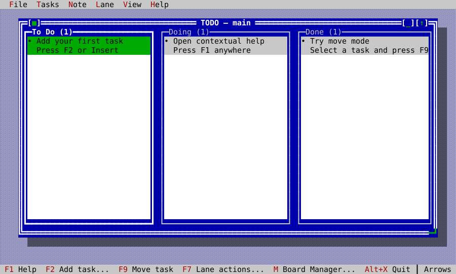

## Run it

```sh
cmake -S . -B build -DCKVISION_BUILD_EXAMPLES=ON -DCMAKE_BUILD_TYPE=Release
cmake --build build --target ckvision_todo
./build/examples/ckvision_todo --demo
```

`--demo` is the safest first tour. It opens a fixed in-memory board and writes
nothing. The ordinary command opens a persistent workspace under
`~/.ckvision/todo` on POSIX:

```sh
./build/examples/ckvision_todo
./build/examples/ckvision_todo --data-dir /path/to/workspace
./build/examples/ckvision_todo --board Release
./build/examples/ckvision_todo Release
./build/examples/ckvision_todo --help
./build/examples/ckvision_todo --version
```

On first persistent launch, choose a guided sample or an empty Board. A
requested Board name is selected after loading; otherwise the last selected
Board is restored. `--data-dir` makes demonstrations and tests independent of
personal data.

## The product tour

### Tasks and movement

Each task has a title, details, long note, due date with an optional due time, four-level priority,
optional named color, stable id, creator/updater, and timestamps. The two-row
cards keep their height while selection moves. Priority and due state use text
and glyph shape as well as color, so Mono remains understandable.

F2 adds a task and F3 edits every short field. Due dates use ckVision's typed,
optional `DatePicker` rather than process locale: Left/Right selects year,
month, or day, Up/Down adjusts it, and Delete clears it. Space or the visible
dropdown affordance opens ckVision's full `CalendarDropdown`/`CalendarView` for
grid selection. The adjacent optional due-time control is a `TimePicker`;
Left/Right selects hour or minute and
Up/Down adjusts it. New times seed from the injected local clock and persist
as canonical 24-hour `HH:MM`. Cards label overdue, today, and tomorrow from
the injected calendar date before falling back to a future ISO date, and append
the due time when one is set. Delete is a permanent, confirmed operation;
Archive first writes a separate durable record and only then removes the task.

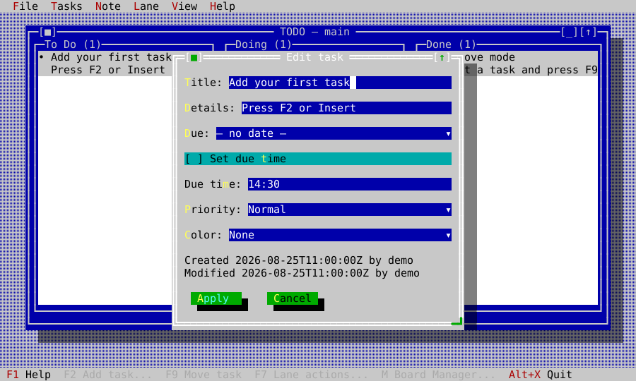

Archive and permanent Delete are deliberately distinct, and both show the
exact task before asking for confirmation:

| Archive to the durable history | Delete permanently |
|---|---|
| 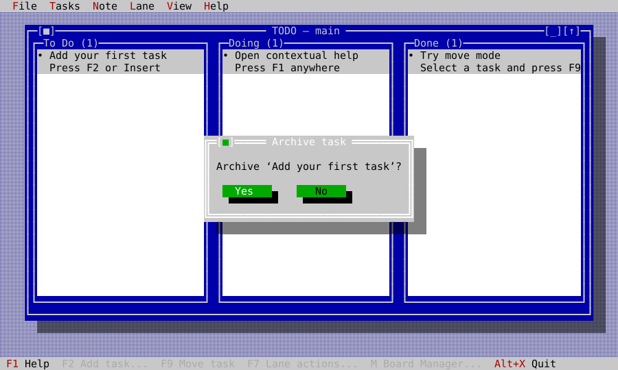 | 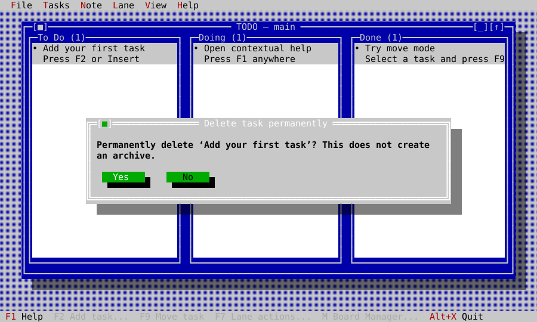 |

F9, Enter, or Space starts move mode. Arrow keys choose the target lane and
insertion point; Enter/Space commits and Escape cancels. Pointer drag/drop
uses the same controller transaction and visible insertion marker. A lane
with automatic sorting accepts cross-lane moves but explains why manual
reordering is unavailable.

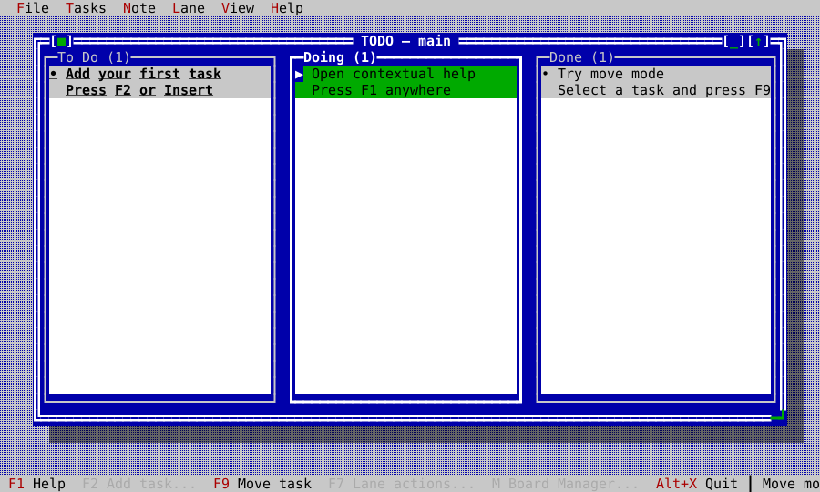

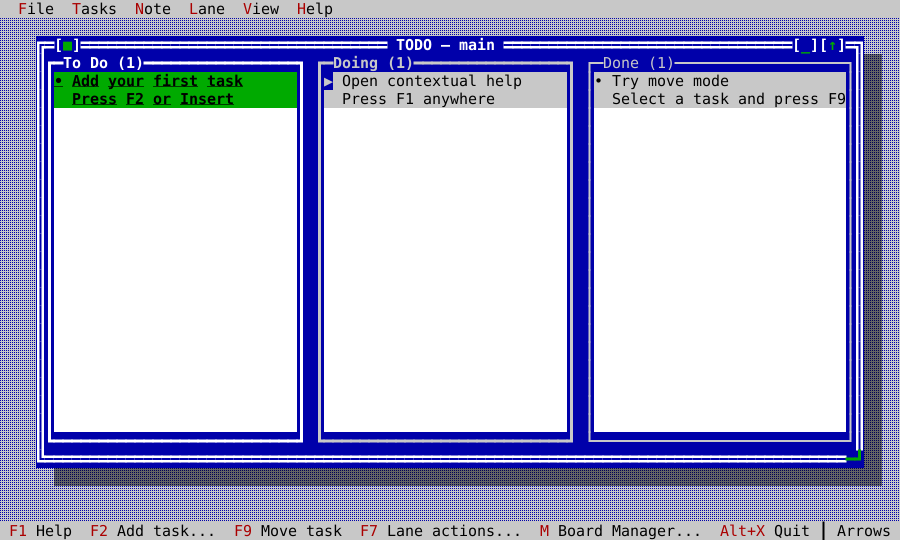

### Full note editor

F4 opens the selected task's note in a modeless, movable, resizable
`TextEditor` window. Multiple notes can overlap the Board and participate in
standard next/previous/list/tile/cascade window commands. The Note menu exposes
undo, redo, cut, copy, paste, find selection, find next, and word wrap. The
window footer shows line, column, and `Saving…`/`Saved` state.

Edits coalesce for 150 ms and flush on close. If another instance edits the
same note, local text remains visible until the user chooses which version to
keep. If the task is removed externally, the editor becomes read-only and
retains the local text so it can still be copied.

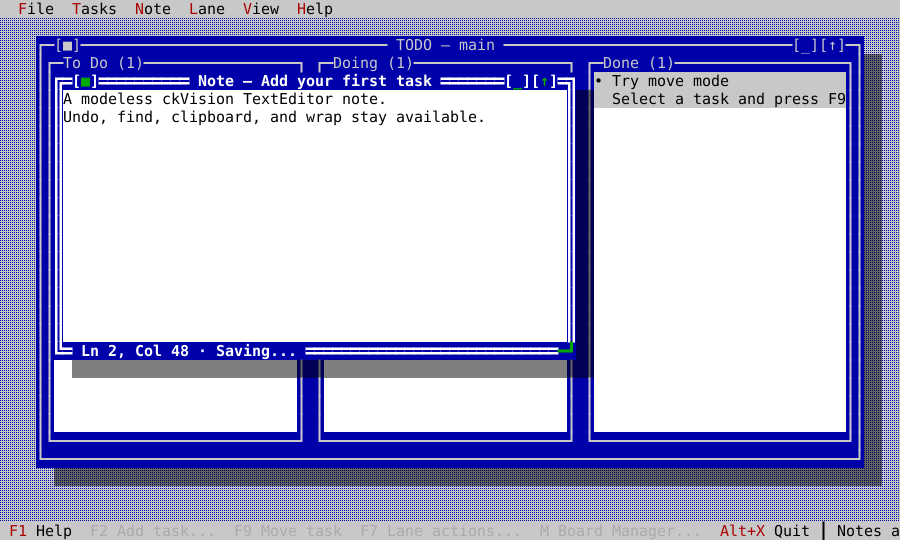

### Lanes and Boards

F7 opens Lane actions. A lane can be renamed, colored, sorted by Manual,
Color, Due, Created, Modified, or Priority, inserted on either side, merged
into a chosen lane, or archived with all its tasks. The final lane cannot be
removed, and actions that cannot succeed at the current lane or workspace
limit are omitted instead of leading to an error-only workflow.

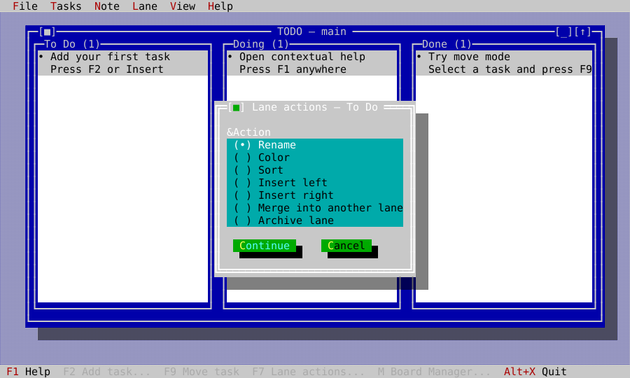

Press `m` or click `Board: name` in the status line for Board Manager. Boards
can be created, switched, renamed, merged, or archived. Merge preserves global
ids, combines same-title lanes in target order, and appends unmatched lanes.
The protected `main` Board ensures the workspace can never have zero Boards.
Rename, merge, and archive first choose from eligible non-main Boards; until
one exists, Board Manager shows only switch and create.

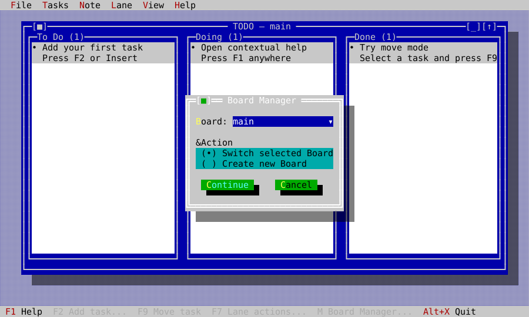

Additional lanes remain useful rather than shrinking into unreadable slivers:
the Board uses a horizontal `ScrollViewport`, gives each lane a minimum width,
and reveals the focused lane automatically.

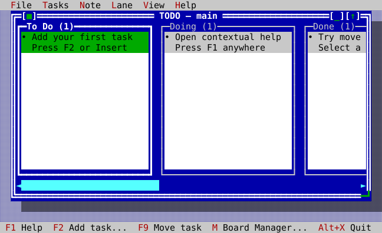

### Desktop and themes

The Board is an ordinary ckVision `Window`: move, resize, zoom, minimize,
cycle, list, tile, and cascade all remain available. The menu bar is reached
with F10 or Alt+mnemonic; visible status commands are clickable; task and lane
context menus open with right-click or Shift+F10. Initial Board and Note
windows are fitted inside the available desktop even on a small terminal.

The View menu switches the whole application through ckVision's theme
service. State remains distinguishable in all schemes:

| Dark | Light |
|---|---|
| 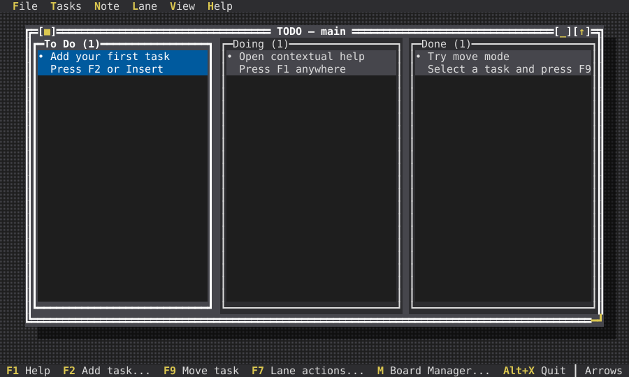 | 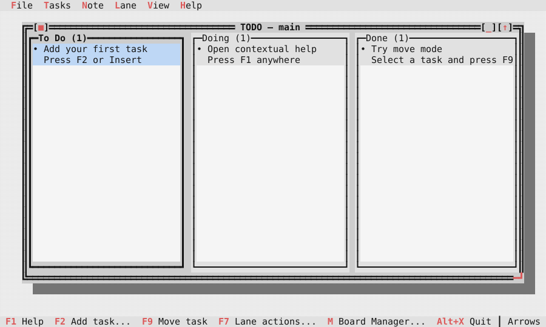 |

| Mono | High contrast |
|---|---|
| 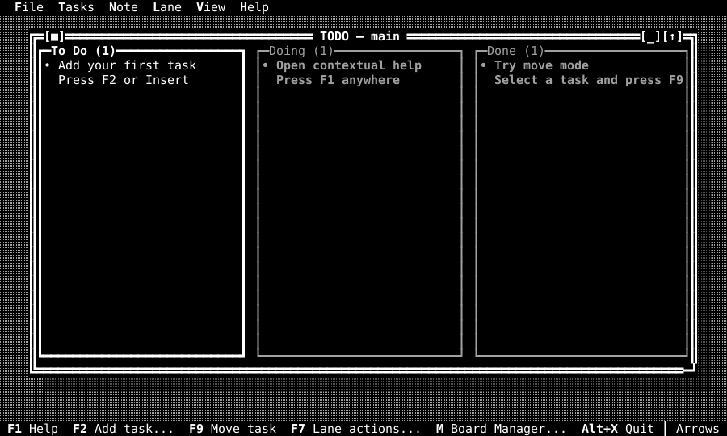 | 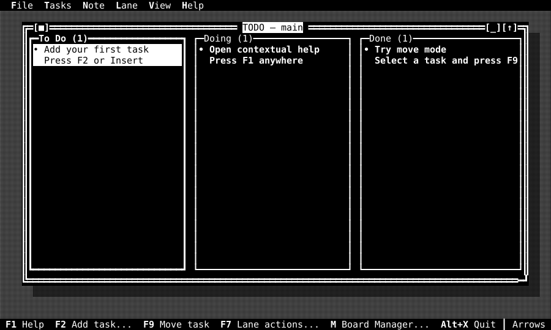 |

## Keyboard and pointer reference

Bare-letter aliases belong to the `todo.board` command context. Typing in a
dialog or note therefore never archives, moves, or quits the Board.
Every descriptor-built dialog inherits a Board, task, lane, Board-management,
or persistence help topic, so F1 remains contextual throughout a workflow.

| Intent | Keys |
|---|---|
| Context help | F1; Board-only `h` or `?` |
| Add / edit task | F2 or Insert or `+`; F3 or `e` |
| Open note | F4 or `n` |
| Lane actions | F7 |
| Archive / move | F8 or `a`; F9 or Enter or Space |
| Permanent delete | Delete or `d` |
| Select task / lane | Up/Down; Left/Right or Tab/Shift+Tab |
| Board Manager | `m` or the Board status item |
| Menu / window zoom / next window | F10; F5; F6 |
| Cancel | Escape |
| Quit | Alt+X or Board-only `q` |
| Note undo / redo | Ctrl+Z / Ctrl+Y |
| Note cut / copy / paste | Ctrl+X / Ctrl+C / Ctrl+V |
| Note find selection / next | Ctrl+F / Ctrl+G |
| Note wrap | Alt+W |

Pointer equivalents include task selection and double-click edit, independent
lane scrolling, direct task drag/drop, status-line command activation, dialog
controls, menus, context menus, and standard window chrome.

## Architecture to reuse

The example keeps domain rules, persistence, UI coordination, and host impurity
separate:

| Layer | Responsibility |
|---|---|
| `todo_model.*` | stable values, validation, sorting, moves, lane/Board transitions |
| `todo_codec.*` | bounded RFC 8259 JSON decode and canonical encode |
| `todo_repository.hpp` | injected load/revision/commit/archive contract |
| `memory_todo_repository.*` | deterministic tests, demo mode, screenshots, benchmarks |
| `json_todo_repository.*` | atomic real files, daily backups, separate archives |
| `todo_controller.*` | time/identity stamps and durable transaction boundary |
| `todo_lane_view.*` | two-row cards, selection, scrolling, pointer drag surface |
| `todo_board_view.*` | responsive lanes, focus/navigation, insertion target |
| `todo_app.*` | commands, menus, dialogs, windows, help, themes, conflict UX |
| `todo_host.*`, `main.cpp` | CLI, environment/user lookup, terminal, real clock/filesystem |

The repository is deliberately small enough to implement in memory and on a
real filesystem without changing the controller:

<!-- ckvision-snippet source="examples/todo/todo_repository.hpp" region="todo-repository" -->
```cpp
class TodoRepository {
public:
    virtual ~TodoRepository() = default;

    virtual TodoLoadResult load() = 0;
    virtual TodoRevisionResult revision() = 0;
    virtual TodoCommitResult commit(const RepositoryRevision& expected,
                                    const TodoWorkspace& workspace,
                                    IsoDate mutation_date) = 0;
    virtual TodoArchiveResult store_archive(const ArchivedTask& record) = 0;
};
```
<!-- /ckvision-snippet -->

Every ordinary mutation works on a candidate workspace and publishes it only
after the repository accepts the expected revision. Model failure and storage
failure leave the controller's current value untouched:

<!-- ckvision-snippet source="examples/todo/todo_controller.hpp" region="todo-controller-commit" -->
```cpp
template <class T>
ControllerResult<T> complete(TodoWorkspace candidate,
                             ModelResult<T> model_result,
                             const CalendarReading& reading) {
    if (!model_result) return ControllerResult<T>::failure(model_error(std::move(model_result.error)));
    const TodoCommitResult committed = repository_.commit(revision_, candidate, reading.local_date);
    if (!committed) return ControllerResult<T>::failure(repository_error(committed.error));
    workspace_ = std::move(candidate);
    revision_ = committed.value->revision;
    return ControllerResult<T>::success(std::move(*model_result.value));
}
```
<!-- /ckvision-snippet -->

The custom lane and Board views are the extension lesson: subclass
`ui::View`, declare focus/context/help at construction, render only through
`scene::Painter`, use ckVision text measurement/elision, and translate input
into stable-id callbacks. They do not reach into the controller, repository,
clock, filesystem, or terminal.

## Persistence and concurrent instances

The workspace is versioned, human-readable JSON. `JsonTodoRepository` writes a
temporary sibling, syncs it, and atomically replaces `todo.json`. Before the
first mutation on a calendar day it writes the previous valid workspace to
`backup/YYYY-MM-DD.json` and never overwrites that day's backup. Archives live
under `archive/` with timestamp and task id in the file name. A failed archive
write leaves its task live. POSIX writes use a persistent hidden advisory lock
per directory so the expected-revision check and rename are one critical
section across cooperating TODO processes; the containing directory is synced
after publication. Reads derive both bytes and revision from the same opened
file descriptor.

The library layers never read the filesystem, environment, locale, or wall
clock. `main.cpp` resolves the POSIX home/user, constructs
`PosixFileSystem`, `PosixTerminal`, `PosixClock`, and `SystemCalendarClock`, and
injects them inward. Tests replace all four facts.

Every second, the application polls only the repository's opaque revision. A
clean external change reloads while stable task/lane/Board ids preserve the
current selection where possible. A non-overlapping local operation is
replayed once over the new revision. An overlapping task, lane, Board, move,
or note edit remains pending until the user retries the local intent or keeps
the external version.

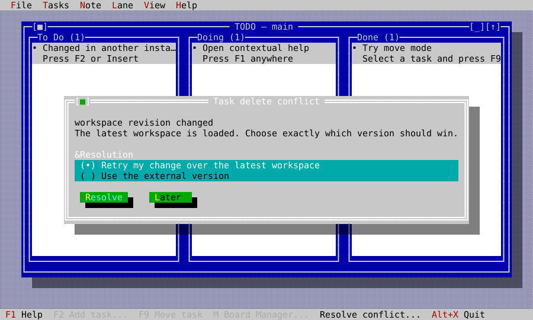

## Verification and generated evidence

| Evidence | Coverage |
|---|---|
| `test_todo_model.cpp` | every task/lane/Board transition, validation, sorts, merges, archive plans |
| `test_todo_codec.cpp` | canonical round-trip, hostile JSON/UTF-8, schema and size bounds |
| `test_todo_repository*.cpp` | conflicts, backups, archive-first removal, real atomic files and a real second process |
| `test_todo_controller.cpp` | injected time/identity and durable controller outcomes |
| `test_todo_board.cpp` | navigation, responsive lanes, move/drag geometry and Unicode cards |
| `test_todo_smoke.cpp` | dialogs, commands, menus, status, themes, editor, pointer, conflicts, lifecycle |
| `test_todo_golden.cpp` | fifteen pinned workflow and theme frames |
| `fuzz_todo_codec` | empty, guided, Unicode, malformed, oversized and future-schema corpus |
| `todo_bench` | 1,000-task codec/load/refresh/render, movement and unchanged polling with hard size/work/redraw budgets |

Regenerate and review the TODO figures and goldens together:

```sh
cmake --build build --target capture_todo_screenshots
./build/tools/docgen/capture_todo_screenshots docs/generated/screenshots tests/golden
ctest --test-dir build -R 'suite_test_todo_|todo_benchmark_smoke' --output-on-failure
```

The capture tool runs `TodoApp` on `HeadlessTerminal`; the SVGs are derived
from the independently reconstructed terminal display, while golden dumps pin
the composed cell surface. Neither path is illustrative artwork.

## Deliberate boundaries

This is a fully featured local Kanban example, not a network service. It does
not include cloud sync, reminders, recurrence, tags, global search, archive
browsing/restoration, self-update, or import from another application's private
format. Those exclusions keep the example dependency-free and make every
included behavior teachable from its own source and executable evidence.
