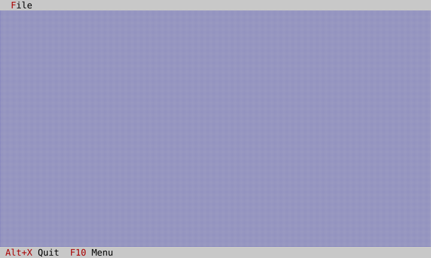
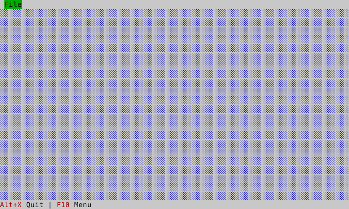
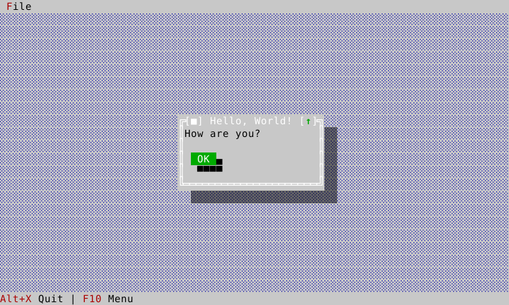



# Hello: a complete application

Hello is intentionally small, but it is not a mockup. It creates a real
Desktop, exposes a greeting and quit command in a File menu and a status line,
and presents a modal information dialog. Build and run it with
`./build/examples/ckvision_hello` after the [getting-started build](getting-started.md).

## What appears on screen



F10 opens the menu. The `Exit` item and the `Quit` status item deliberately
present the same command with different wording; one registered handler owns
the behavior.



Alt+G opens the information message. Escape or Ok closes it; while it is
open, it is modal, so background commands do not run.



## Object hierarchy and ownership

```text
Application                         host owns this
`-- root View                       Application owns this
    `-- Desktop                     HelloApp inserts and transfers ownership
        |-- MenuBar                 ApplicationShell docks it at the top
        |-- StatusLine              ApplicationShell docks it at the bottom
        `-- transient message box   present_message_box adds/removes it modally
            `-- Ok button
```

`HelloApp` is not a `View`; it is a small builder/controller that stores a
reference to `Application` and a non-owning pointer to the Desktop it created.
`ApplicationShell` transfers the actual view ownership into the Application
tree. The Desktop routes focus to its active surface. A message-box
presentation establishes modality and restores the prior focus when it closes.
Every node paints through the Application frame; a terminal resize reaches the
root and is propagated through the tree.

## Full source: application object

The header is deliberately tiny: keep a direct reference only to services you
use and a non-owning handle to a view whose lifetime is contained by the app.

<!-- ckvision-snippet source="examples/hello/hello_app.hpp" lines="1-26" -->
```cpp
// Copyright (c) 2026 C. Klukas. All rights reserved.
// SPDX-License-Identifier: MIT
//
// A compact ckVision-owned integration example: desktop, menu/status chrome,
// modal greeting dialog, and golden coverage. See docs/hello-example.md.
#pragma once

#include "cvision/ui/application.hpp"
#include "cvision/ui/standard_roles.hpp"
#include "cvision/widgets/desktop.hpp"

namespace ckv::hello {

class HelloApp {
public:
    explicit HelloApp(ui::Application& app);

    widgets::Desktop& desktop() noexcept { return *desktop_; }

private:
    void greeting_box();

    ui::Application& app_; ui::StandardRoles roles_; widgets::Desktop* desktop_ = nullptr;
};

}  // namespace ckv::hello
```
<!-- /ckvision-snippet -->

The constructor declares two application commands. Each names itself with a
key — `"hello.greeting"`, `"hello.quit"` — and the registry hands back the id
the application then references; no source file anywhere chooses a command
number. A `CommandPresentation` lets the menu and status line render the
title, chord, enablement and mnemonic from that one declaration. The menu
override changes only its visible title to `Exit`; it does not create a second
quit command.

<!-- ckvision-snippet source="examples/hello/hello_app.cpp" lines="1-34" -->
```cpp
// Copyright (c) 2026 C. Klukas. All rights reserved.
// SPDX-License-Identifier: MIT
#include "hello_app.hpp"

#include "../example_about.hpp"

#include "cvision/widgets/application_shell.hpp"
#include "cvision/widgets/menu.hpp"
#include "cvision/widgets/message_box.hpp"
#include "cvision/widgets/status_line.hpp"

namespace ckv::hello {

HelloApp::HelloApp(ui::Application& app) : app_(app), roles_(ui::intern_standard_roles(app.roles())) {
    // Each command names itself; the registry hands back the id this
    // application then references. Nothing here picks a number.
    const ui::CommandId greeting_command = app_.commands().declare({.key = "hello.greeting", .title = "&Greeting...", .category = "Hello", .chord = "Alt+G", .handler = [this] { greeting_box(); }});
    // Its own quit command rather than the framework's, so this example
    // can present the concept as "Exit" in the reference vocabulary it
    // follows -- see docs/standard-commands.md on when that is the right
    // call and when CommandPresentation is.
    const ui::CommandId quit_command = app_.commands().declare({.key = "hello.quit", .title = "&Quit", .category = "Hello", .chord = "Alt+X", .handler = [this] { app_.request_quit(); }});
    widgets::ApplicationShell shell(app_, {.theme = ui::make_classic_theme(app_.roles(), roles_),
                                           .menus = {{"&File",
                                                      {widgets::MenuItem::command(widgets::CommandPresentation{greeting_command}),
                                                       widgets::MenuItem::separator(),
                                                       widgets::MenuItem::command(widgets::CommandPresentation{
                                                           app_.commands().standard().help, "&About..."}),
                                                       widgets::MenuItem::separator(),
                                                       widgets::MenuItem::command(widgets::CommandPresentation{quit_command, "E&xit"})}}},
                                           .status_items = {
                                               widgets::StatusLineItem{widgets::CommandPresentation{quit_command, "&Quit"}},
                                               widgets::StatusLineItem{widgets::CommandPresentation{app_.commands().standard().menu}}}});
    desktop_ = &shell.desktop();
```
<!-- /ckvision-snippet -->

The greeting handler returns immediately after presenting the dialog. Its
typed completion handler observes the result without capturing a raw dialog
window pointer, so close/removal remains owned by the presentation API.

<!-- ckvision-snippet source="examples/hello/hello_app.cpp" lines="44-51" -->
```cpp
// A command handler presents the typed, non-blocking standard dialog and
// returns; completion is intentionally observed without retaining a Window.
void HelloApp::greeting_box() {
    auto greeting = widgets::present_message_box(app_, *desktop_, roles_,
                                                  {widgets::MessageBoxKind::Info, "Hello, World!", "How are you?",
                                                   widgets::MessageBoxButtons::Ok});
    greeting.set_completion_handler([](widgets::MessageBoxResult) {});
}
```
<!-- /ckvision-snippet -->

The interactive host is equally short and is the complete `main.cpp`:

<!-- ckvision-snippet source="examples/hello/main.cpp" lines="1-18" -->
```cpp
// Copyright (c) 2026 C. Klukas. All rights reserved.
// SPDX-License-Identifier: MIT
//
// ckVision Hello — a compact visual integration example; see
// docs/hello-example.md for its behavior contract and golden coverage.
#include "cvision/term/posix_clock.hpp"
#include "cvision/term/terminal_clipboard.hpp"
#include "cvision/term/posix_terminal.hpp"
#include "cvision/ui/application.hpp"

#include "hello_app.hpp"

int main() {
    ckv::term::PosixClock clock; ckv::term::PosixTerminal terminal(clock);
    ckv::term::TerminalClipboardWriter clipboard(terminal);
    ckv::ui::Application app(terminal, clock, clipboard); ckv::hello::HelloApp hello(app);
    app.run(); return 0;
}
```
<!-- /ckvision-snippet -->

## Interaction map

| Input | Where it is handled | Result |
|---|---|---|
| Alt+G | application command registry | opens the modal information dialog |
| F10 | standard Menu command | focuses and opens the menu bar |
| Esc | focused menu/dialog | dismisses that transient surface and restores focus |
| Alt+X | application command registry | requests a clean application exit |

The key point is that menu and status line are command *presentations*, not
parallel callback systems. Register command behavior once; expose it wherever
it is useful. The same approach scales to [dialogs and commands](dialogs-and-commands.md).

## Test it headlessly

`tests/test_hello_golden.cpp` drives this public app path through a
`HeadlessTerminal`, checking the initial/dialog frames, modal command scope,
dismissal, and Alt+X. `capture_hello_screenshots` drives the same path and
generates the images above. That makes the tutorial visual evidence repeatable,
not hand-drawn.

