

# Widget gallery

Every entry below names the public header, tells you where to place the type,
and points to a real example/capture. The code blocks are extracted from the
compiled example applications; run `tools/docgen/extract_snippets.py --write`
after changing their source rather than maintaining copy-pasted documentation.

The Forms frame is the compact reference for editable controls; the Workbench
tabs cover text/data/utility components.

| Forms | Workbench: text | Workbench: data | Workbench: utilities |
|---|---|---|---|
|  | 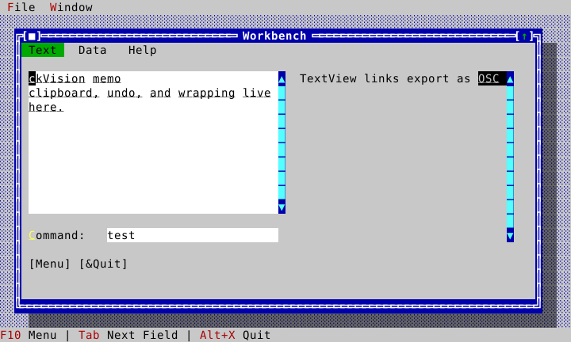 |  | 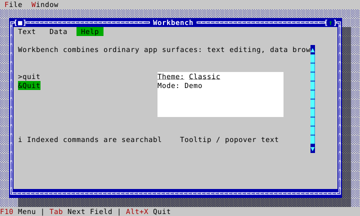 |

The navigation components have their own public-API capture because a calendar
and a scrolling viewport do not belong naturally in the compact Forms or
Workbench windows.

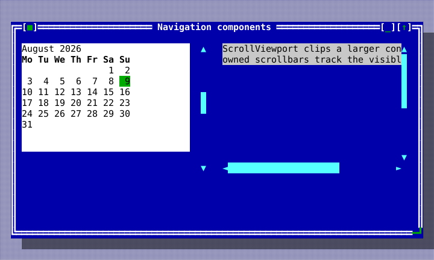

## DocumentPosition

Header: `include/cvision/widgets/editor_document.hpp`. A revision-bound,
grapheme-boundary byte position in an `EditorDocument`; obtain it from the
document instead of retaining an unversioned offset.

## DocumentRange

Header: `include/cvision/widgets/editor_document.hpp`. A half-open pair of
positions from one document revision. It is the unit accepted by replacement,
selection, and search results.

## DocumentLineColumn

Header: `include/cvision/widgets/editor_document.hpp`. A logical line and
grapheme column, not a terminal-cell coordinate.

## EditorDocumentOptions

Header: `include/cvision/widgets/editor_document.hpp`. Sets invalid-UTF-8 and
bounded undo-history policy when constructing a document.

## DocumentChange

Header: `include/cvision/widgets/editor_document.hpp`. The deterministic
revision/change record delivered to document observers.

## DocumentEditResult

Header: `include/cvision/widgets/editor_document.hpp`. The status and optional
change record returned by a document edit or transaction commit.

## DocumentTextEdit

Header: `include/cvision/widgets/editor_document.hpp`. A requested replacement
used to assemble a revision-atomic `DocumentTransaction`.

## DocumentTransaction

Header: `include/cvision/widgets/editor_document.hpp`. Collects non-overlapping
edits against one base revision; use it for replace-all and compound commands.

## EditorDocument

Header: `include/cvision/widgets/editor_document.hpp`. The shared persistent
UTF-8 document model for `TextEditor`; see [Editor](editor.md).

## SyntaxSpan

Header: `include/cvision/widgets/syntax_profile.hpp`. A semantic byte range in
one logical line emitted by a profile highlighter.

## SyntaxLineResult

Header: `include/cvision/widgets/syntax_profile.hpp`. Syntax spans plus the
next immutable lexer state for incremental line processing.

## LanguageDetectionInput

Header: `include/cvision/widgets/syntax_profile.hpp`. Explicit requested
profile, filename, prefix, and shebang data used for deterministic detection.

## LanguageDetection

Header: `include/cvision/widgets/syntax_profile.hpp`. A profile detector's
score and diagnostic reason.

## LanguageProfile

Header: `include/cvision/widgets/syntax_profile.hpp`. A stable language ID,
detector, and line highlighter registered by an application.

## SyntaxProfileRegistry

Header: `include/cvision/widgets/syntax_profile.hpp`. Instance-owned language
profile registry; the editor guide registers JSON, YAML, Bash, and plain text.

## SyntaxCacheLine

Header: `include/cvision/widgets/syntax_cache.hpp`. One cached source line:
the source text, validated semantic spans, and its incoming/outgoing lexer
state.

## SyntaxRelexReport

Header: `include/cvision/widgets/syntax_cache.hpp`. Deterministic evidence of
where an incremental lexical update began, how many lines it processed, and
whether it reached a state fixed point.

## SyntaxCache

Header: `include/cvision/widgets/syntax_cache.hpp`. A reusable incremental
line-state cache for a `LanguageProfile`; `TextEditor` uses it to avoid
rehighlighting an unchanged lexical suffix.

## EditorSearchQuery

Header: `include/cvision/widgets/editor_search.hpp`. The literal search text
and case/whole-word options for `EditorSearch`.

## EditorSearchMatch

Header: `include/cvision/widgets/editor_search.hpp`. A revision-bound match
range returned by deterministic literal search.

## EditorSearch

Header: `include/cvision/widgets/editor_search.hpp`. Finds literal matches and
performs one-transaction replace-all; see [Editor](editor.md#search-and-files).

## EditorStatus

Header: `include/cvision/widgets/text_editor.hpp`. Line/column, selection,
modified, overwrite, and profile data a client can place in its own status UI.

## EditorStatusModel

Header: `include/cvision/widgets/text_editor.hpp`. Scoped, instance-owned
observer model that mirrors one editor's status for independently composed
window chrome or status UI.

## TextEditor

Header: `include/cvision/widgets/text_editor.hpp`. The dedicated shared-
document editing view with keyboard/mouse selection, scrolling, gutter, syntax
roles, and clipboard commands. It is not a `Memo` replacement; see [Editor](editor.md).

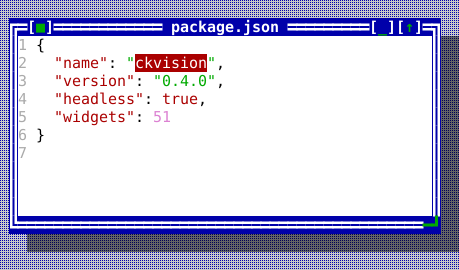

The compiled scene below is the source of this figure.

<!-- ckvision-snippet source="tools/docgen/widget_shots_text.cpp" region="texteditor" -->
```cpp
widgets::SyntaxProfileRegistry profiles;
widgets::register_standard_syntax_profiles(profiles);

auto document = std::make_shared<widgets::EditorDocument>(
    "{\n"
    "  \"name\": \"ckvision\",\n"
    "  \"version\": \"0.4.0\",\n"
    "  \"headless\": true,\n"
    "  \"widgets\": 51\n"
    "}\n");

auto editor = std::make_unique<widgets::TextEditor>(document, &profiles);
editor->set_file_name("package.json");   // the profile detector reads this
editor->set_show_line_numbers(true);
editor->set_wrap_mode(widgets::WrapMode::None);
editor->set_vertical_scrollbar_policy(widgets::ScrollbarPolicy::Auto);
editor->set_search_query(widgets::EditorSearchQuery{"ckvision", false, false});
```
<!-- /ckvision-snippet -->

## FileEditorController

Header: `include/cvision/widgets/file_editor_controller.hpp`. Explicit safe
load/save/save-as controller over an injected `FileSystem`, including external-
change conflict detection and newline preservation.

## EditorOpenOptions

Header: `include/cvision/widgets/file_editor_controller.hpp`. Per-open input
policy for `FileEditorController`. File input rejects malformed UTF-8 unless a
client deliberately passes `InvalidUtf8Policy::Replace`; the choice is local
to that open and does not silently alter the document's normal edit policy.
The same options require an explicit discard choice before replacing dirty
content with another file.

## EditorWindow

Header: `include/cvision/widgets/editor_window.hpp`. Optional reusable window
composition owning a `TextEditor`, `FileEditorController`, dirty title, status
overlay, and safe implicit close veto. Clients may instead compose the lower-
level editor and controller themselves.

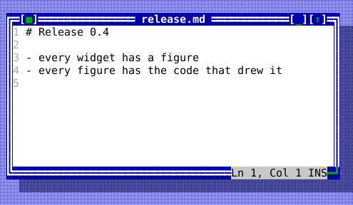

The compiled scene below is the source of this figure.

<!-- ckvision-snippet source="tools/docgen/widget_shots_text.cpp" region="editorwindow" -->
```cpp
static widgets::SyntaxProfileRegistry profiles;
widgets::register_standard_syntax_profiles(profiles);

auto window = std::make_unique<widgets::EditorWindow>(
    "release.md", std::make_shared<widgets::EditorDocument>(), files, &profiles);
window->set_bounds(Rect{14, 4, 52, 13});
window->open("/notes/release.md");
window->editor().set_show_line_numbers(true);
widgets::EditorWindow* editor_window = stage.desktop().add<widgets::EditorWindow>(
    std::move(window));
```
<!-- /ckvision-snippet -->

## ApplicationShell

Header: `include/cvision/widgets/application_shell.hpp`. Use when a small app
needs a Desktop, classic theme, menu bar, and status line in one construction
step. The Application owns that Desktop while the shell helper is alive; the
helper can call `detach_desktop()` when its controller must end before the
Application. [Hello](tutorial-hello.md) is the complete source; use explicit
Desktop construction when the shell needs more customization.

## ApplicationShellOptions

Header: `include/cvision/widgets/application_shell.hpp`. This aggregate
configures the shell's theme, menu definitions, and status items. Keep command
behavior in the Application registry and use the options only to present it.

## Button

Header: `include/cvision/widgets/button.hpp`. `set_flat(true)` drops the cast
shadow and the classic ten-cell footprint: one row, as wide as its label, with
the press shown in `ckv.button.pressed` since there is no geometry left to
show it in. For a control inside a dense row — a stepper beside a field — that
should still arm, disarm when the pointer slides off it, and fire on release
like any other button. Put buttons in a window or
dialog content view; Space/Enter activate the focused/default button and a
mouse click invokes `on_press`. Use it for an immediate action, not a command
shortcut duplicated elsewhere. Forms shows default and ordinary buttons. The
classic metric is a ten-cell minimum footprint; use `set_minimum_width()` only
to make a related button family deliberately wider.

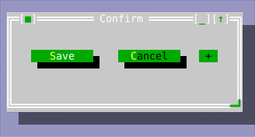

The compiled scene below is the source of this figure.

<!-- ckvision-snippet source="tools/docgen/widget_shots_controls.cpp" region="button" -->
```cpp
auto* save = content.make<widgets::Button>("&Save");
save->set_bounds(Rect{2, 2, 12, 2});
save->set_default(true);
save->on_press = [] { /* run the save command */ };

auto* cancel = content.make<widgets::Button>("&Cancel");
cancel->set_bounds(Rect{16, 2, 12, 2});
cancel->on_press = [] { /* dismiss */ };

auto* step = content.make<widgets::Button>("+");
step->set_flat(true);  // one row, no shadow, as wide as its label
step->set_bounds(Rect{30, 2, 3, 1});
```
<!-- /ckvision-snippet -->

## Canvas

Header: `include/cvision/widgets/canvas.hpp`. Use for deterministic client
drawn raster content. Set bounds/cell metrics, install a draw callback, and
use `on_click` for pointer interaction; see [Graphics](graphics.md).

| Canvas with Sixel graphics | Canvas fallback without terminal graphics |
| :---: | :---: |
| 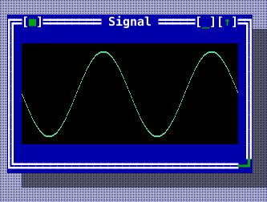 | 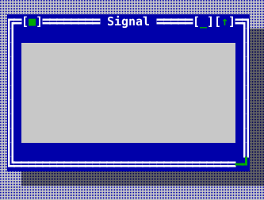 |

The compiled scene below is the source of this figure.

<!-- ckvision-snippet source="tools/docgen/widget_shots_composite.cpp" region="canvas" -->
```cpp
auto* canvas = content.make<widgets::Canvas>();
canvas->set_bounds(Rect{1, 1, 30, 7});
canvas->set_cell_metrics(stage.app().terminal_cell_pixels());
canvas->set_pixel_size(30 * stage.app().terminal_cell_pixels().width,
                       7 * stage.app().terminal_cell_pixels().height);
canvas->set_draw_callback([](Image& image) {
    for (int x = 0; x < image.width(); ++x) {
        const double phase = 6.283 * x / image.width();
        const int y = static_cast<int>((0.5 + 0.42 * std::sin(phase * 2)) * image.height());
        for (int thickness = 0; thickness < 2; ++thickness)
            image.set_pixel(x, std::min(image.height() - 1, y + thickness),
                            Image::Rgba{80, 220, 160, 255});
    }
});
canvas->set_fallback_painter([](scene::Painter& painter, Rect area) {
    painter.draw_text(Point{0, area.height / 2}, "[no graphics: 2 Hz sine]", Style{});
});
```
<!-- /ckvision-snippet -->

## ComboBox

Header: `include/cvision/widgets/combo_box.hpp`. Use `PickOnly` for a closed
choice set and `Editable` when the user can type a value. Opening it drops a
[PopupList](#popuplist): a real popup on the desktop, over the surface rather
than inside the control, so the control stays one row tall and its neighbours
are undisturbed while the list is up. Arrow keys navigate the list, Enter
takes a row, Escape and a press outside close it with nothing taken. Where
there is no desktop to drop a popup onto, the arrows step through the items in
place, so the control still works. When the dropdown is closed, `Editable`
uses the standard text keymap (word/boundary navigation, Shift selection,
Ctrl+C/X/V, Ctrl+Insert/Shift+Insert, and word deletion). Forms and Workbench
show both modes.

| Closed ComboBox controls | ComboBox with its PopupList open |
| :---: | :---: |
| 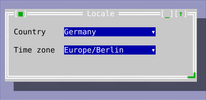 | 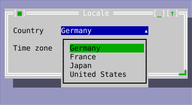 |

The compiled scene below is the source of this figure.

<!-- ckvision-snippet source="tools/docgen/widget_shots_controls.cpp" region="combobox" -->
```cpp
auto* country = content.make<widgets::ComboBox>(widgets::ComboBoxMode::PickOnly);
country->set_bounds(Rect{12, 1, 20, 1});
country->set_items({"Germany", "France", "Japan", "United States"});
country->set_selected_index(0);

auto* zone = content.make<widgets::ComboBox>(widgets::ComboBoxMode::Editable);
zone->set_bounds(Rect{12, 3, 20, 1});
zone->set_items({"Europe/Berlin", "Europe/Paris", "Asia/Tokyo"});
zone->set_text("Europe/Berlin");
```
<!-- /ckvision-snippet -->

## CommandPresentation

Header: `include/cvision/widgets/command_presentation.hpp`. This value maps a
registered command to a menu/status/toolbar surface. It inherits title, chord,
and enablement from the registry; [dialogs and commands](dialogs-and-commands.md)
shows the real Hello source.

## CalendarView

Header: `include/cvision/widgets/common_components.hpp`. Use for a visible
month calendar where the user moves a date selection with arrows/page keys.
Place it in a dialog or application content view; pair it with DatePicker for
a compact field. It appears in the navigation capture above. The month it
shows is held between `kFirstCalendarYear` and `kLastCalendarYear`: the leap
rule and weekday it computes with are Gregorian, and that calendar began in
October 1582 — a month it also cannot draw, since ten days were struck out of
it — so 1583 is the first year it can state truthfully.

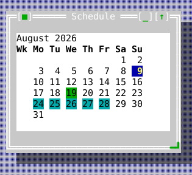

The compiled scene below is the source of this figure.

<!-- ckvision-snippet source="tools/docgen/widget_shots_data.cpp" region="calendarview" -->
```cpp
auto* calendar = content.make<widgets::CalendarView>();
calendar->set_bounds(Rect{1, 1, 28, 9});
calendar->set_month(widgets::DateValue{2026, 8, 1});
calendar->set_selected(widgets::DateValue{2026, 8, 19});
calendar->set_today(widgets::DateValue{2026, 8, 9});
calendar->set_marked_span(widgets::DateValue{2026, 8, 24}, widgets::DateValue{2026, 8, 28});
calendar->set_first_weekday(widgets::Weekday::Monday);
calendar->set_show_iso_week_numbers(true);
calendar->on_select = [](widgets::DateValue day) { (void)day; };
```
<!-- /ckvision-snippet -->

## ClockView

Header: `include/cvision/widgets/common_components.hpp`. A clock for a menu
bar or status line. It ticks once a second, re-renders, and asks for a repaint
only when the rendered text differs — so a clock without seconds costs one
string comparison a second and one repaint a minute.

The time comes from an injected provider rather than from ckVision, whose
`Clock` is monotonic with an implementation-defined epoch and deliberately not
a wall clock; the provider is also what makes a clock testable. Seconds,
a blinking separator, and twelve- or twenty-four-hour display are options, and
the meridiem words are the host's to supply, as ckVision carries no locale
data. `on_click` lets a clock open something — see CalendarDropdown — and
`set_open()` draws it with the menu bar's own active role while that thing is
showing, so it reads as a menu title rather than as a second kind of control.

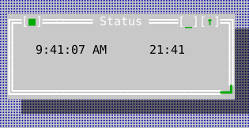

The compiled scene below is the source of this figure.

<!-- ckvision-snippet source="tools/docgen/widget_shots_data.cpp" region="clockview" -->
```cpp
auto* clock = content.make<widgets::ClockView>();
clock->set_bounds(Rect{2, 1, 14, 1});
clock->set_time_provider([] { return widgets::TimeValue{9, 41, 7}; });
clock->set_show_seconds(true);
clock->set_hour_format(widgets::HourFormat::TwelveHour);
clock->set_meridiem_labels("AM", "PM");
clock->on_click = [] { /* drop a calendar under it */ };
```
<!-- /ckvision-snippet -->

## CalendarDropdown

Header: `include/cvision/widgets/common_components.hpp`. A month, framed and
coloured as a dropdown menu, with the controls for choosing which month on one
row above it: a ComboBox of month names — as wide as its longest month and no
wider — then `<<`, a year field, and `>>`. Typing in the year field admits
digits and nothing else; Enter — or moving on with Tab — commits it, and a
year this calendar cannot draw gives the row over to the word `invalid` for
three seconds, the field stepping aside rather than holding what was rejected.
That range is `kFirstCalendarYear` (1583) to `kLastCalendarYear`: the
arithmetic here is Gregorian, so `26` is refused rather than drawn as a grid
for a year that had a different calendar.
`show_month()` sets all three at once, so the picker and the field never
disagree with the grid. Opening the month list grows the popup to the list's
own length where there is room below, so twelve months are not read through
eight rows.

It is a transient popup: it closes on Escape and on a press anywhere but
itself. That behaviour is what separates a dropdown from a small window, and
it is deliberately not in CalendarView — the same calendar sits permanently in
a dialog elsewhere and must not vanish when the reader clicks beside it. Open
one with `show_calendar_dropdown()`, which hangs it under an anchor with their
right edges aligned, the way a submenu hangs from the right end of a bar, and
pulls it back inside the desktop rather than letting it run off the edge. It
scopes input while it is up, so Tab walks its own three controls — days, month,
year — and reaches nothing behind it.

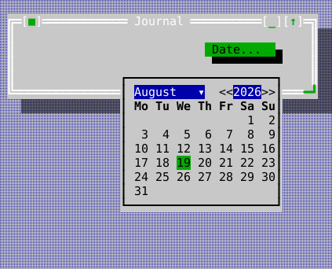

The compiled scene below is the source of this figure.

<!-- ckvision-snippet source="tools/docgen/widget_shots_data.cpp" region="calendardropdown" -->
```cpp
widgets::CalendarDropdown* month =
    widgets::show_calendar_dropdown(*anchor, stage.app(), stage.desktop());
month->show_month(widgets::DateValue{2026, 8, 1});
month->calendar().set_selected(widgets::DateValue{2026, 8, 19});
month->calendar().on_select = [](widgets::DateValue day) { (void)day; };
```
<!-- /ckvision-snippet -->

## DateValue

Header: `include/cvision/widgets/common_components.hpp`. A plain deterministic
year/month/day value used by CalendarView and DatePicker; Forms initializes one
in the source-backed control setup below.

## TimeValue

Header: `include/cvision/widgets/common_components.hpp`. A plain hour/minute/
second value used by TimePicker; it has no implicit system-clock behavior.

## DatePicker

Header: `include/cvision/widgets/common_components.hpp`. Use for a compact
optional date field. Left/Right selects year, month, or day; Up/Down adjusts
that portion; Delete clears an optional value. Pointer clicks select a portion
and the wheel adjusts it. The caller supplies a deterministic seed (normally
its injected notion of today), so the control never reads a clock or locale.
`format_iso_date()` and `parse_iso_date()` provide the strict typed
`YYYY-MM-DD` boundary; `add_calendar_days()` performs bounded Gregorian date
arithmetic without reading a clock.

Declarative forms can request the same control with `FieldKind::Date`,
`initial_date`, `date_seed`, and `date_optional`. Accepted `DialogResult`s
carry the answer in the parallel `dates` vector and canonical text in
`values`. Set `DialogDescriptor::help_context_key` to make every field and
button inherit the form's contextual F1 topic.

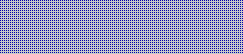

The compiled scene below is the source of this figure.

<!-- ckvision-snippet source="tools/docgen/widget_shots_controls.cpp" region="datepicker" -->
```cpp
auto* date = content.make<widgets::DatePicker>();
date->set_bounds(Rect{12, 1, 13, 1});
date->set_value(widgets::DateValue{2026, 8, 9});
date->on_change = [](std::optional<widgets::DateValue> value) { (void)value; };
```
<!-- /ckvision-snippet -->

## TimePicker

Header: `include/cvision/widgets/common_components.hpp`. Use for a compact
time field. Arrow keys adjust the active component; the caller supplies and
reads a `TimeValue`.


The compiled scene below is the source of this figure.

<!-- ckvision-snippet source="tools/docgen/widget_shots_controls.cpp" region="timepicker" -->
```cpp
auto* time = content.make<widgets::TimePicker>();
time->set_bounds(Rect{12, 3, 12, 1});
time->set_value(widgets::TimeValue{14, 30, 0});
time->set_show_seconds(true);
time->set_24_hour(true);
time->on_change = [](widgets::TimeValue value) { (void)value; };
```
<!-- /ckvision-snippet -->

## SpinBox

Header: `include/cvision/widgets/common_components.hpp`. Use for a small
bounded integer. Set the range before setting the value; arrows and mouse
controls change it in range.

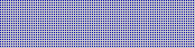

The compiled scene below is the source of this figure.

<!-- ckvision-snippet source="tools/docgen/widget_shots_controls.cpp" region="spinbox" -->
```cpp
auto* speed = content.make<widgets::SpinBox>();
speed->set_bounds(Rect{12, 3, 10, 1});
speed->set_range(1, 16);  // set the range BEFORE the value
speed->set_step(1);
speed->set_value(4);
speed->on_change = [](int value) { (void)value; };
```
<!-- /ckvision-snippet -->

## Slider

Header: `include/cvision/widgets/common_components.hpp`. Use for a bounded
continuous-looking value where a visual position is useful. Arrows and pointer
input adjust the value; retain a textual value/label when precision matters.

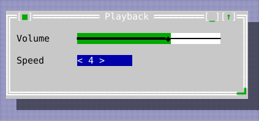

The compiled scene below is the source of this figure.

<!-- ckvision-snippet source="tools/docgen/widget_shots_controls.cpp" region="slider" -->
```cpp
auto* volume = content.make<widgets::Slider>();
volume->set_bounds(Rect{12, 1, 26, 1});
volume->set_range(0, 100);
volume->set_step(5);
volume->set_value(65);
volume->on_change = [](int value) { (void)value; };
```
<!-- /ckvision-snippet -->

## SearchBox

Header: `include/cvision/widgets/common_components.hpp`. Use for a query field
with search affordance. It owns query editing; the application decides how and
when to execute the search.

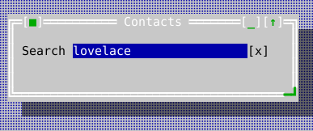

The compiled scene below is the source of this figure.

<!-- ckvision-snippet source="tools/docgen/widget_shots_controls.cpp" region="searchbox" -->
```cpp
auto* search = content.make<widgets::SearchBox>();
search->set_bounds(Rect{1, 1, 34, 1});
search->set_query("lovelace");
search->on_change = [](const std::string& query) { (void)query; /* filter the model */ };
search->on_clear = [] { /* show everything again */ };
```
<!-- /ckvision-snippet -->

## ToolBar

Header: `include/cvision/widgets/common_components.hpp`. Use to present a
short list of registered commands near document content. It follows command
enablement and executes the same handler as a menu/status item.

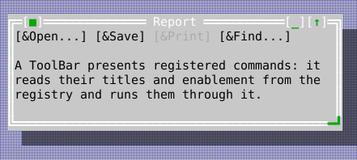

The compiled scene below is the source of this figure.

<!-- ckvision-snippet source="tools/docgen/widget_shots_chrome.cpp" region="toolbar" -->
```cpp
auto* tools = content.make<widgets::ToolBar>();
tools->set_bounds(Rect{0, 0, 44, 1});
tools->set_commands({ids.open, ids.save, ids.print, ids.find});
```
<!-- /ckvision-snippet -->

## CommandPalette

Header: `include/cvision/widgets/common_components.hpp`. Use for searchable
command discovery. It presents an inset search field and an independently
scrollable result viewport, excludes framework-only commands, preserves
mnemonics, and activates through the registry command path rather than a
palette-only callback.

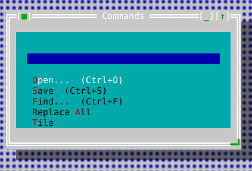

The compiled scene below is the source of this figure.

<!-- ckvision-snippet source="tools/docgen/widget_shots_chrome.cpp" region="commandpalette" -->
```cpp
auto* palette = content.make<widgets::CommandPalette>();
palette->set_bounds(Rect{1, 1, 40, 9});
// An empty query offers everything the registry holds that is not
// framework-only; typing narrows it, matching from the start of a
// word rather than anywhere in the string.
palette->set_query("");
```
<!-- /ckvision-snippet -->

## BreadcrumbBar

Header: `include/cvision/widgets/common_components.hpp`. Use to display a
hierarchical location. It is a view in normal content chrome, not a replacement
for a TreeView when the user needs expansion/navigation.

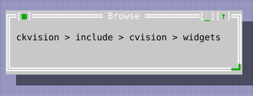

The compiled scene below is the source of this figure.

<!-- ckvision-snippet source="tools/docgen/widget_shots_data.cpp" region="breadcrumbbar" -->
```cpp
auto* trail = content.make<widgets::BreadcrumbBar>();
trail->set_bounds(Rect{1, 1, 40, 1});
trail->set_segments({"ckvision", "include", "cvision", "widgets"});
trail->set_separator(" > ");
trail->on_activate = [](std::size_t index) { (void)index; /* jump to that level */ };
```
<!-- /ckvision-snippet -->

## PropertyItem

Header: `include/cvision/widgets/common_components.hpp`. A name/value/editable
record consumed by PropertyInspector.

## PropertyInspector

Header: `include/cvision/widgets/common_components.hpp`. Use to inspect or
edit a small named set of properties. Workbench shows the visual pattern.

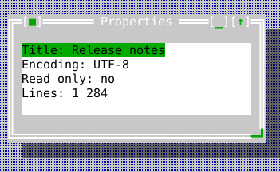

The compiled scene below is the source of this figure.

<!-- ckvision-snippet source="tools/docgen/widget_shots_data.cpp" region="propertyinspector" -->
```cpp
auto* inspector = content.make<widgets::PropertyInspector>();
inspector->set_bounds(Rect{1, 1, 32, 5});
inspector->set_items({
    widgets::PropertyItem{"Title", "Release notes", true},
    widgets::PropertyItem{"Encoding", "UTF-8", false},
    widgets::PropertyItem{"Read only", "no", true},
    widgets::PropertyItem{"Lines", "1 284", false},
});
inspector->on_change = [](std::size_t index, std::string value) { (void)index; (void)value; };
```
<!-- /ckvision-snippet -->

## WizardPage

Header: `include/cvision/widgets/common_components.hpp`. Supply a title and a
predicate for forward validity. The predicate is the correct place for the
state-dependent Next policy.

## Wizard

Header: `include/cvision/widgets/common_components.hpp`. Use a sequence of
dialog-like pages with Back/Next. It enables Next only when the current page's
predicate accepts; see [Dialogs](dialogs-and-commands.md#wizard-state-dependent-next).

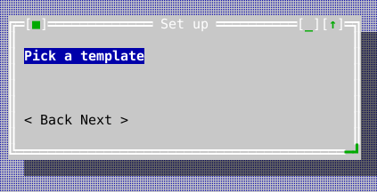

The compiled scene below is the source of this figure.

<!-- ckvision-snippet source="tools/docgen/widget_shots_composite.cpp" region="wizard" -->
```cpp
auto* wizard = content.make<widgets::Wizard>();
wizard->set_bounds(Rect{1, 1, 40, 5});
wizard->set_pages({
    widgets::WizardPage{"Choose a name", [] { return name_given; }},
    widgets::WizardPage{"Pick a template", [] { return true; }},
    widgets::WizardPage{"Confirm", [] { return true; }},
});
wizard->on_finish = [] { /* do the thing */ };
wizard->on_cancel = [] { /* leave it undone */ };
```
<!-- /ckvision-snippet -->

## Notification

Header: `include/cvision/widgets/common_components.hpp`. A severity/message/
dismissibility record owned by NotificationCenter. `persistent` decides
whether time may take it away: a persistent notification waits for the reader
however long that takes, everything else expires on the interval its centre
was given.

## NotificationCenter

Header: `include/cvision/widgets/common_components.hpp`. Use for non-modal
application feedback. It does not replace a modal message box when a decision
or acknowledgement is required.

`set_auto_dismiss(nanos)` is what turns it into a toast surface: a
non-persistent notification leaves by itself that long after it was posted,
measured on the injected Clock. Zero — the default — is no expiry at all, so a
consumer written before this behaves exactly as it did. Each notification is
timed from when it was posted, and everything due at one moment leaves in one
sweep; changing the interval re-times what is already on screen.

The reader can dismiss any line, persistent included, by clicking it; Escape
takes the most recent. `on_changed` fires whenever the set moves for any
reason — a post, a dismissal, or an expiry — which a host needs because expiry
happens on a timer it never sees, and a centre that emptied itself would
otherwise leave the host holding a rectangle for rows that are gone.

An empty centre paints nothing, and a centre with two lines paints two rows.
So a host may leave one lying over its content at a generous size instead of
resizing it on every post: the cells it does not write show what is beneath.

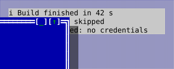

The compiled scene below is the source of this figure.

<!-- ckvision-snippet source="tools/docgen/widget_shots_chrome.cpp" region="notificationcenter" -->
```cpp
auto* centre = stage.desktop().make<widgets::NotificationCenter>();
centre->set_bounds(Rect{40, 2, 36, 6});
centre->set_auto_dismiss(4'000'000'000);  // 4s for everything not persistent
centre->add(widgets::Notification{widgets::NotificationSeverity::Info,
                                  "Build finished in 42 s", false});
centre->add(widgets::Notification{widgets::NotificationSeverity::Warning,
                                  "2 tests were skipped", false});
centre->add(widgets::Notification{widgets::NotificationSeverity::Error,
                                  "Upload refused: no credentials",
                                  /*persistent=*/true});
centre->on_changed = [] { /* a post, a dismissal or an expiry */ };
```
<!-- /ckvision-snippet -->

## Tooltip

Header: `include/cvision/widgets/common_components.hpp`. Use for short
contextual help. Show it at an explicit point; it is not a focusable dialog.

The Forms example's exact setup supplies DatePicker, TimePicker, SpinBox,
Slider, and Wizard with real values and ownership.

<!-- ckvision-snippet source="examples/forms/forms_app.cpp" lines="119-156" -->
```cpp
    content->add_child(std::move(options));

    auto mode = std::make_unique<widgets::RadioGroup>(std::vector<std::string>{"&Modal", "Mode&less"});
    mode->set_group_label("Presentation mode");
    mode->set_bounds(Rect{30, 6, 14, 3});
    mode->set_selected(0);
    mode_ = mode.get();
    content->add_child(std::move(mode));

    auto country = std::make_unique<widgets::ComboBox>(widgets::ComboBoxMode::Editable);
    country->set_bounds(Rect{30, 9, 20, 4});
    country->set_items({"US", "DE", "FR", "JP"});
    country->set_text("DE");
    country_ = country.get();
    content->add_child(std::move(country));

    auto date = std::make_unique<widgets::DatePicker>();
    date->set_bounds(Rect{1, 10, 13, 1});
    date->set_value(widgets::DateValue{2026, 8, 9});
    date_picker_ = date.get();
    content->add_child(std::move(date));

    auto time = std::make_unique<widgets::TimePicker>();
    time->set_bounds(Rect{16, 10, 10, 1});
    time->set_value(widgets::TimeValue{14, 30, 0});
    time_picker_ = time.get();
    content->add_child(std::move(time));

    auto spin = std::make_unique<widgets::SpinBox>();
    spin->set_bounds(Rect{30, 13, 10, 1});
    spin->set_range(0, 10);
    spin->set_value(3);
    spin_box_ = spin.get();
    content->add_child(std::move(spin));

    auto slider = std::make_unique<widgets::Slider>();
    slider->set_bounds(Rect{42, 13, 18, 1});
    slider->set_value(40);
```
<!-- /ckvision-snippet -->

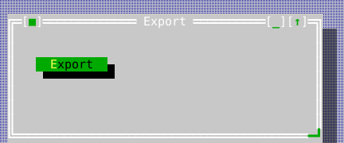

The compiled scene below is the source of this figure.

<!-- ckvision-snippet source="tools/docgen/widget_shots_chrome.cpp" region="tooltip" -->
```cpp
auto* tip = stage.desktop().make<widgets::Tooltip>("Writes report.pdf beside the source");
tip->show_at(Point{20, 10});
```
<!-- /ckvision-snippet -->

## Desktop

Header: `include/cvision/widgets/desktop.hpp`. Insert one below the
Application root. It owns window z-order, docks, popups, activation, and
desktop-wide tile/cascade commands; do not use a global desktop singleton.

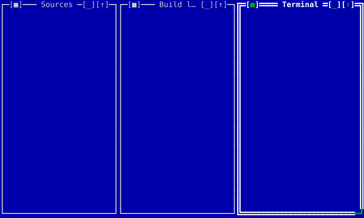

The compiled scene below is the source of this figure.

<!-- ckvision-snippet source="tools/docgen/widget_shots_chrome.cpp" region="desktop" -->
```cpp
for (const char* title : {"Sources", "Build log", "Terminal"}) {
    auto frame = std::make_unique<widgets::Window>(title);
    frame->set_content(std::make_unique<ui::View>());
    stage.desktop().add_window(std::move(frame));
}
stage.desktop().tile();  // or cascade(); both are desktop-wide commands
```
<!-- /ckvision-snippet -->

### A world larger than the view of it (U7-a)

A `Desktop` is its own viewport until a host says otherwise. `set_extent()`
makes the world it contains bigger than the hole it is seen through, and
`set_pan()` says which part of that world the hole is over. `pan_to_show(rect)`
moves the view the least distance that brings a world rect fully into it —
what a host calls when a reader focuses a window that is off-screen.

Two vocabularies, and every call site belongs to exactly one:

| | Reads | Examples |
|---|---|---|
| **World** | `extent()`, `content_area()` | window `bounds()`, the tilings, the cascade, `filled_tile_fractions()`, the remembered arrangement (D-058) |
| **View** | the desktop's own `bounds()`, `pan()` | where things are drawn, where a click lands, docked chrome |

An arrangement is a statement about the world and does not change because
somebody looked elsewhere. That is enforced rather than asked for: panning sets
each window's `View::set_paint_offset`, which moves where a view is DRAWN
without touching its `bounds()`. A host whose window rects are shared state —
ckmux's are session state held by a server and seen by two readers — can pan
one reader's view without restating anybody's arrangement.

Drawing and hit-testing cannot disagree, because the offset is applied in the
three places that compose coordinates: both child-painting paths and
`absolute_bounds()`. A view drawn somewhere is hit-tested there.

**Docked chrome does not pan.** A menu bar that scrolled off the top of the
screen would not be a menu bar, so the docks keep their own position and full
view width; popups likewise stay where they were put, since a dropdown belongs
to the bar it hangs from and a context menu was opened at a place on the
screen.

With no extent set, the world is the desktop's own bounds and every answer is
what it has always been — which is the regression bar for the feature: a
viewport equal to the extent must be invisible to a consumer that never asked
for one.

Four tilings, each a standard command `Desktop` installs a default handler
for: `tile()`/`tile_vertically()` (full-height bands side by side — the same
arrangement under two names, because `ckv.window.tile` is a command
applications already bind), `tile_horizontally()` (full-width bands stacked
top to bottom) and `tile_grid()` (a near-square grid of `ceil(sqrt(n))`
columns, its short last row stretched across the full width). All of them
fill `content_area()` exactly, leaving no gap row or column.

"Every window" means every window on the desktop: a minimized one (and one an
application hid itself) gets no band, and the area is divided by the count of
the rest — otherwise the arrangement would leave a gap exactly where the
hidden window's band would have been. `cascade()` skips them for the same
reason, `activate_next`/`activate_previous` step over them, and
`filled_tile_fractions()` does not count them. `activate()` is the exception
and restores one instead: naming a window is asking for it, and an activation
pointing at something nobody can see is the incoherence every other rule here
exists to avoid.

`filled_tile_fractions()` reports the current arrangement as a fraction of
`content_area()` per window — but only while that arrangement really is a
filled, non-overlapping tiling, which it measures geometrically rather than
recording when a tile command runs. A host restoring a saved layout onto a
differently sized desktop lays the fractions back down and keeps a 50/50
split 50/50. The same detection suppresses window shadows while the desktop
is filled: a shadow says "this floats above that", and a full tiling leaves
no desktop between the windows for one to fall on.

An arrangement survives a resize. A `Desktop` remembers the cells of the last
arrangement that was stated — by `tile()`, `tile_horizontally()`,
`tile_vertically()`, `tile_grid()`, `restore()`, or by a reader's own drag or
resize ending in a tiling — together with the content area they were stated in,
and re-divides them by the same proportions whenever the content area changes.
It is the proportions that survive, not the cell sizes: a band of a 23-row
desktop is one row shorter than the same band of a 24-row one, and returning to
a size the arrangement was already laid out in returns exactly the cells it had
there. The arrangement is forgotten when one of its own windows leaves the
desktop, when a reader moves or resizes one of them out of its cell, or when the
content area becomes too small to give every cell a row and a column — two
stacked bands need two rows, not eight. A window merely opening over the tiling
suspends the `filled_tile_fractions()` verdict for as long as it covers part of
the grid, without disturbing the arrangement underneath. A window that is zoomed
or carries a `DesktopGrowPolicy` other than `None` is already sized on every
resize by that policy, and an arrangement containing one is not remembered at
all: no window is sized by two authorities.

`set_maximize_follows_active(true)` opts in to a new window opening
maximized when the window active at the moment of creation was maximized.
Off by default, and it reuses `Window`'s own zoom, so the frame's zoom
control restores such a window normally. Standard-dialog presentation
(`present_modeless`/`present_modal`/`exec_modal`) is outside the policy: a
dialog opens at the size it was built for.

`subscribe_window_change(observer)` reports a window being added, removed,
activated, renamed, minimized or restored. It exists for views that *list*
windows rather than contain them — a switcher bar, a navigator pane —
because nothing else
invalidates such a view when a window it does not contain opens or is
renamed, and its list would silently stop matching the desktop. The overload
taking a `std::weak_ptr<void>` drops the observer once that token expires,
which is what a view docked on the same desktop needs: it is destroyed as
part of that desktop, and a destructor cancelling by hand would reach into a
`Desktop` whose members are already gone. An observer is a notification, not
a place to add, remove or activate windows — post that work instead.

## FieldDescriptor

Header: `include/cvision/widgets/dialog.hpp`. A label/initial-value/validator
record used to materialize a descriptor dialog. `kind` selects the control:
`Text` (an `InputLine`, the default), `Memo` (a multi-line text field whose
`memo_rows` controls its requested visible height), `Check` (a checkbox carrying
the label as its own text) or `Note` (text the form states rather than asks). See
[Dialogs](dialogs-and-commands.md#fields-that-are-not-text).

## ButtonDescriptor

Header: `include/cvision/widgets/dialog.hpp`. Defines a dialog action: its
label, its own handler, and a `ButtonRole` saying what pressing it does to the
dialog — `Accept` (the default button: validate, answer, close), `Dismiss`
(close exactly as Esc does, with no answer) or `Neutral` (run the handler and
stay, as Apply or Browse… do). `Neutral` is the default, so a button that ends
the dialog states which way it ends it.

## DialogDescriptor

Header: `include/cvision/widgets/dialog.hpp`. Use for a standard form dialog
when declarative fields and validation are sufficient; see [Dialogs](dialogs-and-commands.md).
It can reserve a measured minimum framed size and align its action row. Set
`anchor_buttons_to_bottom` when the measured height deliberately leaves room
beneath the fields; the actions remain at the lower edge while the fields
retain their ordinary layout and validation semantics.

Its public configuration is synchronized directly from the declaration:

<!-- ckvision-fields type="DialogDescriptor" -->
| Field | Type | Default |
|---|---|---|
| `title` | `std::string` | — |
| `fields` | `std::vector<FieldDescriptor>` | — |
| `buttons` | `std::vector<ButtonDescriptor>` | — |
| `resizable` | `bool` | `false` |
| `minimum_window_size` | `Size` | `{}` |
| `button_alignment` | `ui::Alignment` | `ui::Alignment::Start` |
| `anchor_buttons_to_bottom` | `bool` | `false` |
| `help_context_key` | `std::string` | `{}` |
<!-- /ckvision-fields -->

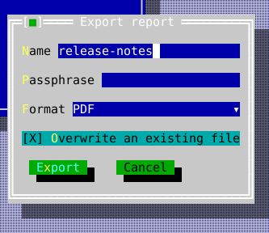

The compiled scene below is the source of this figure.

<!-- ckvision-snippet source="tools/docgen/widget_shots_composite.cpp" region="dialogdescriptor" -->
```cpp
widgets::DialogDescriptor descriptor;
descriptor.title = "Export report";
widgets::FieldDescriptor name;
name.label = "&Name";
name.initial_text = "release-notes";
descriptor.fields.push_back(std::move(name));

widgets::FieldDescriptor passphrase;
passphrase.label = "&Passphrase";
passphrase.password_echo = true;
descriptor.fields.push_back(std::move(passphrase));

widgets::FieldDescriptor format;
format.label = "&Format";
format.kind = widgets::FieldKind::Combo;
format.options = {"PDF", "HTML", "Plain text"};
format.initial_selection = 0;
descriptor.fields.push_back(std::move(format));

widgets::FieldDescriptor overwrite;
overwrite.label = "&Overwrite an existing file";
overwrite.kind = widgets::FieldKind::Check;
overwrite.initial_checked = true;
descriptor.fields.push_back(std::move(overwrite));

descriptor.buttons = {
    widgets::ButtonDescriptor{"E&xport", widgets::ButtonRole::Accept, [] {}},
    widgets::ButtonDescriptor{"Cancel", widgets::ButtonRole::Dismiss, [] {}},
};

widgets::DescriptorDialogPresentation dialog =
    widgets::present_dialog(std::move(descriptor), stage.app(), stage.desktop(), stage.roles());
dialog.set_completion_handler([](widgets::DialogResult result) {
    (void)result;  // .accepted, plus one value per field
});
```
<!-- /ckvision-snippet -->

## MaterializedDialog

Header: `include/cvision/widgets/dialog.hpp`. The materialized view/result of
a descriptor; normally use `present_dialog` instead of manually managing it.

Its tree always has the same shape: the fields inside a ScrollViewport
(`content_viewport`), and the button row that viewport's sibling, below it.
There is no second shape for a dialog that does not fit, because a dialog
cannot know at materialization time how much room it will be given and is
given a different amount every time the terminal is resized. Only the layout
varies, and it is recomputed from the height the dialog actually has:

- **Room for everything** — the viewport is exactly as tall as the fields need,
  the buttons sit directly under it, and the `Auto` vertical bar stays off
  screen. Nothing about the result differs from a dialog built before any of
  this existed: same rows, same columns, no reserved track.
- **Not enough room** — the buttons keep the bottom rows and the viewport takes
  what is left. The fields scroll by the bar, by the keyboard, and by the wheel
  where the field under it does not want it; Tab and Shift-Tab still reach every
  field, scrolling it into view rather than leaving the cursor off screen; and
  the accept-time validation veto scrolls the offending field into view as it
  focuses it. **The buttons never scroll away** — a dialog that cannot show its
  Save and Cancel is not merely cramped, it is unusable.

Horizontal scrolling is off: a form whose left column has scrolled away is not
a view of that form.

A dialog opened with `present_dialog`/`exec_dialog` takes its own recommended
height, clamped to what the desktop can show, and re-answers that on every
desktop resize: a terminal that shrinks below the form turns the dialog into a
scrolling one, and a terminal that grows again gives its full height back. A
`resizable` descriptor is left alone once it is open — the reader has a resize
grip, so the size is theirs. `wire_dialog_window` does not re-fit a
caller-owned window at all; the window and its geometry policy belong to the
caller.

## DialogResult

Header: `include/cvision/widgets/dialog.hpp`. Typed completion payload for a
descriptor dialog. Inspect it in the presentation completion handler.

## DialogFocusRestore

Header: `include/cvision/widgets/dialog_presentation.hpp`. Presentation helper
that restores the invoking focus after modal close; use the public presentation
functions rather than constructing it directly.

## DialogPresentationAccess

Header: `include/cvision/widgets/dialog_presentation.hpp`. Internal access
surface for typed presentations; clients consume the typed aliases returned by
the standard `present_*` functions.

## DirectoryPickerResult

Header: `include/cvision/widgets/directory_picker.hpp`. Typed result from the
directory-picker presentation. Inject a FileSystem; never make the widget read
the disk implicitly.

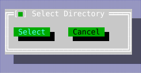

The compiled scene below is the source of this figure.

<!-- ckvision-snippet source="tools/docgen/widget_shots_composite.cpp" region="directorypicker" -->
```cpp
widgets::DirectoryPickerPresentation picker = widgets::present_directory_picker(
    fs, "/project", stage.app(), stage.desktop(), stage.roles());
picker.set_completion_handler([](widgets::DirectoryPickerResult result) {
    (void)result;  // {accepted, path}
});
```
<!-- /ckvision-snippet -->

## FileDialogFilter

Header: `include/cvision/widgets/file_dialog.hpp`. Describes a displayed file
filter for the standard open/save dialog.

## FileDialogOptions

Header: `include/cvision/widgets/file_dialog.hpp`. Options record for the
standard file dialog, including mode and filters.

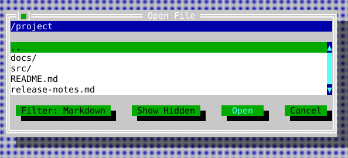

The compiled scene below is the source of this figure.

<!-- ckvision-snippet source="tools/docgen/widget_shots_composite.cpp" region="filedialog" -->
```cpp
widgets::FileDialogOptions options;
options.filters = {widgets::FileDialogFilter{"Markdown", {".md"}},
                   widgets::FileDialogFilter{"All files", {}}};
options.active_filter = 0;

widgets::FileDialogPresentation picker = widgets::present_file_dialog(
    widgets::FileDialogMode::Open, "/project", fs, options, stage.app(), stage.desktop(),
    stage.roles());
picker.set_completion_handler([](widgets::FileDialogResult result) {
    (void)result;  // {accepted, path}
});
```
<!-- /ckvision-snippet -->

## FileDialogResult

Header: `include/cvision/widgets/file_dialog.hpp`. Typed result from an
open/save presentation.

## HelpTopic

Header: `include/cvision/widgets/help_viewer.hpp`. Text/title/link data for a
help topic supplied by your `HelpProvider`.

## HelpIndexEntry

Header: `include/cvision/widgets/help_viewer.hpp`. Search/index record emitted
by a help provider.

## HelpProvider

Header: `include/cvision/widgets/help_viewer.hpp`. Abstract, injected source
of help topics. It keeps help content under application ownership.

## MemoryHelpProvider

Header: `include/cvision/widgets/help_viewer.hpp`. Deterministic in-memory
provider suitable for small applications and tests; Forms uses it.

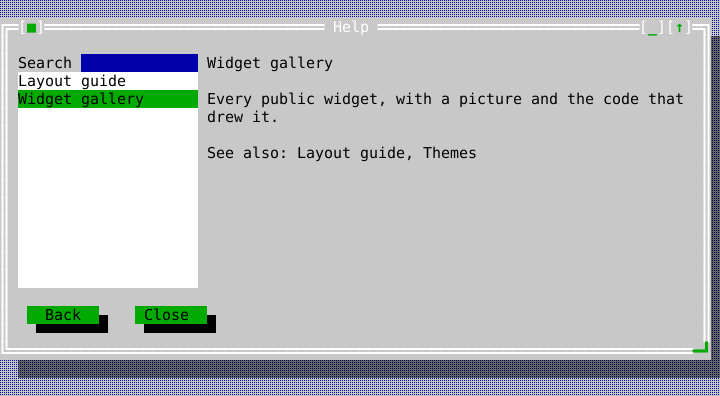

The compiled scene below is the source of this figure.

<!-- ckvision-snippet source="tools/docgen/widget_shots_composite.cpp" region="helpviewer" -->
```cpp
provider.add_topic("gallery",
                   widgets::HelpTopic{"Widget gallery",
                                      "Every public widget, with a picture and the code that "
                                      "drew it.",
                                      {{"layout", "Layout guide"}, {"themes", "Themes"}}});
provider.add_topic("layout", widgets::HelpTopic{"Layout guide", "Row, Column, Grid, Dock.", {}});

widgets::HelpViewerPresentation help = widgets::present_help_viewer(
    provider, "gallery", stage.app(), stage.desktop(), stage.roles());
help.set_completion_handler([](widgets::HelpViewerResult result) { (void)result; });
```
<!-- /ckvision-snippet -->

## ImageView

Header: `include/cvision/widgets/image_view.hpp`. Use to display an `Image`.
It renders raster output if the terminal supports it and a cell fallback if it
does not; [Graphics](graphics.md) shows both captures.

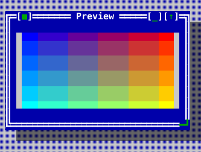

The compiled scene below is the source of this figure.

<!-- ckvision-snippet source="tools/docgen/widget_shots_composite.cpp" region="imageview" -->
```cpp
auto* preview = content.make<widgets::ImageView>();
preview->set_bounds(Rect{1, 1, 30, 7});
preview->set_image(gradient_image(240, 120));
preview->set_stretch_to_fill(false);  // keep the picture's own aspect
preview->on_click = [](const MouseEvent& event) {
    (void)event;  // carries both the cell and the pixel it was in
};
```
<!-- /ckvision-snippet -->

## FlowText

Header: `include/cvision/widgets/flow_view.hpp`. A styled text run, optionally
with a link target, inside a FlowDocument block.

## FlowLineBreak

Header: `include/cvision/widgets/flow_view.hpp`. An explicit visual line break
inside a flow block.

## FlowImage

Header: `include/cvision/widgets/flow_view.hpp`. An inline raster atom with a
cell extent and required text fallback.

## FlowBlock

Header: `include/cvision/widgets/flow_view.hpp`. An ordered group of flow
atoms separated from adjacent blocks by a blank row.

## FlowDocument

Header: `include/cvision/widgets/flow_view.hpp`. The application-owned value
set on a FlowView; see [Flow content](flow-view.md) for composition and link
handling.

## FlowView

Header: `include/cvision/widgets/flow_view.hpp`. Use for wrapped styled
read-only content with keyboard and pointer link navigation plus inline raster
atoms. Workbench's text tab provides the compiled example.

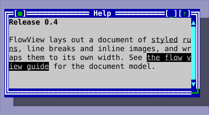

The compiled scene below is the source of this figure.

<!-- ckvision-snippet source="tools/docgen/widget_shots_text.cpp" region="flowview" -->
```cpp
widgets::FlowBlock heading;
heading.content.push_back(widgets::FlowText{"Release 0.4", Attr::Bold, std::nullopt});

widgets::FlowBlock body;
body.content.push_back(widgets::FlowText{"FlowView lays out a document of ", Attr{}, std::nullopt});
body.content.push_back(widgets::FlowText{"styled runs", Attr::Underline, std::nullopt});
body.content.push_back(widgets::FlowText{", line breaks and inline images, and wraps them to its own width. See ", Attr{}, std::nullopt});
body.content.push_back(widgets::FlowText{"the flow view guide", Attr{}, std::string("flow-view.md")});
body.content.push_back(widgets::FlowText{" for the document model.", Attr{}, std::nullopt});

widgets::FlowDocument document;
document.blocks = {std::move(heading), std::move(body)};
flow->set_document(std::move(document));
flow->on_link_activate = [](const std::string& target) { (void)target; /* follow it */ };
```
<!-- /ckvision-snippet -->

## InputLine

Header: `include/cvision/widgets/input_line.hpp`. Use for one-line text with
grapheme-aware editing, selection, validation, optional per-grapheme admission
filtering, masks, password echo, history, clipboard, and undo. Text events
edit it; arrows/home/end and mouse adjust its
cursor/selection. Ctrl+Left/Right moves by word, Ctrl+Home/End reaches the
field boundaries, and Shift extends any cursor motion. Ctrl+C/X/V and
Ctrl+Insert/Shift+Insert copy, cut, and paste; Ctrl+Backspace/Delete erase by
word, while Shift+Delete cuts the selection. Forms shows a labelled field.

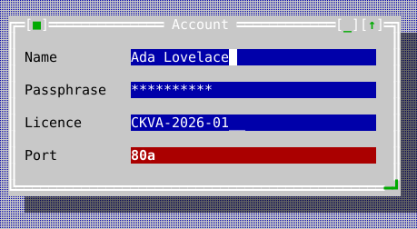

The compiled scene below is the source of this figure.

<!-- ckvision-snippet source="tools/docgen/widget_shots_controls.cpp" region="inputline" -->
```cpp
auto* name = content.make<widgets::InputLine>();
name->set_bounds(Rect{14, 1, 30, 1});
name->set_text("Ada Lovelace");

auto* secret = content.make<widgets::InputLine>();
secret->set_bounds(Rect{14, 3, 30, 1});
secret->set_password_echo(true);
secret->set_text("analytical");

auto* serial = content.make<widgets::InputLine>();
serial->set_bounds(Rect{14, 5, 30, 1});
// '9' a digit, 'A' a letter, '*' anything; everything else is a
// literal the reader cannot edit and the cursor skips. Setting a
// mask resets the field to placeholders, so set it before the value.
serial->set_mask("AAAA-9999-9999");

auto* port = content.make<widgets::InputLine>();
port->set_bounds(Rect{14, 7, 30, 1});
port->set_validator([](const std::string& text) { return text.find_first_not_of("0123456789") == std::string::npos; });
port->set_text("80a");
port->set_valid(false);  // draws in the invalid role until it validates
```
<!-- /ckvision-snippet -->

## KeyChordCapture

Header: `include/cvision/widgets/key_chord_capture.hpp`. Use for editing a
single command shortcut without allowing the captured chord to trigger that
command. Focus the control and press Enter or Space to begin capture; the next
key press becomes its typed `KeyChord`. Escape abandons capture, while
Backspace or Delete clears a binding. The application owns conflict analysis,
rebinding, and persistence through its `CommandRegistry`; this widget has no
keymap or filesystem policy of its own.

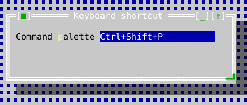

The compiled scene below is the source of this figure.

<!-- ckvision-snippet source="tools/docgen/widget_shots_controls.cpp" region="keychordcapture" -->
```cpp
auto* shortcut = content.make<widgets::KeyChordCapture>();
shortcut->set_bounds(Rect{17, 1, 22, 1});
shortcut->set_chord(KeyChord{Key::Char, Modifier::Ctrl | Modifier::Shift, "p"});
shortcut->on_chord_changed = [](const std::optional<KeyChord>& chord) {
    (void)chord;  // validate conflicts, then persist the typed chord
};

auto* label = content.make<widgets::Label>("Command &palette");
label->set_bounds(Rect{1, 1, 15, 1});
label->set_buddy(shortcut);
```
<!-- /ckvision-snippet -->

## Label

Header: `include/cvision/widgets/label.hpp`. Use a mnemonic label next to a
control; it participates in mnemonic focus routing. Use StaticText for passive
wrapped copy.

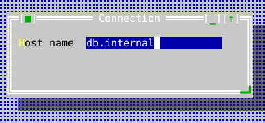

The compiled scene below is the source of this figure.

<!-- ckvision-snippet source="tools/docgen/widget_shots_controls.cpp" region="label" -->
```cpp
auto* host = content.make<widgets::InputLine>();
host->set_bounds(Rect{12, 1, 22, 1});
host->set_text("db.internal");

auto* label = content.make<widgets::Label>("&Host name");
label->set_bounds(Rect{1, 1, 11, 1});
label->set_buddy(host);  // Alt+H now focuses the field, not the label
```
<!-- /ckvision-snippet -->

## ListItem

Header: `include/cvision/widgets/list_view.hpp`. A stable item identity, text,
and optional presentation style returned by a ListModel.

## ListModel

Header: `include/cvision/widgets/list_view.hpp`. A caller-owned synchronous
visible-slice provider for ListView. It supplies reverse identity lookup so
selection survives refreshes and reordering; see [Data views](data-views.md).

## ListView

Header: `include/cvision/widgets/list_view.hpp`. Use a linear selectable
collection. Arrow keys select and Enter activates; File Browser connects it to
TreeView selection. For dynamic or large data, set a ListModel rather than
materializing rows.

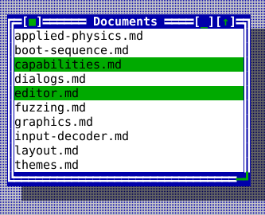

The compiled scene below is the source of this figure.

<!-- ckvision-snippet source="tools/docgen/widget_shots_data.cpp" region="listview" -->
```cpp
list->set_items({"applied-physics.md", "boot-sequence.md", "capabilities.md",
                 "dialogs.md", "editor.md", "fuzzing.md", "graphics.md",
                 "input-decoder.md", "layout.md", "themes.md"});
list->set_cursor(2);
list->set_selected(2, true);
list->set_selected(4, true);
list->set_scrollbar_policy(widgets::ScrollbarPolicy::Auto);
list->on_activate = [](std::size_t index) { (void)index; /* open the row */ };
list->on_selection_changed = [](std::size_t index) { (void)index; };
```
<!-- /ckvision-snippet -->

## Memo

Header: `include/cvision/widgets/memo.hpp`. Use for multiline editable text
with undo and optional wrapping. It handles cursor keys, text input, scrolling,
and clipboard through Application services. It uses the same editing keymap as
InputLine: Ctrl+Left/Right moves by word, Ctrl+Home/End reaches document
boundaries, Shift extends selections, and Ctrl+C/X/V or
Ctrl+Insert/Shift+Insert provide clipboard operations. Ctrl+Backspace/Delete
erase by word; Shift+Delete cuts the current selection.

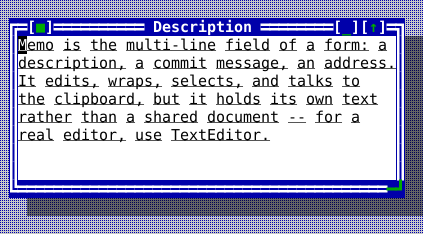

The compiled scene below is the source of this figure.

<!-- ckvision-snippet source="tools/docgen/widget_shots_text.cpp" region="memo" -->
```cpp
memo->set_text(
    "Memo is the multi-line field of a form: a description, a commit "
    "message, an address.\n"
    "It edits, wraps, selects, and talks to the clipboard, but it holds "
    "its own text rather than a shared document -- for a real editor, use "
    "TextEditor.");
memo->set_wrap_mode(widgets::WrapMode::Word);
memo->set_vertical_scrollbar_policy(widgets::ScrollbarPolicy::Auto);
```
<!-- /ckvision-snippet -->

## MnemonicText

Header: `include/cvision/widgets/mnemonic.hpp`. Parsed label/mnemonic value
used by controls that accept `&` mnemonic notation.

## MenuItem

Header: `include/cvision/widgets/menu.hpp`. A menu row, and exactly one kind
of row: `MenuItem::command()`, `MenuItem::action()`, `MenuItem::submenu()` or
`MenuItem::separator()`. The kind comes from the named constructor that made
the row rather than from which of several optional fields happen to be filled
in, so "a separator that also has a submenu" is not a state a menu can be
asked to draw.

Prefer a command row: its wording, chord hint and availability come from the
registry, so the menu cannot disagree with the palette or the status line
about them. A callback row is for a genuinely local action — opening a
contextual dialog — and carries its own label and its own enabled flag,
because nothing else could know either.

Refinements chain onto any row: `.with_mark()` puts a check box or a radio
mark in the left column, `.with_help()` names the topic F1 answers with while
the row is highlighted, and `.with_disabled_reason()` gives a surface the
words to explain a grey verb instead of leaving the reader to guess.

## MenuMark

Header: `include/cvision/widgets/menu.hpp`. What a row's left column shows:
nothing, a check box (an independent switch), or a round mark (one choice out
of a set). The two shapes differ because the promises differ — turning a radio
row on turns its neighbour off, which a column of boxes would not say.

## MenuItemKind

Header: `include/cvision/widgets/menu.hpp`. Which of the four kinds a
[MenuItem](#menuitem) is. Read it when walking a menu someone else built;
never needed to construct one.

## MenuHighlight

Header: `include/cvision/widgets/menu.hpp`. What a menu reports about the row
the reader is standing on: its command, its help topic, whether it is
available and why not, or `none` once the menu closes. Following an open
submenu chain to its innermost menu, because that is where the reader actually
is. A status line explaining the current entry and an F1 that answers about it
both read this, so the two cannot disagree about which row is meant.

## DropdownMenu

Header: `include/cvision/widgets/menu.hpp`. A transient menu surface owned by
the menu system. Arrow keys/mnemonics select, Enter activates, and Escape/light
dismiss returns focus. Its `&` mnemonic uses the shared `ckv.hotkey` accent.

Home and End go to the first and last row that can be chosen in whichever
menu the reader is in, skipping a leading separator or a greyed first entry
rather than being swallowed by one. With no menu open they are the menu bar's
own ends.

A submenu is a keyboard destination, not a pointer-only one. Right or Enter on
an entry that has one opens it and the keys go to it — arrows move inside it,
its own mnemonics reach its own entries — while the entry that opened it stays
highlighted to mark the way in. Left or Escape steps back out onto that entry,
one level at a time. Right where there is nothing deeper to open is not
swallowed: below a [MenuBar](#menubar) it carries the walk on to the next
top-level menu, closing the chain behind it. The highlight a listener hears
about is the innermost menu's, so a status line explaining the current entry
follows the reader into a submenu and back out again.

The pointer reaches the same places. Hovering a row that has children opens
them, and moving to a sibling closes them again — a submenu left standing over
a row the reader has already left is a menu that no longer describes where the
pointer is. Pressing such a row opens it too, so a drag can go straight down
into a submenu and choose from it in one gesture.

That works because a pointer gesture belongs to the whole chain of menus, not
to whichever one holds the input capture at the moment. Capture follows the
innermost menu, but a press that opens a submenu lands on the parent row and
its release arrives after the new submenu has taken the capture over — so
every pointer event goes to the menu of the chain the pointer is actually
over, and to the chain's root when it is over none of them. A press that ends
up outside every one of them therefore closes the whole chain in one click,
not one level of it.

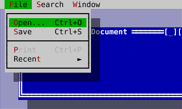

The compiled scene below is the source of this figure.

<!-- ckvision-snippet source="tools/docgen/widget_shots_chrome.cpp" region="dropdownmenu" -->
```cpp
bar->activate();  // F10 does this for the reader; Down drops the menu
stage.app().dispatch(KeyEvent{KeyChord{Key::Down, Modifier::None, ""}});
```
<!-- /ckvision-snippet -->

## MenuBarItem

Header: `include/cvision/widgets/menu.hpp`. Top-level label plus its MenuItem
rows, normally constructed before making a MenuBar.

## MenuBar

Header: `include/cvision/widgets/menu.hpp`. Dock it at the Desktop top. F10
activates the standard menu command, mnemonics enter menus, Escape restores
the preceding focus. Its mnemonic letters use the shared `ckv.hotkey` accent.
Focus stays on the bar for as long as any of its menus is open, so the bar is
what delivers keys to them — always to the innermost one, which is where the
reader's highlight is. Left and Right walk the top-level menus, except where a
[DropdownMenu](#dropdownmenu) has a submenu to enter or leave.
The [Hello tutorial](tutorial-hello.md) shows it open.

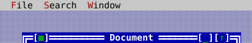

The compiled scene below is the source of this figure.

<!-- ckvision-snippet source="tools/docgen/widget_shots_chrome.cpp" region="menubar" -->
```cpp
auto* bar = stage.desktop().dock_top(std::make_unique<widgets::MenuBar>(demo_menus(ids)));
bar->on_highlight_changed = [](const widgets::MenuHighlight& highlight) {
    (void)highlight;  // e.g. mirror the help context into a status line
};
```
<!-- /ckvision-snippet -->

## MenuBarAccessory

Header: `include/cvision/widgets/menu.hpp`. What a view implements to become a
participant in the menu bar rather than something merely parked on it. A bar
with a trailing view — a clock at the right end, say — walks onto it with the
arrow keys and activates it with Enter or Space, and the accessory is told when
it is the highlighted slot so it can wear the bar's active colours like any
menu title. `MenuBar::set_trailing_view<T>()` installs one and hands back the
typed pointer; a trailing view that does not implement the interface is still
laid out and drawn, it simply cannot be reached from the keyboard.

## MemoPosition

Header: `include/cvision/widgets/memo.hpp`. A line/grapheme position value for
Memo cursor and selection APIs.

## MessageBoxDescriptor

Header: `include/cvision/widgets/message_box.hpp`. A kind/title/message/button
set record for `present_message_box`; use a completion handler for its typed
result. It may additionally carry immutable raster artwork, requested cell
dimensions, a minimum content width, and explicit graphic/text/button
alignment for a deliberate identity presentation while ordinary alerts retain
their compact composition.

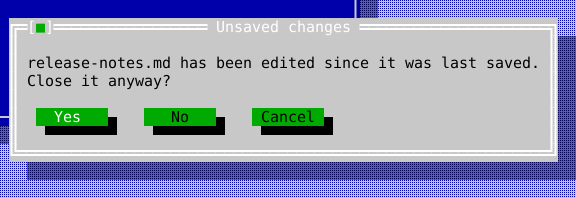

The compiled scene below is the source of this figure.

<!-- ckvision-snippet source="tools/docgen/widget_shots_composite.cpp" region="messagebox" -->
```cpp
widgets::MessageBoxDescriptor descriptor{
    widgets::MessageBoxKind::Confirm, "Unsaved changes",
    "release-notes.md has been edited since it was last saved.\n"
    "Close it anyway?",
    widgets::MessageBoxButtons::YesNoCancel};

widgets::MessageBoxPresentation box =
    widgets::present_message_box(stage.app(), stage.desktop(), stage.roles(), descriptor);
box.set_completion_handler([](widgets::MessageBoxResult result) {
    (void)result;  // Yes, No, or Cancel -- arrives after the box detaches
});
```
<!-- /ckvision-snippet -->

## CheckGroup

Header: `include/cvision/widgets/option_group.hpp`. Use multiple independent
choices. Arrows select a row and Space toggles it; optionally enable tri-state
values as shown in Forms. Its visual contract is square `[ ]`/`[X]` markers.
`set_group_label()` gives the group an owned caption one row above the choices;
the caption changes from its normal label colour to the focused-option
foreground while the group owns keyboard focus.

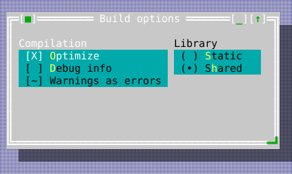

The compiled scene below is the source of this figure.

<!-- ckvision-snippet source="tools/docgen/widget_shots_controls.cpp" region="checkgroup" -->
```cpp
auto* flags = content.make<widgets::CheckGroup>(
    std::vector<std::string>{"&Optimize", "&Debug info", "Warnings as errors"});
flags->set_group_label("Compilation");
flags->set_bounds(Rect{1, 1, 24, 4});
flags->set_checked(0, true);
flags->set_tristate(true);  // admits the third, Mixed state
flags->set_check_state(2, widgets::CheckState::Mixed);
flags->on_changed = [](std::size_t index, bool value) { (void)index; (void)value; };
```
<!-- /ckvision-snippet -->

## PopupList

Header: `include/cvision/widgets/popup_list.hpp`. The list a control drops
when its choices are data rather than commands. A
[DropdownMenu](#dropdownmenu) is the right popup for things to *do* — its
items carry commands, mnemonics, check marks and submenus — while a list of
months, fonts or files is things to *be*, and there may be more of them than
fit on the screen. So this is a [ListView](#listview) in a popup: the frame,
the colours and the dismissal rules are the menu's, the scrolling and
selection are the list's, and neither reimplements half of the other.

`show_popup_list()` hangs one under an anchor rectangle — below it, or above
it where there is no room below rather than clamped down over the control that
opened it — takes the mouse and the keys while it is up, and restores focus
when it closes. Enter or a single press on a row chooses; Escape or a press
outside dismisses. One of the two callbacks runs, once.


The compiled scene below is the source of this figure.

<!-- ckvision-snippet source="tools/docgen/widget_shots_controls.cpp" region="popuplist" -->
```cpp
auto popup = std::make_unique<widgets::PopupList>(
    std::vector<std::string>{"UTF-8", "UTF-16LE", "Latin-1", "Shift-JIS"},
    std::optional<std::size_t>{0});
popup->set_bounds(Rect{24, 6, 16, 6});
popup->on_choose = [](std::size_t index) { (void)index; /* apply the encoding */ };
popup->on_dismiss = [] { /* nothing was chosen */ };
widgets::PopupList* list = stage.desktop().add<widgets::PopupList>(std::move(popup));
stage.app().set_focus(&list->list());  // the inner ListView is the focusable part
```
<!-- /ckvision-snippet -->

## RadioGroup

Header: `include/cvision/widgets/option_group.hpp`. Use exactly one choice.
Arrows and mnemonics change its selected index. Its visual contract is rounded
`( )`/`(U+2022)` markers. `set_group_label()` gives the group an owned caption
one row above the choices; the caption changes from its normal label colour to
the focused-option foreground while the group owns keyboard focus. Use
`set_column_width()` only for a measured form column; it clips long labels at
that specified edge rather than changing the control's interaction model.

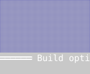

The compiled scene below is the source of this figure.

<!-- ckvision-snippet source="tools/docgen/widget_shots_controls.cpp" region="radiogroup" -->
```cpp
auto* target = content.make<widgets::RadioGroup>(
    std::vector<std::string>{"&Static", "S&hared"});
target->set_group_label("Library");
target->set_bounds(Rect{26, 1, 14, 3});
target->set_selected(1);
target->on_changed = [](int index) { (void)index; };
```
<!-- /ckvision-snippet -->

## Progress

Header: `include/cvision/widgets/progress.hpp`. Use a determinate fraction
with an optional label; application work updates it through `set_fraction`.

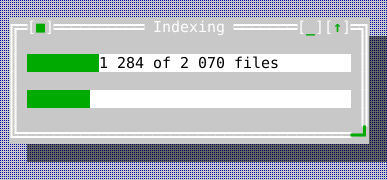

The compiled scene below is the source of this figure.

<!-- ckvision-snippet source="tools/docgen/widget_shots_controls.cpp" region="progress" -->
```cpp
auto* bar = content.make<widgets::Progress>();
bar->set_bounds(Rect{1, 1, 36, 1});
bar->set_fraction(0.62);
bar->set_label("1 284 of 2 070 files");

auto* scanning = content.make<widgets::Progress>();
scanning->set_bounds(Rect{1, 3, 36, 1});
scanning->set_indeterminate(true);  // no fraction is known yet
scanning->set_pulse(7);             // the host advances this per tick
```
<!-- /ckvision-snippet -->

## ScrollViewport

Header: `include/cvision/widgets/scroll_viewport.hpp`. Use to expose a larger
child view through a clipped scrollable region. Pair with Scrollbar when a
visible position control helps. `set_scrollbars_always_visible(true)` retains
both conventional tracks for document views whose content may grow. Both
appear in the navigation capture above.

`set_vertical_scrollbar_policy` and `set_horizontal_scrollbar_policy` set the
two axes separately, for a surface that wants one bar's rule and not the
other's. `ScrollbarPolicy::Hidden` says more than "draw no bar": that axis
does not scroll at all, and the content is held to the visible extent rather
than to its own larger preferred one — so nothing can end up off screen along
an axis offering neither a bar nor a key to bring it back. A dialog uses
exactly that pairing: `Auto` vertically, `Hidden` horizontally.

`ensure_visible(view)` scrolls by the least amount that brings a descendant
fully into sight, and answers whether it moved anything. Whoever moves focus
into a scrolled surface should call it: a control that takes focus while
scrolled out of sight leaves the terminal cursor blinking where the reader
cannot see it. `can_scroll_vertically()`/`can_scroll_horizontally()` answer
whether there is anywhere to go — and a viewport with nowhere to go leaves the
arrow keys and the wheel alone rather than consuming them to move by nothing.

The mouse wheel reaches the viewport from anywhere over its content, because
Application walks an unhandled wheel event up the ancestors of whatever it hit.
A content widget that consumes the wheel for its own scrolling keeps it, which
is the right answer — the innermost scrollable surface under the pointer is the
one that should move — but it does mean an OUTER viewport never sees a wheel an
inner one has taken.

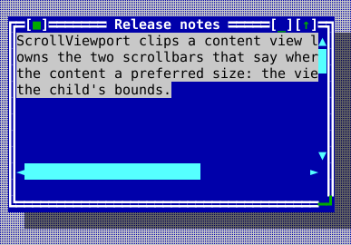

The compiled scene below is the source of this figure.

<!-- ckvision-snippet source="tools/docgen/widget_shots_data.cpp" region="scrollviewport" -->
```cpp
auto* viewport = content.make<widgets::ScrollViewport>();
viewport->set_bounds(Rect{0, 0, 38, 9});

auto page = std::make_unique<ui::View>();
page->set_preferred_size(Size{60, 30});  // the world, larger than the hole
auto* body = page->make<widgets::StaticText>(
    "ScrollViewport clips a content view larger than itself and owns the two "
    "scrollbars that say where in it you are. Give the content a preferred "
    "size: the viewport reads that, not the child's bounds.");
body->set_bounds(Rect{0, 0, 58, 12});
viewport->set_content(std::move(page));
viewport->set_scroll(0, 0);
viewport->set_scrollbars_always_visible(true);
```
<!-- /ckvision-snippet -->

## Scrollbar

Header: `include/cvision/widgets/scrollbar.hpp`. Use for an explicit vertical
or horizontal scroll position. Arrow/page keys and pointer interaction adjust
its model; orientation comes from `Orientation`. The built-in presentation uses
the CP437-style U+25B2/U+25BC or U+25C4/U+25BA arrows, a U+2591 light-shade
page area, and a U+2588 full-block proportional thumb. The active scheme owns
their colours.

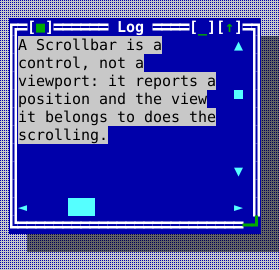

The compiled scene below is the source of this figure.

<!-- ckvision-snippet source="tools/docgen/widget_shots_data.cpp" region="scrollbar" -->
```cpp
auto* bar = content.make<widgets::Scrollbar>(widgets::Orientation::Vertical);
bar->set_bounds(Rect{24, 0, 1, 8});
bar->set_range(/*content_size=*/240, /*viewport_size=*/8);
bar->set_position(96);
bar->set_policy(widgets::ScrollbarPolicy::Auto);
bar->on_position_changed = [](int position) { (void)position; };

auto* ruler = content.make<widgets::Scrollbar>(widgets::Orientation::Horizontal);
ruler->set_bounds(Rect{0, 9, 25, 1});
ruler->set_range(200, 25);
ruler->set_position(40);
```
<!-- /ckvision-snippet -->

## Splitter

Header: `include/cvision/widgets/splitter.hpp`. Use exactly two adjacent panes
with user-controlled division. Focus it and use its directional keys, or drag
the divider. [Layout guide](layout-guide.md) and File Browser show it.

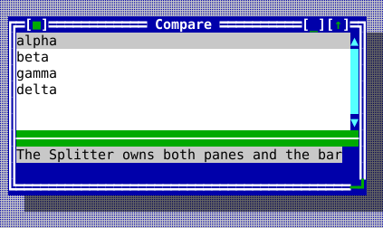

The compiled scene below is the source of this figure.

<!-- ckvision-snippet source="tools/docgen/widget_shots_data.cpp" region="splitter" -->
```cpp
auto left = std::make_unique<widgets::ListView>();
left->set_items({"alpha", "beta", "gamma", "delta"});
auto right = std::make_unique<widgets::StaticText>(
    "The Splitter owns both panes and the bar between them. Drag the bar, or "
    "focus it and use the arrow keys.");

auto* splitter = content.make<widgets::Splitter>(Rect{0, 0, 42, 8}, std::move(left),
                                                 std::move(right),
                                                 widgets::Orientation::Vertical);
splitter->set_split_position(16);
```
<!-- /ckvision-snippet -->

## StandardStrings

Header: `include/cvision/widgets/standard_strings.hpp`. Application-local
standard dialog wording; pass it to factories instead of installing global
localization state.

## StaticText

Header: `include/cvision/widgets/static_text.hpp`. Use passive, wrapping text.
It is not editable/focusable like Memo or TextView links.

A paragraph asks to be `kProseMeasureCells` wide at most, whatever its
unwrapped length, and wraps into whatever width it is actually given. That
request is what decides the width of a container that sizes itself to its text
— a message box, or a `Column` asked for its preferred width — so prose in one
opens at a width it can be read at instead of at the width of the terminal.
Text marked preformatted with `set_preformatted` asks for every column it was
written with instead: it cannot be reflowed, so a narrower view would clip it.

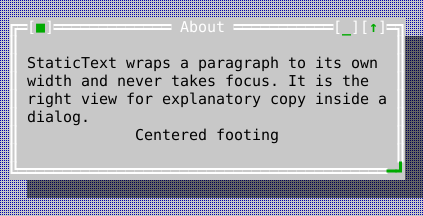

The compiled scene below is the source of this figure.

<!-- ckvision-snippet source="tools/docgen/widget_shots_controls.cpp" region="statictext" -->
```cpp
auto* body = content.make<widgets::StaticText>(
    "StaticText wraps a paragraph to its own width and never takes focus. "
    "It is the right view for explanatory copy inside a dialog.");
body->set_bounds(Rect{1, 1, 40, 4});

auto* footer = content.make<widgets::StaticText>("Centered footing");
footer->set_alignment(ui::Alignment::Center);
footer->set_bounds(Rect{1, 5, 40, 1});
```
<!-- /ckvision-snippet -->

## StatusLineItem

Header: `include/cvision/widgets/status_line.hpp`. A command presentation or
short status surface entry used by StatusLine.

## StatusLine

Header: `include/cvision/widgets/status_line.hpp`. Dock it at Desktop bottom
for command hints and contextual help. Its command item executes the same
registry action as a menu item; the registered key chord automatically uses
the same `ckv.hotkey` accent as menu mnemonics.

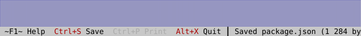

The compiled scene below is the source of this figure.

<!-- ckvision-snippet source="tools/docgen/widget_shots_chrome.cpp" region="statusline" -->
```cpp
auto* status = stage.desktop().dock_bottom(std::make_unique<widgets::StatusLine>());
status->set_items({
    widgets::StatusLineItem{"~F1~ Help"},
    widgets::StatusLineItem{"~Ctrl+S~ Save", ids.save},
    widgets::StatusLineItem{"~Ctrl+P~ Print", ids.print},
    widgets::StatusLineItem{"~Alt+X~ Quit", stage.app().commands().standard().quit},
});
status->set_transient_hint("Saved package.json (1 284 bytes)");
```
<!-- /ckvision-snippet -->

## TabControl

Header: `include/cvision/widgets/tab_control.hpp`. Use mutually exclusive
pages within one window. Mnemonics/keyboard navigation change active page;
Workbench and Graphics provide real tab captures.

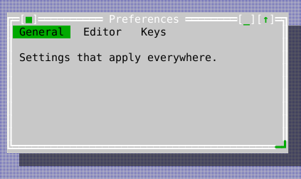

The compiled scene below is the source of this figure.

<!-- ckvision-snippet source="tools/docgen/widget_shots_data.cpp" region="tabcontrol" -->
```cpp
auto* tabs = content.make<widgets::TabControl>();
tabs->set_bounds(Rect{0, 0, 42, 8});

auto general = std::make_unique<ui::View>();
general->make<widgets::StaticText>("Settings that apply everywhere.")
    ->set_bounds(Rect{1, 1, 36, 2});
tabs->add_tab("&General", std::move(general));

auto editor = std::make_unique<ui::View>();
editor->make<widgets::StaticText>("Editor-only settings.")->set_bounds(Rect{1, 1, 36, 2});
tabs->add_tab("&Editor", std::move(editor));

tabs->add_tab("&Keys", std::make_unique<ui::View>());
tabs->set_active_index(0);
```
<!-- /ckvision-snippet -->

## TableCell

Header: `include/cvision/widgets/table.hpp`. A typed value, independent display
text, optional style, and editability flag supplied by a TableModel.

## TableCellRef

Header: `include/cvision/widgets/table.hpp`. Stable row identity plus column
position used for selection, editing, sorting callbacks, and model commits.

## TableEditResult

Header: `include/cvision/widgets/table.hpp`. The provider's explicit accept or
reject result for an edit, including a diagnostic retained by Table on failure.

## TableModel

Header: `include/cvision/widgets/table.hpp`. A caller-owned synchronous
visible-slice provider for typed Table cells, ordering requests, and validated
commits. See [Data views](data-views.md).

## TableColumn

Header: `include/cvision/widgets/table.hpp`. Defines a Table header and sizing
constraints.

## Table

Header: `include/cvision/widgets/table.hpp`. Use aligned sortable typed
rows/columns. Arrow keys navigate; F2, Enter, or typing begins an editable
cell's provider-validated edit. Use a TableModel for dynamic or large data.

| Table with typed columns | Table with an active cell editor |
| :---: | :---: |
| 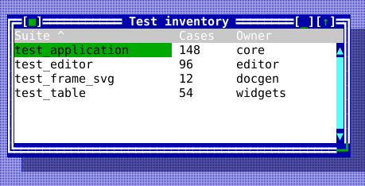 |  |

The compiled scene below is the source of this figure.

<!-- ckvision-snippet source="tools/docgen/widget_shots_data.cpp" region="table" -->
```cpp
table->set_columns({
    widgets::TableColumn{"Suite", 22, 8, widgets::TableCellType::Text, false},
    widgets::TableColumn{"Cases", 7, 4, widgets::TableCellType::Integer, false},
    widgets::TableColumn{"Owner", 12, 5, widgets::TableCellType::Text, true},
});
table->set_rows({
    {"test_application", "148", "core"},
    {"test_editor", "96", "editor"},
    {"test_frame_svg", "12", "docgen"},
    {"test_table", "54", "widgets"},
});
// With set_rows() and no TableModel the built-in order is a plain
// text comparison of that column; a model decides its own order in
// request_sort() instead.
table->sort_by(0, /*ascending=*/true);
table->set_selected_cell(widgets::TableCellRef{0, 2});
table->on_edit_committed = [](widgets::TableCellRef cell,
                              const widgets::TableEditResult& result) {
    (void)cell;
    (void)result;
};
```
<!-- /ckvision-snippet -->

## TerminalView

Header: `include/cvision/widgets/terminal_view.hpp`. Hosts one explicitly
launched `TerminalSubsession` in a normal view tree. It renders the private
child snapshot, forwards the child input modes it requests, and keeps parent
focus under the application's control; see [Embedded terminal](embedded-terminal.md).

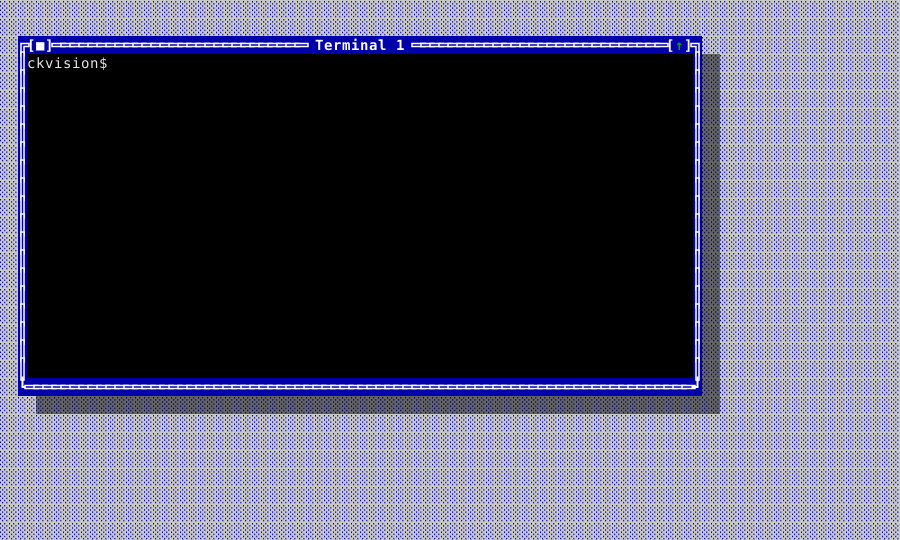

The compiled scene below is the source of this figure.

<!-- ckvision-snippet source="tools/docgen/capture_terminal_screenshots.cpp" region="terminalview" -->
```cpp
auto window = std::make_unique<ckv::widgets::Window>(child_sixel ? "Sixel Demo" : "Terminal 1");
window->set_bounds(ckv::Rect{2, 2, 76, 20});
auto view = std::make_unique<ckv::widgets::TerminalView>(session);
window->set_content(std::move(view));
shell.desktop().add_window(std::move(window));
```
<!-- /ckvision-snippet -->

## Terminal report dialog

Header: `include/cvision/widgets/terminal_report_dialog.hpp`. The standard
typed dialog showing `ckv::term::capability_report()` — what the terminal
reported and what ckVision concluded from it — together with the
application's mouse-dispatch diagnostics; its Copy button exports the
plain-text form for a bug report. Desktop installs it behind the standard
`terminal_report` command, so an application need only place that command in
a menu; an application whose terminal can count decoded SGR mouse reports (a
POSIX host) presents the dialog itself through
`present_terminal_report_dialog` and passes
`TerminalReportDialogOptions::mouse_reports_decoded`.


The compiled scene below is the source of this figure.

<!-- ckvision-snippet source="tools/docgen/widget_shots_composite.cpp" region="terminalreportdialog" -->
```cpp
widgets::TerminalReportDialogOptions options;
options.mouse_reports_decoded = [] { return std::size_t{0}; };

widgets::TerminalReportDialogPresentation report = widgets::present_terminal_report_dialog(
    stage.desktop(), stage.app(), stage.roles(), options);
report.set_completion_handler([](widgets::TerminalReportDialogResult result) { (void)result; });
```
<!-- /ckvision-snippet -->

## TerminalReportDialogOptions

Header: `include/cvision/widgets/terminal_report_dialog.hpp`. What the
report cannot observe through the Application: `mouse_reports_decoded`
supplies the count of SGR mouse reports the terminal layer recognized in
the byte stream, shown beside the events dispatch actually delivered.
Left empty, the report omits that line — a headless or mirrored terminal
has no byte stream of its own to count.

## TextSpan

Header: `include/cvision/widgets/text_view.hpp`. Styled/link-capable fragment
used by TextView.

## WrapMode

Where a line is allowed to break, shared by every scrolling text surface —
`TextView`, `Memo` and `TextEditor` all take the same three choices, so a
reader meets one behaviour rather than three.

- `WrapMode::None` — one display row per logical line, however long, with a
  horizontal scrollbar reaching the rest. Preformatted text (a table, a
  diagram, source, a log) means what it means only at its own line breaks.
  This is the default for `TextView` and `TextEditor`.
- `WrapMode::Word` — break between words, keeping each whole. What prose
  wants, and the default for `Memo` and for the help viewer. A word wider
  than the row is *not* split: it takes a row of its own and overflows, which
  is what brings the horizontal bar out rather than telling the reader a path
  is shorter than it is.
- `WrapMode::Character` — break exactly at the edge, mid-word where the edge
  falls there. For content with no word structure to respect: a hex dump, one
  unbroken identifier, a script that does not space its words.

```cpp
editor->set_wrap_mode(widgets::WrapMode::Word);
memo->set_wrap_mode(widgets::WrapMode::Character);
```

## WrapOptions

The width a row may use, the `WrapMode`, and `continuation_reserve` — cells
held back on wrapped rows for a continuation marker the caller draws.
`wrap_graphemes` indexes by grapheme cluster, `wrap_text` by byte offset; both
respect cluster boundaries and always return at least one segment, so an empty
line still occupies a row.

## WrapSegment

One display row's worth of a logical line, as a half-open `[begin, end)`
range in whichever units the entry point indexes by.

## ScrollGeometry

Which scrollbars a surface shows and what is left for its content, from
`resolve_scroll_geometry`. The two bars cannot be decided independently: a
vertical bar costs a column, which can be what makes a line no longer fit; a
horizontal bar costs a row, which can be what makes the text no longer fit;
and under wrapping the width also decides how many rows there are. The
resolver settles them together and reports the viewport that results — always
measure and draw against that, never against the raw bounds.

## TextView

Header: `include/cvision/widgets/text_view.hpp`. Use passive rich,
preformatted text or link content. Its link activation callback receives the
target; a containing ScrollViewport may own the visible scrollbars through
`set_vertical_scrollbar_visible(false)`; Workbench shows an OSC 8-capable link
span.


The compiled scene below is the source of this figure.

<!-- ckvision-snippet source="tools/docgen/widget_shots_text.cpp" region="textview" -->
```cpp
view->set_text(
    "TextView shows text the reader cannot edit: a log, a report, a help "
    "page.\n"
    "It wraps, scrolls, and carries OSC 8 hyperlinks.\n"
    "\n"
    "Open the \x1B]8;;https://cklukas.github.io/ckVision/\x1B\\documentation "
    "site\x1B]8;;\x1B\\ for the rest.");
view->set_wrap_mode(widgets::WrapMode::Word);
view->set_vertical_scrollbar_policy(widgets::ScrollbarPolicy::Auto);
view->on_link_activate = [](const std::string& target) { (void)target; };
```
<!-- /ckvision-snippet -->

## TreeNode

Header: `include/cvision/widgets/tree_view.hpp`. A hierarchy node with label,
children, expansion state, and optional client data.

## TreeItem

Header: `include/cvision/widgets/tree_view.hpp`. The compact label,
known-children state, and optional client payload returned for one requested
`TreeModel` node. It carries neither child storage nor expansion state.

## TreeModel

Header: `include/cvision/widgets/tree_view.hpp`. A caller-owned, synchronous
stable-ID hierarchy provider. It supplies root, parent, child-index, and item
lookups so TreeView can retain view-owned selection and expansion across a
refresh without enumerating the whole forest. See [Data views](data-views.md#tree-providers).

## TreeView

Header: `include/cvision/widgets/tree_view.hpp`. Use hierarchical navigation.
Arrows select/expand, Enter activates, and `on_expand_request` supports lazy
children. `reveal_and_select(id)` opens the ancestors of a materialized node
and selects it, which lets a result list or search controller navigate a tree
without synthesizing input. File Browser uses the public selection callback to
update a ListView. TreeView retains its flattened visible entries until roots
or expansion state changes, so repeated draws and navigation do not repeatedly
walk an unchanged materialized forest. `TreeModel` supplies the scalable,
caller-owned alternative: it keeps expansion and selection by stable item id,
and resolves only visible hierarchy paths. See [Data views](data-views.md#tree-providers)
for the provider contract.
`TreeConnectorStyle::Outline` provides the compact classic terminal-outline
appearance: `─+` for groups, `──` for leaves, and `│` ancestry guides.


The compiled scene below is the source of this figure.

<!-- ckvision-snippet source="tools/docgen/widget_shots_data.cpp" region="treeview" -->
```cpp
widgets::TreeNode core;
core.label = "core";
widgets::TreeNode widgets_dir;
widgets_dir.label = "widgets";

widgets::TreeNode cvision;
cvision.label = "cvision";
cvision.expanded = true;
cvision.children = {std::move(core), std::move(widgets_dir)};

widgets::TreeNode include;
include.label = "include";
include.expanded = true;
include.children.push_back(std::move(cvision));

widgets::TreeNode src;
src.label = "src";
src.children_known = false;  // an expander, with the listing not yet done

widgets::TreeNode readme;
readme.label = "README.md";

tree->set_roots({std::move(include), std::move(src), std::move(readme)});
tree->set_connector_style(widgets::TreeConnectorStyle::Outline);
tree->on_expand_request = [](widgets::TreeNode& node) {
    (void)node;  // fill node.children in place; the tree redraws with them
};
tree->on_activate = [](widgets::TreeNode& node) { (void)node; };
```
<!-- /ckvision-snippet -->

## FrameSlot

Header: `include/cvision/widgets/window.hpp`. Chooses a Window frame overlay
edge/alignment/offset; use it for border metadata such as a current path.

## Window

Header: `include/cvision/widgets/window.hpp`. Desktop owns modeless windows.
Their title bars move, borders resize when enabled, and a close request may be
vetoed by application policy. Resizable focused windows expose one-cell
single-line grips at both lower corners inside their otherwise double-line
frame; dragging the left grip anchors the right edge. Put one content view inside each window. A
window using `DesktopGrowPolicy::KeepFilling` is permanently maximized: its
title control automatically shows the U+2195 restore glyph even though `zoomed()`
remains false (there is no transient geometry to restore). Its maximize/restore
control uses the theme's `ckv.window.control` accent while its brackets retain
the frame background and foreground.

A third control, `[_]`, sits immediately left of the maximize/restore one and
**minimizes** the window — `set_minimized(true)`, which is what a click on it
does. A minimized window is hidden but still listed in its `Desktop`'s
`windows()`: that listing is how a reader gets it back, from the window
switcher bar, while every tiling, the grid, the cascade, the next/previous
cycle and `filled_tile_fractions()` step over it. Restoring returns the
window's bounds, its place in the z-order and its zoom exactly — a window
minimized while maximized comes back maximized — because minimizing disturbs
none of the three, so there is nothing to remember and replay. Restoring does
not activate: `Desktop::activate()` does both, and that is the call a bar
entry, a window number or a menu item makes.

The control appears from 14 columns wide, where the arithmetic clears the
close control, and — like the maximize/restore control — not at all on a
fixed-size window. `set_minimizable(false)` takes it off a resizable window
that must not be hidden; `Desktop`'s modal presentation does exactly that,
since hiding the one window accepting input would leave an application
answering nothing.

`set_chrome_background_override(color)` replaces only the background used by
the frame, title, controls, footer, and uncovered interior. Theme foregrounds
and attributes remain intact. Use it when that surrounding colour is runtime
state—such as an emulated display's overscan colour—and clear it with
`std::nullopt` to return to the active or inactive window role.


The compiled scene below is the source of this figure.

<!-- ckvision-snippet source="tools/docgen/widget_shots_chrome.cpp" region="window" -->
```cpp
auto frame = std::make_unique<widgets::Window>("Report");
frame->set_bounds(Rect{6, 3, 44, 9});
frame->set_footer("2 of 7");
frame->set_min_size(Size{20, 5});
frame->set_minimizable(true);
frame->set_resizable(true);
frame->close_request = [] {
    return false;  // veto: something is unsaved
};
frame->set_content(std::make_unique<ui::View>());
widgets::Window* window = stage.desktop().add_window(std::move(frame));
```
<!-- /ckvision-snippet -->

### Showing where a window went — the minimize flight

Minimizing can be *shown* rather than merely done: the frame shrinks and flies
to the row the window will live in, and back out of it on restore. It is off
until a host says where a hidden window goes, so nothing changes for an
application that does not ask.

```cpp
desktop.set_minimize_target_provider([&bar](widgets::Window& window) {
    return entry_rect_for(bar, window);           // std::optional<Rect>, desktop-local
});
desktop.set_minimize_animation_duration(180'000'000);   // the default; 0 disables
```

A provider rather than a fixed destination, because a `Desktop` does not know
what lists its windows — a taskbar, a window-list dialog and an application
with no listing at all each answer differently, and one of the answers is
`nullopt` ("nowhere to fly to", which is also what a window on another page of
a [PagedStrip](#pagedstrip) says). The rect is in the same coordinate frame as
`Window::bounds()`, and is asked for when the flight starts rather than
remembered: a taskbar row moves as its neighbours come and go, and a
remembered rectangle is how an effect flies to where a button used to be.

It is asked **once** per flight, though, and flying to that one answer is only
safe while a window changing state does not move its own row. That is the
host's property rather than the `Desktop`'s: `WindowSwitcherBar` holds it
deliberately — its three status glyphs are one cell each, so a minimize cannot
re-flow the row the flight is aimed at. A listing that does re-flow on a state
change would leave the decoration ending where the window is not, which reads
as a rendering glitch rather than as the layout change it actually is.

**The end state never comes from the frames.** `Window::set_minimized` applies
the whole of it — hidden, invisible, bounds untouched — and notifies
afterwards, so the flight starts from a window whose state is already settled
and only draws where it went. Everything the constraint list asks for follows
from that: a host that never gets a timer tick still ends with the window
hidden, `set_minimize_animation_duration(0)` is a complete disable that does
not even call the provider, and `finish_minimize_animation()` — which an
application calls from wherever it sees a keystroke — stops a decoration
rather than resolving a half-applied change. See
[Animation](#animation) for the mechanism and the decision log D-060 for why it is
built this way round.

The decoration is a popup like any other: topmost, its own compositor layer,
added when a flight starts and removed when it ends. It answers no input and
takes no focus, because the desktop beneath it is already in its end state and
a click it swallowed would be one stolen from a window the reader can see.

### Animation

Header: `include/cvision/ui/animation.hpp`. One bounded, interruptible run of
frames over the injected `Clock` — and the whole of what animation means in
this toolkit. There is no scene graph of animated properties, no timeline and
no implicit transitions on setters: a duration, a callback that receives
progress in `[0, 1]`, and a callback that says the run is over.

```cpp
ui::Animation animation;                     // usually a member, not a local
animation.start(app, 180'000'000,
                [&](double progress) { move_the_decoration(progress); },
                [&] { take_the_decoration_down(); });
animation.finish();                          // ends it now; the teardown still runs
```

Three rules make it safe to build on:

- **Progress comes from the clock, never from a frame count.** A host that
  delivers half the frames sees the same run in the same wall time, covering
  more ground per frame; a host that delivers none sees it end at its deadline
  having drawn nothing. Advancing a fixed step per tick instead would turn a
  slow terminal into slow motion and leave the effect outliving the thing it
  described.
- **`on_finished` runs exactly once, for every ending** — completed, cut
  short, or a duration of zero. An effect therefore has one place to tear its
  decoration down and cannot leak one by ending along a path its author
  forgot. Destruction is the sole exception and is silent: an owner being
  destroyed is already tearing down.
- **It never owns the end state.** The caller applies the end state first and
  then, optionally, animates. Nothing downstream can depend on a frame ever
  being drawn — which is what makes "interruptible" cheap rather than
  delicate, since there is no half-applied state for an interruption to
  resolve.

A duration of zero is a run that is already over: `on_finished` and no frames
at all. That is the whole of "animations off", answered once here rather than
by a branch at every call site.


## WindowHandle

Header: `include/cvision/widgets/window.hpp`. Stable window identity used for
activation/listing operations without exposing ownership.

## Window list dialog

Header: `include/cvision/widgets/window_list_dialog.hpp`. The standard typed
dialog for choosing/activating Desktop windows; use its presentation alias and
result enum rather than building a one-off window list.


The compiled scene below is the source of this figure.

<!-- ckvision-snippet source="tools/docgen/widget_shots_composite.cpp" region="windowlistdialog" -->
```cpp
widgets::WindowListDialogPresentation list =
    widgets::present_window_list_dialog(stage.desktop(), stage.app(), stage.roles());
list.set_completion_handler([](widgets::WindowListDialogResult result) { (void)result; });
```
<!-- /ckvision-snippet -->

## PagedStrip

Header: `include/cvision/widgets/paged_strip.hpp`. One row of variable-width
items that **pages** when they do not all fit, together with the chrome that
steers it. Reach for it whenever a one-row strip has more in it than a narrow
terminal can show at once — a window switcher, a status row of command items,
a session list — rather than shortening every item until none of them can be
read.

Left to right, at a width that needs paging:

```text
▼ ◁ 2/3  Item  Another item  Third   ▷
│ │  │   └── the items, as many as fit WHOLE
│ │  └────── the page index, only while there is more than one page
│ └───────── the previous-page control, live only off the first page
└─────────── the collapse toggle, only when the host asked for one
```

An item source is the whole of what the strip does not know:

```cpp
auto strip = std::make_unique<widgets::PagedStrip>();
strip->set_item_source([&model] {
    std::vector<widgets::PagedStrip::Item> items;
    for (const Session& session : model.sessions())
        items.push_back({session.display_width(), session.caption(), session.current()});
    return items;
});
strip->on_item_activated = [&model](std::size_t index) { model.select(index); };
strip->refresh_items();  // whenever the model moves
```

`Item::width` is the cells the item's **own content** needs and is the
provider's answer, never a measurement the strip takes of `Item::text`: an
item that draws a status glyph before its label pays for it there and the
layout follows. The strip adds one padding cell either side and one blank
cell between items.

**Paging, not eliding.** An item takes its natural width and overflows onto
the next page; nothing is shortened to make room. Elision survives in exactly
one case: an item whose box is wider than the entire item area is alone on
its page and is elided to that area, because it has nowhere else to go.

**The chrome is reserved for every page alike** once there is more than one,
including the previous-page cell on the first page, where it is drawn blank.
Items therefore keep their columns as the reader pages, and which items land
on which page is a pure function of the width and the item widths — paging
forward and back returns the reader to the set they came from. Where the row
is too narrow to carry all of it, the chrome is given up in order of what it
costs the reader: the page index first (it is information; the controls are
function), then the collapse toggle, then the controls themselves.

**Revalidation.** `refresh_items()` recomputes the pages on every change,
because the item set moves underneath — in a terminal multiplexer a session
opens or ends at any moment. A current page that no longer exists falls back
to the last one that does, rather than showing a blank row under a `3/2`
index; a page that survives is kept, so removing an item from an *earlier*
page does not carry the reader somewhere they did not ask to go. Both
`on_page_changed` and `page()` report the result.

**The collapse toggle collapses nothing.** `set_collapsible(true)` buys the
column; the toggle then draws `▼` while expanded and `▲` while collapsed,
reports through `on_collapse_changed`, and answers `collapsed()`. What
collapsing *means* — a footer that goes away, a second docked row — is the
host's other chrome, and a widget that reached out to hide a sibling would be
deciding something that is not its own. The strip's own geometry never
changes with the flag.

All four steering glyphs are one column wide by `ckv::text`, this library's
own width authority: `▼` U+25BC, `▲` U+25B2, `◁` U+25C1 and `▷` U+25B7 are
East Asian *Ambiguous*, which D-019 resolves to one column, and none of them
is `Extended_Pictographic`, so no variation selector can widen one into an
emoji. The black left/right triangles U+25C0/U+25B6 **are**
`Extended_Pictographic` and are deliberately not used: a two-cell triangle
would shear the row it is meant to be steering.

Keyboard: none, deliberately. A strip is chrome, and its items are reached by
whatever commands the host already binds to them.


The compiled scene below is the source of this figure.

<!-- ckvision-snippet source="tools/docgen/widget_shots_chrome.cpp" region="pagedstrip" -->
```cpp
auto* strip = stage.desktop().dock_bottom(std::make_unique<widgets::PagedStrip>());
// The strip pulls its items rather than being handed them: a host
// whose model moved calls refresh_items() and the source is asked
// again.
strip->set_item_source([] {
    std::vector<widgets::PagedStrip::Item> items;
    for (const auto& [text, selected] : std::initializer_list<std::pair<const char*, bool>>{
             {"editor", true}, {"shell", false}, {"monitor", false},
             {"release notes", false}, {"changelog", false}}) {
        widgets::PagedStrip::Item item;
        item.text = text;
        // The provider's own answer, never a measurement the strip takes
        // of `text`: an item carrying a leading glyph says so here.
        item.width = static_cast<int>(item.text.size());
        item.selected = selected;
        items.push_back(std::move(item));
    }
    return items;
});
strip->on_item_activated = [](std::size_t index) { (void)index; };
strip->on_collapse_changed = [](bool collapsed) { (void)collapsed; };
```
<!-- /ckvision-snippet -->

## WindowSwitcherTarget

Header: `include/cvision/widgets/window_switcher_bar.hpp`. The window one
switcher-bar row stands for, and the way to run something against *that*
window from a menu built elsewhere. `bind(f)` returns the callback
`MenuItem::action` carries, checked against the window's own liveness token
and against its still being listed before `f` runs. Reach for it — not
`MenuItem::command` — whenever a menu item concerns a window other than the
one in front: command dispatch has no target, and every standard
window-management handler a `Desktop` installs acts on `active_window()`, so
a `Close` chosen from a background row would close the wrong window.

## MinimizedWindowStub

Header: `include/cvision/widgets/minimized_window_stub.hpp`. The one row a
put-away window leaves behind: its own top frame, rolled up and parked along
the bottom of the desktop.

```
┌[■]── config.yaml ──[↑]┐
```

A `Desktop` creates, places and destroys these itself whenever its
`minimized_window_placement()` is `Parked`, which is the default — an
application never constructs one. `[■]` closes the window through its own
`close_request`, so a parked editor with unsaved changes still gets to ask;
`[↑]`, the caption, or Enter on a stub reached by Tab brings the window back
through `Desktop::activate`, which restores it on the way to the front
(D-056). Both mouse controls arm on the press and decide on the release,
exactly like the frame's own: the pressed face shows while the pointer is
over the control, and releasing anywhere else takes the press back. The
keyboard follows `Button`'s rule (D-055): on a session whose verified key
enhancements report releases, Enter or Space arms and the key coming back
up restores — Escape or focus moving away in between takes it back — and on
a session that cannot report a release the press acts at once, held
visibly down for a moment. It draws in the window roles — `ckv.window.frame.inactive`,
`ckv.window.title.inactive` and `ckv.window.control` — so a theme that
retints inactive frames retints these with them.

The stub is a popup, not an ordinary child: it is drawn above the windows,
because a parked window that a maximized neighbour could cover would be back
where it started. The window behind it is untouched — hidden, with its
bounds, zoom state and z-order exactly as they were — which is why restoring
replays nothing.

The three placements a host chooses between (D-064):

| `MinimizedWindowPlacement` | What a minimized window leaves on screen |
|---|---|
| `Parked` (default) | A stub on the desktop's bottom edge |
| `HostListed` | Nothing — the host lists its own windows, e.g. with a [WindowSwitcherBar](#windowswitcherbar) |
| `Disabled` | Nothing, and no window offers the `_` control at all |


The compiled scene below is the source of this figure.

<!-- ckvision-snippet source="tools/docgen/widget_shots_chrome.cpp" region="minimizedwindowstub" -->
```cpp
// An application never constructs one: a Desktop whose placement is
// Parked puts a stub up when a window is minimized, and takes it down
// again when the window comes back.
stage.desktop().set_minimized_window_placement(
    widgets::MinimizedWindowPlacement::Parked);
stage.desktop().windows().front()->set_minimized(true);
stage.desktop().finish_minimize_animation();
```
<!-- /ckvision-snippet -->

## WindowSwitcherBar

Header: `include/cvision/widgets/window_switcher_bar.hpp`. One row listing
every open window by title and by state, right-click for a host-supplied
context menu, the arrangement a desktop taskbar uses. The active window's
entry is drawn in the theme's `ckv.statusline.selected`; the rest, and the
bar itself, in `ckv.statusline.normal`.

Each row carries a status glyph one space left of its title, and a left
click does what that glyph promises (D-059):

| Glyph | `Status` | What a left click does |
|---|---|---|
| `▮` | `Active` | minimizes the window the reader is in |
| `▯` | `Visible` | activates and raises a window that is behind |
| `▄` | `Minimized` | brings a window that was put away back, in front |

`status_glyph(Status)` is the one place the three shapes are spelled, so a
legend or a host's own listing names the same ones the bar draws. A window
whose `minimizable()` is false is never minimized from its row — its frame
draws no `_` control, and the bar is not a second route past that gate.

`WindowSwitcherBar(desktop)` wires the common case: that desktop's
`windows()`, their `title()`, its `active_window()`, `Window::minimized()`,
and `activate()` as the click action. Each is replaceable —
`set_window_source`, `set_label_provider`, `set_active_provider`,
`set_minimized_provider`, `set_activate_action`, `set_minimize_action`,
`set_context_menu_provider` — so an application whose notion of a window is
its own keeps the row, the layout, the elision and the input handling. The
two actions are separate on purpose: a host that installs its own activate
action to move the keyboard with the window keeps the three transitions
above without re-deriving which one it is looking at.
`set_context_menu_provider` is the only one with no default: what belongs on
that menu is the application's vocabulary, not the library's.

Dock it by composing, not by docking twice — `Desktop::dock_bottom` holds
exactly one view per edge:

```cpp
auto stack = std::make_unique<ui::Column>();
stack->add_item(std::make_unique<widgets::WindowSwitcherBar>(desktop));
stack->add_item(std::make_unique<widgets::StatusLine>());
desktop.dock_bottom(std::move(stack));
```

`ui::Column`'s vertical hint sums its children, so `Desktop::content_area()`
— and with it the rectangle a maximized window is zoomed into — already
excludes both rows.

Too narrow for every title, the bar **pages** rather than shortening every
name: it derives from [PagedStrip](#pagedstrip), which owns the layout, the
page controls, the page index and the collapse toggle. Every window keeps a
row — dropping one would make that window unreachable from the very bar that
exists to reach it — but the row it keeps may be on another page. `entries()`
still lists every window; `drawn_entries()` describes the current page only,
and `entry_at()` answers for that page. A bar wide enough for its windows
lays out exactly as it did before it could page: one page, no index, no
controls, and the first entry at column zero.

The collapse toggle is off until a host calls `set_collapsible(true)`, so a
bar that never collapses pays no column for the possibility.


The compiled scene below is the source of this figure.

<!-- ckvision-snippet source="tools/docgen/widget_shots_chrome.cpp" region="windowswitcherbar" -->
```cpp
auto* switcher =
    stage.desktop().dock_bottom(std::make_unique<widgets::WindowSwitcherBar>(stage.desktop()));
switcher->refresh();
```
<!-- /ckvision-snippet -->

### Damped widths

A window's title is not a stable string: a shell rewrites its caption at every
prompt, a build tool writes its progress into one, an editor appends and
removes a dirty marker. Each rewrite is a new measurement, so an undamped bar
re-sizes that button and re-flows every button beside it several times a
second — the row becomes unreadable long before the titles do, and a reader
aiming at a button hits the one that took its place.

`set_width_damping(grow_delay_nanos, shrink_delay_nanos)` puts a floor under
how often one entry's box may change width. Both delays are measured on the
injected `Clock`, from that entry's last width change in either direction, so
the promise is the plain one: at most one widening per grow delay, at most one
narrowing per shrink delay. Zero for both — the default — is no damping, and
every row follows its label in the same frame.

```cpp
bar->set_width_damping(1'000'000'000, 30'000'000'000);  // 1 s wider, 30 s narrower
```

The two directions get different delays because they are not equally urgent. A
box that is too narrow is showing an elided name and should widen soon; one
that is too wide is showing the whole name with slack around it, which costs
the reader nothing and is very often about to be needed again.

What is damped is the **layout** width. That is deliberate: the complaint is
that the button jitters, and a button's length is the width the strip lays it
out at, so damping a merely drawn width would leave the boxes shuffling
underneath at exactly the rate the damping was meant to stop. Page composition
therefore depends on time as well as on the labels — as it already does, since
a title change re-pages. Damping does not make a pure function
history-dependent; it lengthens the interval over which that function holds
still, and within such an interval paging forward and back returns the reader
to exactly the set they came from.

Three rules complete it:

- A window the bar has not measured before takes its natural width at once. A
  row that has just appeared has no previous width to flicker between.
- The label is never held back — only the box is. A name too long for the box
  it has is elided into it (the strip's own elision) and comes out whole when
  the box catches up.
- `settle_width(window)` forgets one window's memory, so its next measurement
  is taken at once. It is for the change a *reader* made: damping absorbs what
  a program does to a caption, and a rename that visibly took effect half a
  minute later reads as a command that did not work.

A deferred change is applied by a wake-up the bar arms on the `Application`
timer, because nothing else re-reads the widths: a program that renames its
window once and then says nothing more would otherwise leave that name elided
into its old box for the rest of the session. The wake-up holds still while a
press is in flight (`PagedStrip::press_in_flight()`) and re-asks shortly
after — the strip resolves a click by index, so a box that changed width
between press and release would either move the item out from under the
pointer or spend the click on a window the reader never pointed at.

No keyboard handling, deliberately: windows are already cycled by the
standard next/previous-window commands and selected by number.

The row stays correct through `Desktop::subscribe_window_change` rather than
by re-reading the window set as it draws.

The Workbench source shows the text/data family in the exact compiled app:

<!-- ckvision-snippet source="examples/workbench/workbench_app.cpp" lines="78-177" -->
```cpp
}

void WorkbenchApp::build_window() {
    auto window = std::make_unique<widgets::Window>("Workbench");
    window->set_bounds(Rect{2, 2, 74, 20});
    window->set_grow_policy(widgets::DesktopGrowPolicy::AnchorEdges);

    auto tabs = std::make_unique<widgets::TabControl>();
    tabs->set_bounds(Rect{0, 0, 72, 18});
    tabs_ = tabs.get();
    tabs->add_tab("&Text", build_text_page());
    tabs->add_tab("&Data", build_data_page());
    tabs->add_tab("&Help", build_help_page());
    window->set_content(std::move(tabs));
    window_ = desktop_->add_window(std::move(window));
}

std::unique_ptr<ui::View> WorkbenchApp::build_text_page() {
    auto page = std::make_unique<ui::View>();

    auto memo = std::make_unique<widgets::Memo>();
    memo->set_bounds(Rect{1, 1, 36, 10});
    memo->set_wrap_mode(widgets::WrapMode::Word);
    memo->set_text("ckVision memo\nclipboard, undo, and wrapping live here.");
    memo_ = memo.get();
    page->add_child(std::move(memo));

    auto command_label = std::make_unique<widgets::Label>("&Command:");
    command_label->set_bounds(Rect{1, 12, 10, 1});
    page->add_child(std::move(command_label));

    auto command = std::make_unique<widgets::InputLine>();
    command->set_bounds(Rect{12, 12, 24, 1});
    command->set_history(&history_, "workbench.command");
    command->set_text("build");
    command->commit_to_history();
    command->set_text("test");
    command->commit_to_history();
    command_input_ = command.get();
    page->add_child(std::move(command));

    auto toolbar = std::make_unique<widgets::ToolBar>();
    toolbar->set_bounds(Rect{1, 14, 34, 1});
    toolbar->set_commands({app_.commands().standard().menu, app_.commands().standard().quit});
    tool_bar_ = toolbar.get();
    page->add_child(std::move(toolbar));

    auto text = std::make_unique<widgets::TextView>();
    text->set_bounds(Rect{39, 1, 30, 12});
    text->set_spans({widgets::TextSpan{"TextView links export as ", static_cast<Attr>(0), std::nullopt},
                     widgets::TextSpan{"OSC 8", Attr::Underline, std::string{"https://example.invalid/osc8"}},
                     widgets::TextSpan{" and activate deterministically.", static_cast<Attr>(0), std::nullopt}});
    text->set_current_link(0);
    text->on_link_activate = [this](const std::string& target) { last_link_ = target; };
    text_view_ = text.get();
    page->add_child(std::move(text));

    auto flow = std::make_unique<widgets::FlowView>();
    flow->set_bounds(Rect{39, 14, 30, 3});
    auto chart = std::make_shared<Image>(4, 1);
    for (int x = 0; x < chart->width(); ++x) chart->set_pixel(x, 0, Image::Rgba{0, 180, 120, 255});
    flow->set_document(widgets::FlowDocument{{widgets::FlowBlock{{
        widgets::FlowText{"Flow: ", static_cast<Attr>(0), std::nullopt},
        widgets::FlowText{"interactive link", Attr::Underline, std::string{"https://example.invalid/flow"}},
        widgets::FlowImage{std::move(chart), Size{7, 1}, "[chart]"},
    }}}});
    flow->on_link_activate = [this](const std::string& target) { last_link_ = target; };
    flow_view_ = flow.get();
    page->add_child(std::move(flow));

    return page;
}

std::unique_ptr<ui::View> WorkbenchApp::build_data_page() {
    auto page = std::make_unique<ui::View>();

    auto tree = std::make_unique<widgets::TreeView>();
    tree->set_bounds(Rect{1, 1, 22, 10});
    tree->set_connector_style(widgets::TreeConnectorStyle::BoxDrawing);
    widgets::TreeNode src;
    src.label = "src";
    widgets::TreeNode tests;
    tests.label = "tests";
    widgets::TreeNode project;
    project.label = "Project";
    project.children = {std::move(src), std::move(tests)};
    project.expanded = true;
    tree->set_roots({std::move(project)});
    tree_ = tree.get();
    page->add_child(std::move(tree));

    auto list = std::make_unique<widgets::ListView>(true);
    list->set_bounds(Rect{25, 1, 18, 10});
    list->set_items({"alpha", "beta", "gamma"});
    list->set_selected(0, true);
    list_ = list.get();
    page->add_child(std::move(list));

    auto table = std::make_unique<widgets::Table>();
    table->set_bounds(Rect{45, 1, 24, 8});
```
<!-- /ckvision-snippet -->

